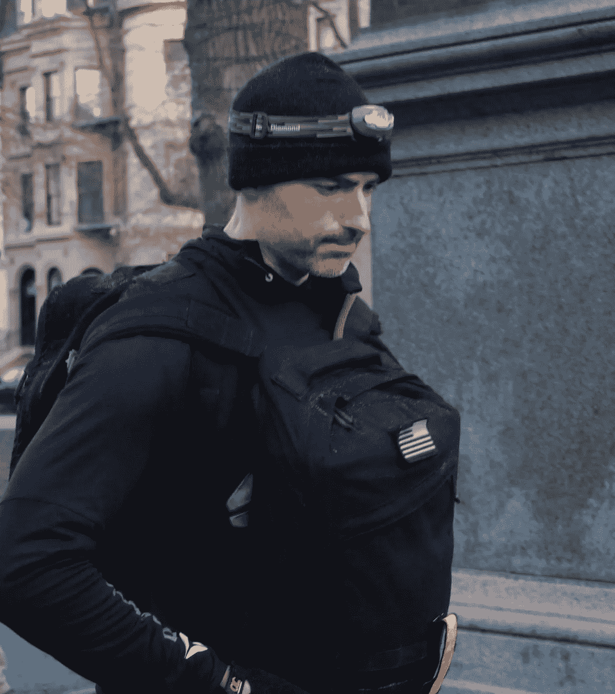

# 有意的逆境

> 原文：<https://medium.com/swlh/intentional-adversity-7d42146b2c6d>

我将引用[SOFREP.com](http://sofrep.com/28789/advance-adversity-part-ii-human-performance/#ixzz2hscBfvwD)上的一篇关于同一主题的伟大文章:**“我们的文化”常常是“任何自己造成的事情”“你疯了”是我们做极端或不寻常的事情时经常听到的评论。我认为他们不做不寻常的事情是疯狂的。有意的逆境应该和有意的锻炼一样重要。你在需要之前就积累了力量。”**

确实如此。这个问题几乎总是来自不太了解我的人:你究竟为什么要做这样的事？无论是推一个小时的雪橇，还是练习武术，或者以写作为生，或者试图让一家制作公司起步——当我做“正常”社会不会做的事情时，问题就开始了，表情从同情(“可怜的家伙肯定在补偿什么。”)到困惑(“天哪，我甚至从来没有想过要做这样的事情！”)到愤怒(“他以为他是谁干的那些事？”)

我这样做的原因很简单:因为我想每天都接受某种形式或方式的挑战。对我来说，生活并不意味着自满或满足于平庸。

听着，我父亲在 48 岁的时候去世了。明年十月是我的 50 岁生日。我父亲的去世给我带来了沉重的负担——有时比其他时候更重——我不想重蹈他的覆辙。许多人会看到最后一句话，并敦促谨慎，而不是(他们认为是鲁莽的)不断挑战。我的观点不同:只有通过不断的挑战，我才能成功——无论我下定决心要完成什么。

通过让自己不断接受挑战，我可以近距离接触失败。我可以和我的心魔依偎在一起，直面它们。我看到了我的力量在哪里衰退，在哪里高涨。我知道在极端压力下我的大脑是如何工作的。所有这一切让我变得更强大。所有这些都在考验我的意志力和“我有多想要它？”

当今社会的大部分问题是，我们用“舒适的自满”的理想来交易“风险和回报”的概念。上学，拿学位，找工作，结婚，买房，生孩子，工作，退休，死亡。当然，这很简单，但这是我们大多数人遵循的道路。人们去探险的日子已经成为过去。只有一小部分人成为企业家。大多数寻找伴侣的人放弃了，满足于一个“还行”的人，即使他们梦想着一段只会随着时间变得更好的浪漫。

我们已经失去了很多对生活的热情。

通过让自己遭受有意的逆境，有可能重新找回激情。正是通过心痛和极度疲劳的考验，我们才发现是什么真正点燃了我们心中的火焰。你意识到推了一个小时的雪橇后，躺在草坪上其实很舒服。喝水就像吮吸生命本身。你的身体确实是不可思议的，而且你刚刚完成了——不管你跑了多少码——这是很多其他人不会做的事情。

你变得更强大。

每次你挑战自己做得更多，走得更快、更努力、更重，你的身体、头脑和精神都会做出反应。它们突破了以前的限制，超越了我们给自己设定的界限。不容易。不应该是这样的。它实际上应该是一样的困难，因为没有冲突和困难，真正的成长是不可能的。

尽管挑战可能不会变得更容易，但你对它们的反应会变得更好。让自己接受摆在你面前的挑战变得更容易，因为你以前做过。每做一次，你就增强了应对下一次挑战的力量。你可能不总是成功——但失败是不可避免的。失败比成功本身更能孕育成功，因为它教会你坚持下去。

Closing in on the end of a GORUCK Challenge wearing 2 rucks weighing 45+ pounds each after a 12-hour slog over roughly 20 miles…As the GORUCK folks say, “Good livin’…”

会有你想放弃的时候:当你看不透汗水、泪水和心痛的时候；当你的身体快要散架，连路都走不直的时候；当你的肺在发胀，你的肠子想把自己掏空的时候。

但正是在那些最黑暗的时候，你会发现最纯粹的力量，那一点点照亮你完成并取得成功的渴望的光芒。

你继续前进。

第 34 代龙忍术大师喜欢说，“继续前进。”事实上，日本汉字“忍者”可以翻译为“在最大压力下忍耐、坚持并最终成功的人”。特种部队对这个概念也很熟悉:精英军事部队选拔的严酷本质是为了淘汰那些无法度过最黑暗时期、变得比自己想象的更强大的人。

通过不断的挑战，你熟悉了那种纯粹的力量。你知道它看起来像什么，感觉起来像什么，以及当你最需要它的时候如何呼唤它。

如果没有故意的逆境，这种力量只是一个概念——只是你在博客或书中读到的一个理想——你可能永远不会认识到，或知道你拥有它。

如果你知道你可以做任何事情，你今天会做什么？如果你知道你可以下定决心完成任何事情并取得成功？

有可能。你可能会走运。

或者你可以让成功成为必然。

通过让自己经受持续的挑战——故意的逆境——的严峻考验，梦想和目标离开了模糊的可能性领域。

进入具体必然性的领域。