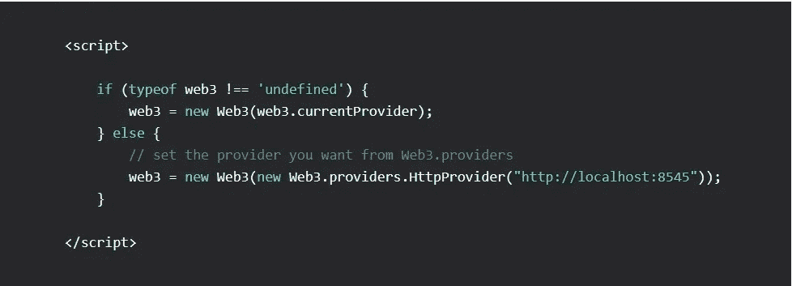

# 通过 Web3.js 与 Smartcontracts 交互

> 原文：<https://medium.com/swlh/interacting-with-smartcontracts-via-web3-js-367ea980652c>

> 最后，您将学习使用 Web3.js 库与 Smartcontracts 交互，并从远程节点发送事务。

`web3.js`是目前使用最多的与以太坊交互的 JavaScript 库。

正如我们所知，为了在区块链网络上进行交易，我们必须签署我们的信息(无论是离线或在线)并在网络上广播。对于以太坊…