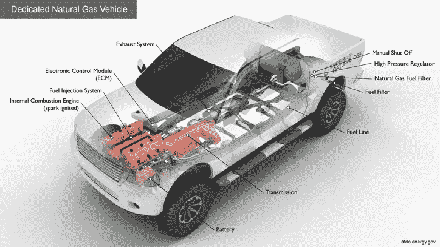

# 内燃机和四冲程发动机

> 原文：<https://medium.com/swlh/internal-combustion-engine-and-the-four-stroke-engine-12381fc54a98>

Figure 1: Internal Combustion Engines in Automobiles

今天，我们有可以在几个小时内带我们环游世界的大型喷气式飞机，可以在最偏远的地方高效发电的发电机，可以帮助我们更快种植作物的拖拉机和水泵，当然还有可以在高速公路上行驶的私人汽车。但是是什么让这一切成为可能呢？答案是内燃机。内部燃烧…