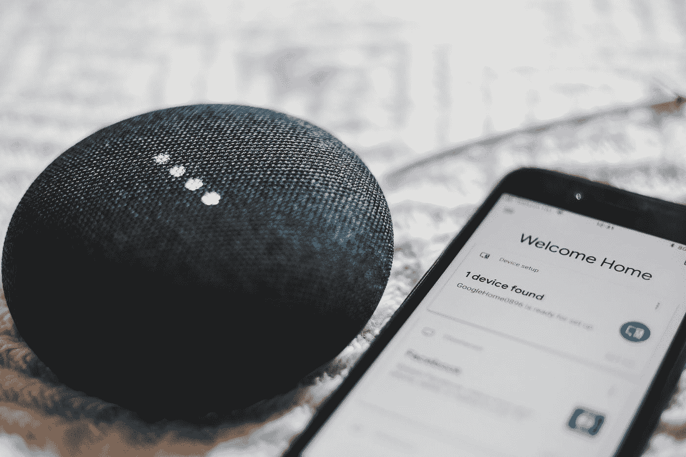

# 物联网。那是什么？

> 原文：<https://medium.com/swlh/internet-of-things-whats-that-d3fb018aa7b8>

## 物联网概述以及它为何如此出色

Credits: [BENCE BOROS](https://unsplash.com/@benceboros?utm_source=medium&utm_medium=referral)

# 物联网是什么？

让我们看看谷歌对此有什么说法。

> 物联网是互联网连接到物理设备和日常物品的延伸。