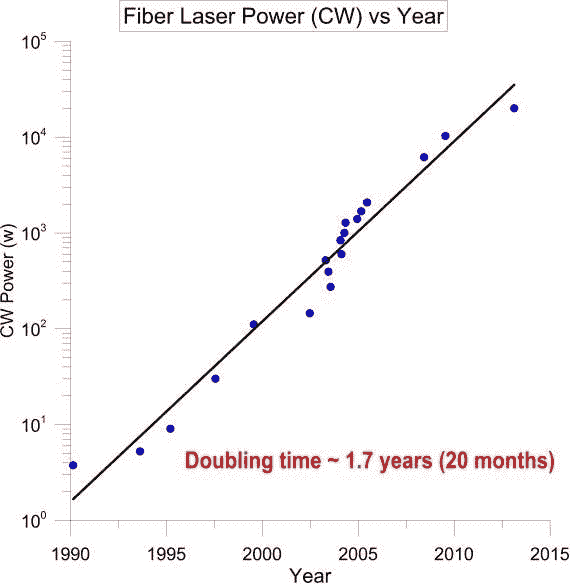

# 星际卫星飞行:小型化和直接成像

> 原文：<https://medium.com/swlh/interstellar-wafersat-flight-miniaturization-and-direct-imaging-8f2ef2cc7924>

受突破性 Starshot 倡议的启发，该倡议提出以 0.2 光速将 1 克级航天器发送到比邻星 b，我回顾了以现实速度加速物体的可行性，可扩展的激光功率阵列，以及使航天器设计小型化的 waferSAT 制造技术，特别关注有可能全面取代硅的新兴二维半导体。我还讨论了我们的数据带宽如何允许航天器将高分辨率图片发送回地球。如果带宽被证明是可以估计的，我们还讨论了无线电干涉测量法和过境光谱学，这两种方法已经在地球上实施，以研究大气和物种，但将在现场进行，具有更高的精度和分辨率。因为它们是机载计算过程，所以只需要很小的数据带宽。

# **星际飞行技术路线图**

我们在用传统化学材料加速质量方面所取得的成就，与我们在像 LHC 这样的设施中使用电磁材料所取得的成就有着深刻的区别。我们当然已经有能力让单个粒子以高度相对论性的速度运行，只是受限于光速的极限。另一方面，化学工艺通常只能为每个键提供几个 eV。为了达到相似的相对论速度，我们需要一个 GeV 键，这是化学材料所不能达到的。

因此，为了能够推动任何形式的星际飞行，我们需要重新定义我们传统的空间探测器概念。我们需要建造一个微型的全功能探测器，配备光子推进器、相机、处理器、电池、电源管理、保护涂层、光帆和发射器。但每个部件都需要从头开始重建，将整个探测器的重量推至克级，甚至更轻。

尽管这看起来非常荒诞和浪漫，激光功率、半导体晶体管、CMOS 阵列和光伏材料的进步在很大程度上遵循了“穆雷斯定律”的变体。英特尔的联合创始人戈登·摩尔(Gorden Moore)提出，密集集成电路中的晶体管数量大约每两年翻一番。因此，我们可以将更多的处理能力(随着晶体管数量的增加而增加)集成到一个更小的计算单元中，同时由于电阻更低而降低了功耗。我们看到了类似的趋势，单个激光器的功率在大约两年内翻了一番，每瓦特的激光功率成本在大约两年内减少了一半。

在下面的小节中，我将分析系统中每个重要组件的技术路线图。

# **激光相控阵作为光子驱动器**

该系统的关键在于建立光子驱动器的能力。光子驱动器是一个激光相控阵，它不需要开发一个非常大的激光器。我们用大量适中的(千瓦级)激光器取代它，消除了传统的光学元件。这是因为目前已有的千瓦级 Yb 光纤激光器和相控阵已经是成熟的技术

Figure 1: CW fiber lasers and Yb fiber laser amplifiers cost per watt with an inflation index corrected for inflation. Credit: Lubin, Philip. "A roadmap to interstellar flight." *arXiv preprint arXiv:1604.01356* (2016).

图 1 显示了基于当前 Yb 光纤放大器每挂图成本的光纤激光器成本。请注意，镱光纤放大器的成本几乎每 18 个月就减少一半。因此，与建造单个激光源相比，集中建造大型激光阵列是非常经济的。

用现代计算术语来说，这相当于现代并行计算，而不是单台超级计算机。

Figure 2: Continuous Wave fiber laser power over 25 years is also showing a ‘’Moore’s Law’’ like progression with a doubling time of about 20 months. Even though the proposed laser array use kilowatt-class laser as the cost is reduced in a similar fashion, we should leave the opportunity open for a higher power laser source (Lubin, 2016)

另一个明显的优势是，虽然单个大型激光源本质上无法同时为多个光帆物体供电。另一方面，相控阵技术是为多任务设计的。更不用说更少的维护成本。

小型阵列还可用于轨道碎片清除、远程激光通信、能量束、国际空间站防御空间碎片以及行星防御的备用系统，因此实际上在各个层面都有用途，资金可在多种用途中合理分摊。

# **晶圆级飞船**

## 硅片

Silicon-based Integrated Circuits on wafers are seen in our everyday computing devices. t

1999 年提出了硅卫星，将单晶硅晶片用于电子基板、机械结构、热控制和辐射屏蔽(Janson，S. W，1999)。Janson 将硅卫星的质量定义为毫微微卫星(1 到 1000 微克质量)和纳米卫星(1 克到 1 千克质量)。关键是使用半导体批量制造技术，这种技术可以生产低功耗的数字和模拟电路、硅基射频电路和微机电系统(MEMS)。

单晶硅比铝、不锈钢或钛更坚固，但密度较低。就强度密度比而言，硅比钛高一个数量级，比铝或不锈钢高得多。但是在热学上，硅可以被看作是一种易碎的金属。硅是一种优秀的热导体，这意味着我们将需要密集的热涂层和隔离，在另一边。

然而，非常重要的是要指出，几乎航天器电子系统的整个质量和体积都是由外壳、连接器、电路板和芯片载体等封装决定的。因此，我们使用多芯片模块将多个电连接的管芯放置在单个载体中，以减少浪费的空间并增加有源器件面积密度。通过将所有电子设备集成在一个硅片上，晶圆级集成可以更进一步。

但我们确实认识到，这个太空芯片项目还有很长的路要走。片上卫星的想法是由 A. Joshi 在 1994 年的一次采访中首次提出的，这个想法还没有在实验上实现。在进行空间芯片可行性研究的同时，还推出了一个 fermoto 卫星的快速 PCB 原型，以期指导空间芯片架构。

## 作为硅替代品的二维材料

## 由于硅的质量密度很大程度上是不变的，空间芯片或在一个小硅片上制造所有必要的电子设备的想法，本质上是减少硅的体积和封装重量。在晶片上，外壳、连接器和电路板的重量无关紧要，因为它们根本不存在于晶片上。

由于量子隧道 effect 效应，当硅基晶体管从源极到漏极的距离下降到大约 5nm 时，电压将从一侧泄漏到另一侧，从而妨碍正常功能。从硅制造技术的现状来看，这一基本的物理限制已经被大规模生产出来。2017 年三星旗舰手机都在用 10 纳米 CPU。英特尔和三星正在生产基于 7 纳米的架构，用于测试和优化目的。事实上，我们已经非常接近 5 纳米的极限了。

科学家和工程师非常积极地寻找硅的替代品。二维半导体是一种具有原子级厚度的天然半导体。2004 年，Geim Novselov 报道了新的半导体材料石墨烯，它是蜂窝晶格几何结构中的单层碳(Novoselov，Kostya S .，et al 2004)。众所周知，石墨烯具有非常高的电子迁移率，因此电子以电流的形式从石墨烯的一侧快速移动到另一侧。由于电子也携带声子，因此石墨烯具有极好的导热性。但是它没有绷带作为价带和导带之间的 difference。它们不能像硅一样直接使用。

过渡金属二硫族化物，或更普遍地称为 TMD，是另一类新兴的二维材料，类似于石墨烯，但其带隙取决于层数。单层 TMD 具有直接带隙，价带的最小点和导带的最大点位于相同的动量值。这种直接带隙正是我们用二维材料实现晶体管所需要的。

当作为异质结构堆叠在一起时，TMD 与石墨烯配合得非常好，找到了下一代电子和光电子器件。用于二维材料的 TFT(薄膜晶体管)类似于 FET(场 Effect 晶体管)是几乎所有半导体技术用户的中心设备。基于 MoS2 作为一种 TMD 的高性能二维 TFT 在室温下已经实现，具有高 on/off电流 rain 和高等效 TMD 所期望的电流饱和的特征。结合饱和速度和机械强度，TMD 对于低功率 TFT 非常有吸引力，这正是我们在 1 克级航天器上需要的。

TMD 作为超级电容器和锂离子电池等储能电极材料也越来越受到关注。电池设计是任何星际任务中最具挑战性的方面之一。突破性 Starshot 项目考虑储存钚-239 或镅-241 等放射性同位素材料。当该设备与星际介质相互作用时，电池将由纳米飞行器正面的热量供应充电。由于其原子级层状结构、高表面积和优异的电化学性能，TMD 层状结构为能量储存中的铁提供了更多的位置，同时在充电和放电循环期间保持了结构稳定性。事实上，石墨烯的表面积密度为 2630 平方米/克，是碳材料中最高的。

**轻帆**

传统的太阳能电池是一种光伏设备，带有覆盖大部分阳光光谱的绷带。然而，由于我们使用的是激光电源，我们需要一个针对单频光源优化的风帆。此外，由于计划是将一个大的激光阵列聚焦在一个非常小的阵列上，通量可以高达 100 毫瓦/米，这大约是 10⁵的太阳强度。所以设计这种 high-efficiency 轻型单频帆的方法应该完全是 different.此外，为了光子推进器的目的，高度期望高反射率。

传统上，人们在代谢玻璃上使用多层电介质来实现 99.999%的反射。这几乎是一个行业标准。我们调整反射率曲线，使其在激光波长处具有最大值。在使用小型反射镜的星际探测器的极限通量下，提出在超薄玻璃上镀纯介质反射膜。新陈代谢的子结构没有足够的反射性，所以热管理变成了

关键问题。如果我们去掉金属，改用全介质反射器，就可以避免热量积聚。

另一方面，一些研究人员正在使用反射率接近统一且吸收率可忽略不计的超材料单层(Slovick 等人，2013 年)。与布拉格反射器和光子带隙材料不同，它们需要多层才能实现高反射，这种超材料既具有高反射性，又具有亚波长厚度。他们开发了一种 0.45 微米厚的硅基超材料单层，垂直入射反射率超过 99.999%(尽管他们没有提到确切的重量)。

# **直接成像**

Proxima b, an exoplanet about four light years away from Earth as the closest exoplanet system from the solar system. This is the target system by Breakthrough Starshot Project

Ross 128 Exoplanet discovered Nov. 2018\. It is 11 light years away from Earth but the host star is an M red dwarf that has much less UV and X-ray radiation that would prevent any life form from living compared to the Proxima b system, making it a very promising exoplanet system to investigate.

TRAPPIST-1 system with seven known planets 37 light years away from Earth. The habitable zone in green color is plotted.

在模拟软件 Universal Sandbox 中，我们展示了三个潜在有趣的系外行星系统，将由我们的空间探测器进行研究。比邻星是我们最近的邻居，也是我们第一个目标系统最合理的选择。与此同时，我们应该为新观测到的系统留有机会，如 Ross 128，它从其宿主恒星接收到的紫外线和 x 射线辐射要少得多。

根据 Breakthrough Starshot 的说法，如果我们能够确保我们的探测器在大约 1AU 的距离内移动，并能够旋转机载相机指向行星，捕捉包括基本成分甚至表面特征的图像，并能够将图像压缩成数据流，通过机载激光阵列发送回地球，那就相当于在地球上拥有一个 300 公里的望远镜(这显然在经济上不可行)。

如果我们同时从地球向该系统发送数千艘飞船，很有可能多艘飞船会在距离目标行星 10-100 天文单位的范围内，那么我们就能做更多的事情。在系统中安装多个能够单独感知辐射的探测器将会确认恒星和行星的位置。使用计算机视觉，飞行器将拍摄一定数量的照片，亮度分析将通过交叉验证帮助飞行器实时准确地定位行星的位置。

**基于计算机视觉算法的干涉测量法**

在**事件视界望远镜**的努力的启发下，计算机视觉算法被用来填补全球黑洞望远镜数据的空白，并近似于一个 10，000 公里宽的天线，我们知道我们不必依赖于由一艘飞船捕捉和发送的一张照片。视界望远镜本质上是一个无线电干涉测量实验。无线电信号到达地球上相距甚远的两台望远镜的时间略有不同。可以从差异中提取视觉信息。但是由于大气的反射指数不仅不同于真空，而且在垂直方向上具有梯度，并且通常不是均匀分布的，所以这两个信号有时会被延迟，这不能很好地估计，从而影响计算。但是如果进行多次测量，它们中的每一个都可以与另一个配对，从而相互抵消

消除大气噪音。此外，考虑到相机的视野可能有多稀疏，我们需要这样一种算法，通过模糊彼此靠近的亮点来组合图像，或者简单地恢复图像的连续性。

在下图中，飞行参数包括 1 克晶片航天器和 1 米帆的数据速率。飞船在 10 分钟内达到 0.2 光速，需要 20 年才能到达目标系统。(卢宾，2016)。假设通信速率为具有 1 瓦短脉冲的 4 类驱动器阵列。在 4 光年，也就是 3.78e16m 远的地方，地球接收到的数据速率大约是每秒 0.65 k 比特。以这种速度，只需要一千秒就可以发送一张合理大小的图片。

Flight Parameters for 1 gram waferSat (Lubin, 2016).

谈到行星及其可居住性本身，这样一颗行星是否能够在其表面维持大气和液态水的问题是一个激烈辩论的问题(Anglada-Escude 等人，2016 年)。反对可居住性的最常见的论点是潮汐锁定、强恒星磁场、强耀斑以及高紫外线和 X 射线通量。但是这些证据都没有被证明是决定性的。

全球大气环流仍然可以让一个被潮汐锁定的星球维持大气。尽管比邻星 b 遭受的 X 射线辐射通量是地球上的 400 倍，但这不会成为一个大问题。直接成像可以以最明确的方式回答这些问题。

# **基于直接成像的渡越光谱**

对系外行星大气的第一次研究是通过凌日光谱学方法进行的，对凌日行星进行研究(D. Charbonneau 等人，2002 年)。但由于只有靠近其主星的行星才会留下更强的凌日信号，凌日光谱学研究中的行星往往属于遭受主星过多热量或辐射的行星类别。此外，由于光谱分辨率较低，这种方法只能对有限数量的光波长进行采样。如果我们可以用相对高分辨率的光谱仪直接瞄准系外行星，当我们比较行星凌日期间的观测和行星凌日之外的观测时，这将避免系外行星与主星的混淆。

但是由于系外行星的角度间隔非常小，行星和恒星亮度的差异非常大，这就是我们所说的用于系外行星大气研究的“直接成像”技术，它非常复杂。然而，如果任何飞船能够在行星附近，角间距将是非常明显的。我们可以看到行星和主星之间明显的亮度差异。因此，如果我们被证明对通信数据过于自信

率，我们可以使用直接成像技术对过境光谱进行原位研究。请注意，这将需要我们携带额外的自适应光学系统和足够的处理能力，以分离来自行星及其主恒星的近红外波长的光。

受这种方法的启发，我们也可以在船上进行单频分析。这将允许物种特异性分析，例如铁和钾，它们具有其特征峰值频率。如果我们的像素密度足够高，我们甚至可以对这些物种在目标星球上的分布进行空间或时间相关的研究。同样，我们非常希望在目标系统中同时出现来自不同位置的多个摄像机，这样我们就能够确认和交叉验证我们的结论。

# **参考文献**

安格拉达-埃斯库德，吉勒姆等人，“比邻星周围温带轨道上的类地行星候选。”*性质*536.7617(2016):437–440。

使用哈勃空间望远镜精细导航传感器 3 对比邻星和巴纳德星的干涉测量:对恒星伴星的探测极限。*天文杂志* 118.2 (1999): 1086。

超越石墨烯的二维材料的最新进展。(2015).

一个太阳系外行星大气的探测。天体物理学杂志 568.1 (2002): 377。

Demory，Brice-Olivier 等人，“哈勃太空望远镜搜寻地球质量的系外行星α Centauri B b 的凌日”*皇家天文学会月报*450.2(2015):2043–2051。

成像视界:一个超大质量黑洞的子 mm-VLBI。 *arXiv 预印本 arXiv:0906.3899* (2009)。

菲利普·卢宾。"星际飞行路线图." *arXiv 预印本 arXiv:1604.01356* (2016)。

用视界望远镜成像 M87 的超大质量黑洞阴影和喷流底部。《天体物理学报》 788.2 (2014): 120。

将更多元件塞进集成电路。IEEE 86.1(1998):82–85。

(2004 年)诺沃肖洛夫、盖姆、莫罗佐夫、江、张、杜博诺什、费索夫。原子级碳薄膜中的电场效应。*理科*， *306* (5696)，666–669。

詹森，齐格弗里德。"用于 21 世纪任务的可大量生产的硅宇宙飞船."*太空技术会议暨博览会*。1999.

史诗:用 E-ELT 对系外行星的直接成像。*地基和机载天文仪器 III* 。第 7735 卷。2010 年国际光学和光子学会。

太阳能光伏应用的二维分层半导体/石墨烯异质结构。*纳米级*6.21(2014):12682–12689。

完美的电介质-超材料反射器。*体检 B* 88.16 (2013): 165116。

王，，等，“二维过渡金属二硫族化合物电子学与光电子学”*自然纳米技术*7.11(2012):699–712。

# **致谢**

这是没有合作者的个人作品。我要特别感谢 Courtney Dressing 教授在 2017 年秋季在加州大学伯克利分校教授这门研究生天文学课程，感谢她在这篇论文的技术评论之外增加科学部分的建议。没有她的建议，这篇论文是不会完成的。我还要感谢天文系及其工作人员对课程运作的支持。