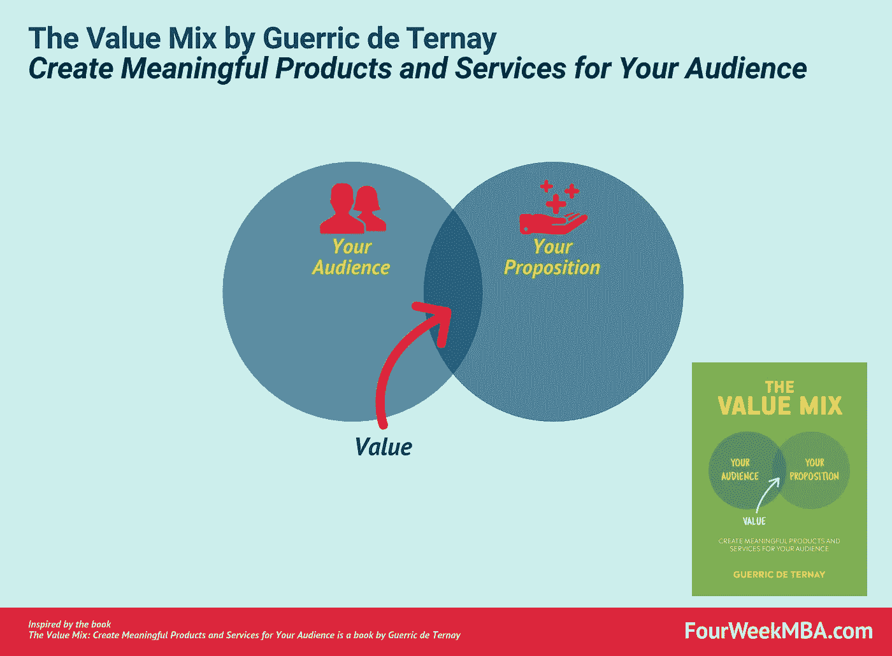

# 格瑞克·德·特尔奈价值主张设计访谈

> 原文：<https://medium.com/swlh/interview-to-guerric-de-ternay-on-value-proposition-design-d4ea9c98848a>

这些话题是任何商业和商业模式的基础。让我们开始吧！

**很高兴你能来参加这次采访！**

# 你介意告诉我们更多关于你是如何成为一名“商业设计师”的吗？

谢谢你邀请我，吉纳罗。

有必要解释一下“[商业设计师](https://fourweekmba.com/business-design/)是做什么的。这是使用设计方法创造新的价值主张或商业模式的工作。

这既包括**高层** [**战略**](https://fourweekmba.com/business-strategy/) (目的、愿景、[商业建模](https://fourweekmba.com/what-is-a-business-model/)、[财务规划](https://fourweekmba.com/financial-ratios/)、品牌定位等。)和**执行** [**战略**](https://fourweekmba.com/business-strategy/) (原型、客户体验、产品路线图、客户获取&留存等。).

所以[商业设计师](https://fourweekmba.com/business-design/)都是相当通才的。他们需要掌握金融、设计和营销方面的各种商业工具和框架，还必须了解行业知识。

一般来说，商业设计师是企业家、产品经理或创新顾问，也是真正好奇的人。

我的建议是寻找机会建立对商业和产品设计的广泛理解。

就我而言，我专注于许多不同的技能:

*   **编程**和**平面设计**十几岁的时候开了一家数码[营销](https://fourweekmba.com/market-segmentation/)代理公司。
*   我去法学院学习法律。
*   **商业**和**管理**我在伦敦商学院读书的时候。
*   **销售**、[、**营销**、**运营**通过运营两个可持续发展的时尚品牌——](https://fourweekmba.com/market-segmentation/)[GoudronBlanc](https://goudronblanc.com/en/)和 [Blackwood](https://goblackwood.co.uk/) 。
*   作为*的创新顾问，我把所有的东西都放在一起？如果呢！*。

我见过的大多数符合“[商业设计师](https://fourweekmba.com/business-design/)”定义的人都对他们所做的事情充满热情，善于反思，但也积极主动——他们毫不犹豫地弄脏自己的手。

# 在商业中，我们都在谈论价值和价值主张，你认为什么是好的价值定义？

商业价值有两种定义:

1.  公司对股东的价值
2.  从客户的角度看产品或服务的价值——[价值主张](https://fourweekmba.com/value-proposition-canvas/)。

从为你的客户创造价值的意义上来说，价值是一个感知的问题。

这里有一个很好的价值定义:

> *顾客从购买、使用或消费特定产品或服务中获得的利益与可获得的替代品相比的感知。*

当人们相信一种产品或服务会为他们创造价值时，他们就会购买并使用这种产品或服务，也就是说，这种产品或服务会比所有其他可供选择的产品或服务更好。

# 在你的书《价值组合》中，你将价值分解为一个受众与一个命题的相遇。你将如何为我们的观众分解这个矩阵？

是的。[值](https://fourweekmba.com/value-proposition-canvas/)是两个东西的组合:

1.  你的[目标受众](https://fourweekmba.com/market-segmentation/)需要什么*和*想要什么
2.  你向市场提供什么来帮助你的受众满足他们的需求和欲望——这就是你的主张。

我喜欢使用这些词——“受众”和“主张”——因为它们超越了“客户”和“产品”的概念

**受众**包括客户、用户和拥护者(可能永远不会购买或使用你的提议，但会影响他人决策的人)。

一个**提议**就是你向你的观众提议/提供*。它不仅仅是一个产品。这也是购买和使用你所销售的东西的所有经验。*

**在打造产品或服务的过程中，环境有多重要？**

背景对于为客户创造[价值](https://fourweekmba.com/value-proposition-canvas/)至关重要。当你建立一个新的价值主张时，这是最有用的设计概念之一。

原因？

背景会影响你的观众对事物投入多少价值。它决定了他们买什么以及愿意为此支付多少钱。

如果雨下得很大，我在去开会的路上在商业区，我会立即考虑买一把伞或者叫一辆出租车。

如果我有一家花店，我想知道我的顾客的结婚纪念日是什么时候。丈夫更有可能在那一天买花。作为花商，我可以帮助她们成为体贴的丈夫。

# 一个企业家应该问什么问题来建立一个成功的企业？

企业家和产品经理的工作资源有限。为了设计和实施成功企业的战略，他们必须做出艰难的选择。

我在伦敦商学院(London Business School)的一位教授科斯塔斯·马基德斯(Costas Markides)用三个简单的问题总结了商业模式的结构:

正如他所解释的，一个[战略](https://fourweekmba.com/business-strategy/)是关于在三个方面做出艰难的选择:

1.  谁=您将关注的客户*和*您将有意识地不瞄准的客户；
2.  什么=您将提供的产品*和*您不会提供的产品；
3.  How =您将执行的活动*和*您将不执行的活动。

# 除了你的书《价值组合》,你还会向企业家推荐什么商业书籍？

很难回答的问题，根纳罗。

我相信任何一本商业书籍的目标都是帮助你进步。

对特定的人来说，最好的商业书籍将取决于他们的情况和他们面临的挑战。例如，我为企业家和产品经理写了《价值组合》,他们面临着创造或改进价值主张的挑战。

话虽如此，但有一本书我经常推荐给高管:《深度工作》(Deep Work)。

分心和肤浅的工作是任何商人面临的两个最大挑战。深度工作令人大开眼界，并提供了一些关于如何更专注于做重要工作的想法。

在我的时事通讯中，我分享了更多关于这本书的想法。

# 你最喜欢的商业作家是谁(如果有的话)？

赛斯·戈丁的作品，尤其是他的博客，给了我很多启发。我经常认为他在沟通商业思维和诗歌方面做得很好。

我也很喜欢弗莱德·威尔森的名为 avc.com 的每日博客和罗里·萨瑟兰为《观察家》写的文章。

# 在商业模式创新方面，你最追随的人是谁？

谈到商业模式创新，最重要的是*观察*。因此，比起追随商业思想家，我更喜欢不断地让自己沉浸在新的刺激中。

**这是关于观察顾客的。例如，当我旅行时，我总是乘坐公共交通工具，去超市，并承诺花大量的时间与当地人交谈。**

了解人们的生活——人们正在努力做什么，他们购买和使用什么东西，以及为什么购买这些东西——是灵感的巨大来源。

**而且是关于观察其他业务和新技术**。您还需要了解可以利用哪些资源为客户创造价值。

对于这一点，我和行业专家聊天，听那些特定产品的倡导者，也经常自己尝试新产品。

一个[价值主张](https://fourweekmba.com/value-proposition-canvas/)是任何[商业模式](https://fourweekmba.com/what-is-a-business-model/)的基础。要做好这件事，首先就意味着要做生意！这就是为什么我建议你深入[价值组合](https://guerric.co.uk/the-value-mix/)的原因，因为你会找到许多资源来构建你的业务基础！

*原载于 2019 年 3 月 8 日*[*fourweekmba.com*](https://fourweekmba.com/value-proposition-design/)*。*

## 这篇文章发表在 [The Startup](https://medium.com/swlh) 上，这是 Medium 最大的创业刊物，拥有+435，678 名读者。

## 在这里订阅接收[我们的头条新闻](https://growthsupply.com/the-startup-newsletter/)。

