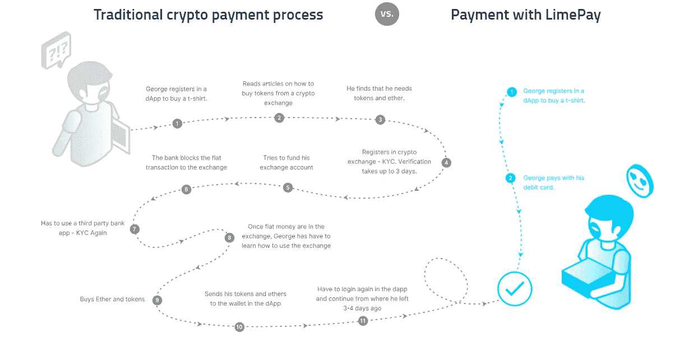
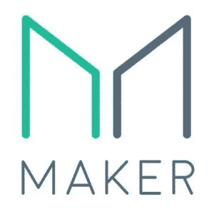

# 引入商业区块链应用的新时代

> 原文：<https://medium.com/swlh/introducing-the-new-era-of-business-enabled-blockchain-applications-4a09576c0f58>

与真正的区块链创新者和社区建设者一对一。

[Joshua Earle](https://unsplash.com/photos/ICE__bo2Vws?utm_source=unsplash&utm_medium=referral&utm_content=creditCopyText) on [Unsplash](https://unsplash.com/search/photos/beginning?utm_source=unsplash&utm_medium=referral&utm_content=creditCopyText)

鉴于区块链技术和创新的现状，你可能会认为现在用你的 dApp 接受菲亚特支付应该很容易。

这只是:它仍然不是…采用和实用性尚未完全实现。

尽管目前的情况即将改变。就现在。

有一个新的孩子正在为我们所有的未来学家和整个加密协会提供一个非常需要的，易于使用的解决方案。

你怎么问？坐下来，放松，拿一杯你最喜欢的饮料，一份健康的小吃，和我一起去看谁，什么和怎样。

# 输入 LimeChain。

And yes, the office is green too. They even have a mini golf course. Scout’s honor.

那么，呃…这些人是谁？ [**LimeChain**](https://limechain.tech/) **是一家总部位于索非亚的区块链咨询和开发公司。**默认的创新者和来电的 Limes，他们是让我们的日常生活变得更轻松的行业先驱。考虑到你是区块链的信徒。

构建 **B2B 区块链解决方案以推动增长和效率**只是 LimeChain 的一个方面。这些人也是很有社会意识的一群人。我甚至不记得在我们的对话中听到过多少次“社区建设和意识”。他们确实理解区块链作为一种社会现象的优点。

不，这不仅仅是一些普通的玩笑。他们以身作则——或者换句话说，通过**组织定期聚会来帮助教育各种爱好者**(企业、开发者、学生，实际上任何感兴趣的人)关于区块链的能力。

他们的工作在科技领域产生了显著的连锁反应。他们处于整个区块链家族的核心。真的。

上周，我有幸见到了莱姆夫妇，并更详细地了解了他们。尽管他们令人惊叹，但他们向我展示了他们最新项目的内幕。在几个月的工作和二月初的发布中，它真的是另一回事…

就像他们的咖啡一样。

# 什么是 LimePay，它是如何工作的？

通俗地说，就是 ***一种支付解决方案，使区块链应用(或 dApps)能够接受像信用卡、借记卡这样的一种传统支付手段。***

为了更简单的解释和更好的说明，让我们假设我们有一个在线商店，销售使用区块链增强可追溯性、透明度和本地令牌工作的超级 t 恤。

在这个例子中，乔治想买一件 t 恤衫。George 不是区块链用户，对 dApps、钱包、购买/出售代币的工作原理了解有限。从我们的谈话来看，我认为乔治是莱姆里的一个内部笑话。

[LimeChain’s website](https://limechain.tech/wp-content/uploads/2019/01/limepay.png)

在左边，灰色的是乔治为了得到他喜欢的 t 恤必须要做的步骤。通过购买代币、研究钱包和学习如何进行交易，获得 KYC 的整个过程可能需要几天到几周的时间。从本质上来说，这不是一个对顾客友好的体验，尤其是考虑到他可以在另一家出售类似 t 恤的在线商店做同样的事情。

在右边的蓝色部分，你可以看到当在线商店集成了 LimePay 时，用户的流程是什么样的。这是一种网上购物的好感觉，没有额外的复杂性，没有学习曲线，也没有等待。

# 为什么要整合 LimePay？

LimePay 的主要价值主张在于增加企业的支付选项能力。它支持接受信用卡和借记卡等传统支付方式。这无疑是对当前 dApp 支付生态系统的突破。

目前，dApps 仅限于精通加密的用户，他们只占整个市场的一小部分。LimePay 帮助克服这一挑战，向更广泛的受众提供产品和服务。这就像有了一个正常的电商，app 或者平台但是有了区块链层的附加值。

***正在去加密的路上！***

## LimePay 上线运营了吗？

是的，当然。LimePay 于 2 月 5 日上线并全面运行。事实上，第一批客户已经启动并运行，越来越多的人蜂拥而至，希望看到使用它的实际好处。Limes 收到了各种关于可能纳入现有支付流程的询问

## 马克道支持

[LimeChain’s website](https://limechain.tech/wp-content/uploads/2019/01/makerdao-300x300.jpg)

LimePay 的模型得到了戴 stable coin T5 的创造者 MakerDAO 的进一步验证。Maker 的人决定通过他们的投资部门支持 LimePay。与区块链中这样一个家喻户晓的名字合作，是对产品质量和 LimePay 服务的明确认可。

莱姆夫妇对与马克一起工作的兴奋是无与伦比的。每当提到合作，他们都会情不自禁地咧嘴一笑。啊，看到人们带着共同的宏伟愿景一起工作，那种纯粹的快乐。

## 好奇想知道更多？

可以通过 hi@limepay.io 直接联系莱姆，或者通过他们在[http://limepay.io/](http://limepay.io/)的在线表格联系莱姆。如果你碰巧在索菲亚附近，不妨去他们的办公室拜访一下。我肯定会受到热烈的欢迎！

或者，如果你对我个人对他们产品的看法感兴趣，你也可以联系我。我很容易被发现定期潜伏在 LinkedIn 的附近。我将非常乐意分享我对 LimePay、他们的业务和整体文化的了解。

via [giphy](https://media.giphy.com/media/l2R0eYcNq9rJUsVAA/giphy.gif)

## 这篇文章发表在[《创业](https://medium.com/swlh)》上，这是 Medium 最大的创业刊物，有+422，678 人关注。

## 订阅接收[我们的头条新闻](https://growthsupply.com/the-startup-newsletter/)。

