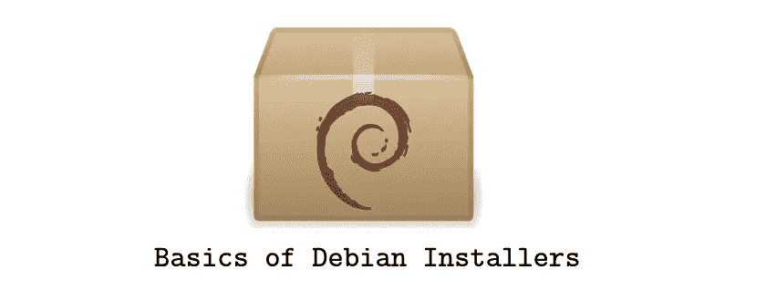

# Debian Maintainer 脚本流程图简介

> 原文：<https://medium.com/swlh/introduction-to-debian-maintainer-script-flow-charts-6f76423b80d9>

## Debian | Ubuntu |开源|安装程序

## debian 软件包安装基础

Debian 成为如此顶尖发行版的原因之一是它的包系统。虽然已经有大量的 Debian 格式的软件，但有时你需要安装不适合你的软件…