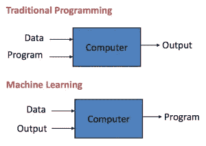
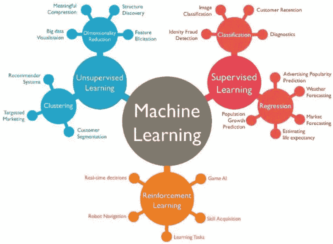
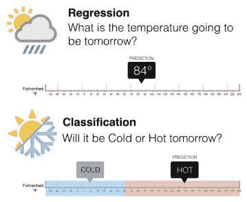
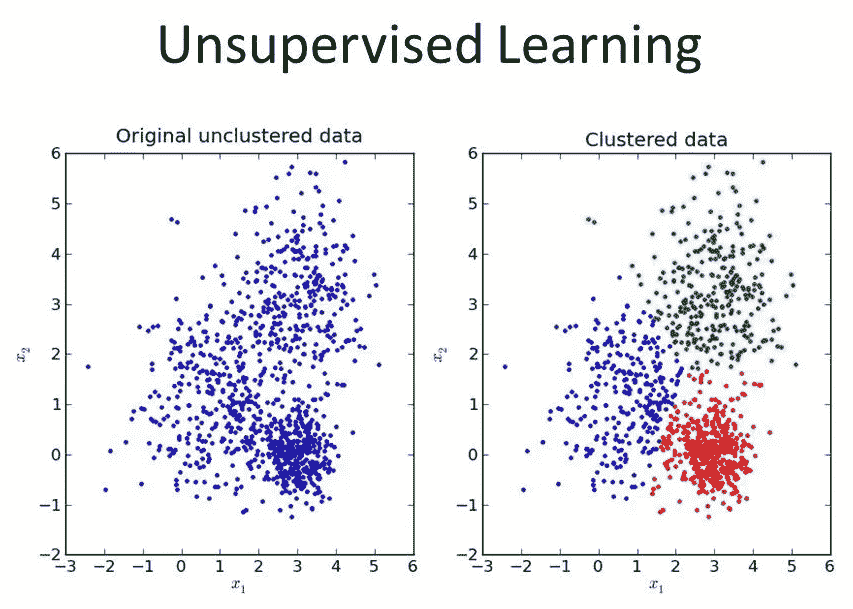
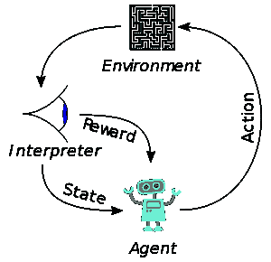
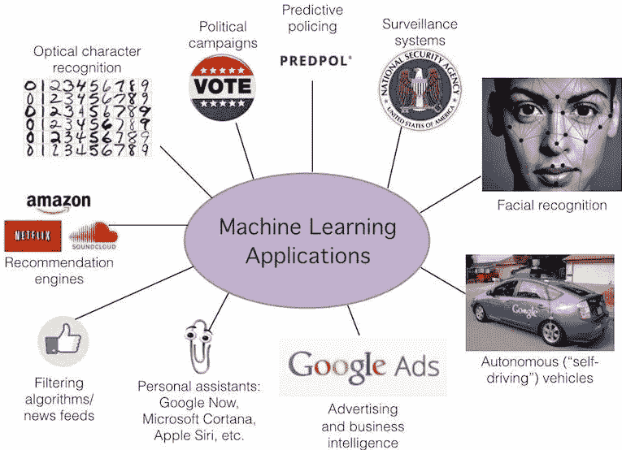

# 机器学习导论🤖

> 原文：<https://medium.com/swlh/introduction-to-machine-learning-different-types-of-machine-learning-algorithms-f710bb81f5ce>

## 不同类型的机器学习算法

Photo by [Arseny Togulev](https://unsplash.com/@tetrakiss?utm_source=unsplash&utm_medium=referral&utm_content=creditCopyText) on [Unsplash](https://unsplash.com/s/photos/machine-learning?utm_source=unsplash&utm_medium=referral&utm_content=creditCopyText)

在过去的几年里，机器学习确实是软件行业的热门话题，但是到底什么是机器学习，为什么你应该关心它，请继续阅读博客寻找答案。

# **什么是机器学习？**

机器学习是人工智能的一个子领域。它的目标是让计算机能够**自主学习**。

机器的学习算法使它能够**识别观察到的数据中的模式**，**建立解释世界的模型**，以及**在没有明确的预编程规则和模型的情况下预测事物**。

Traditional Programming vs Machine Learning

机器学习这个术语是由美国计算机游戏和人工智能领域的先驱亚瑟·塞缪尔于 1959 年创造的，他说

> *“它赋予计算机无需明确编程就能学习的能力”。*

1997 年，**汤姆·米切尔**给出了一个“适定”的数学和关系定义

> *“如果由 P 测量的计算机程序在 T 上的性能随着经验 E 而提高，则称该计算机程序从关于某个任务 T 和某个性能测量 P 的经验 E 中学习。”*

# **不同类型的机器学习:-**

1.  监督学习。
2.  无监督学习。
3.  强化学习。

Machine Learning Types

## **1。监督学习:-**

在监督学习中，我们得到一个数据集，并且**已经知道我们的正确输出**应该是什么样子，知道输入和输出之间有关系。

# **两种监督学习:-**

1.  **回归** —估计连续值(实值输出)
2.  **分类** —识别唯一的类别(离散值、布尔或类别)

## **1.1 回归:-**

**回归**基于独立变量对目标预测值建模。主要用于找出变量和**预测**之间的**关系。回归可用于估计/预测**连续值**(实值输出)。**

例如 **:** 给定一个人的照片，我们要根据给定的照片来预测年龄。

## **1.2 分类:-**

**分类**是指将**组**的输出分成一类。如果数据集是**离散的**或**分类的**，那么这就是一个分类问题。

例如 **:** 给定关于房地产市场中房屋大小的数据，使我们的输出关于房屋“比要价高还是低**的价格”，即将房屋分为两个独立的类别。**

Regression vs Classification

## **2。无监督学习:-**

它允许我们在对结果一无所知的情况下解决问题。我们可以**从数据中推导出结构**，而我们不一定知道变量的影响。

我们可以通过基于数据中变量之间的关系对数据进行**聚类**来得到这种结构。

**2.1。聚类:-**

C **聚类**的任务是将一组对象分组，使得同一组中的对象(称为**簇**)比其他组(簇)中的对象彼此更相似(在某种意义上)。

例如:收集 1，000，000 个不同的基因，并找到一种方法将这些基因自动分组为**组，这些组在某种程度上类似**或通过不同的变量相关，如寿命、位置、角色等。

Unsupervised Learning

## **3。强化学习:-**

强化学习是指在特定情况下采取适当的行动来最大化回报。它被各种软件和机器用来寻找在特定情况下的最佳可能行为或路径。

Reinforcement Learning

强化学习与监督学习的不同之处在于，在监督学习中，训练数据带有答案密钥，因此模型是用正确的答案本身来训练的，而在强化学习中，**没有答案**并且**强化代理**决定做什么来执行给定的任务。在没有训练数据集的情况下，它必然**从它的经验**中学习。

# **机器学习的应用:-**

1.  虚拟个人助理。
2.  通勤时的预测。
3.  视频监控。
4.  社交媒体服务。
5.  垃圾邮件和恶意软件过滤。
6.  在线客户支持。
7.  搜索引擎结果提炼。
8.  产品推荐。
9.  在线欺诈检测。

Some applications of Machine Learning