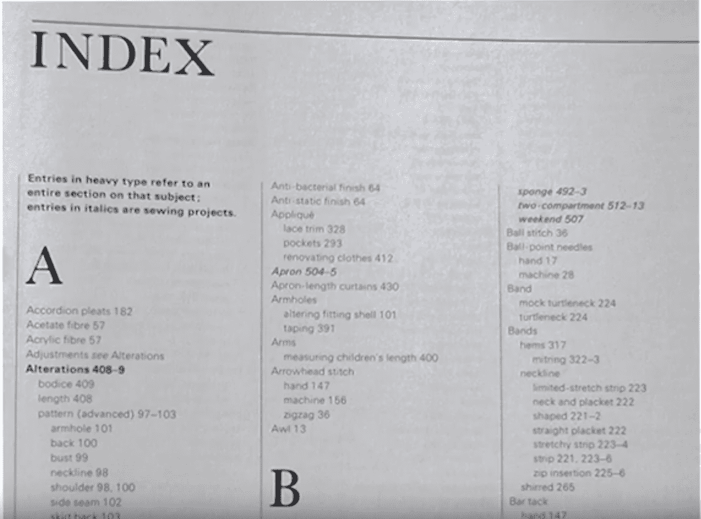

# MongoDB 索引简介

> 原文：<https://medium.com/swlh/introduction-to-mongodb-indexes-cdb216f54f80>

什么是 MongoDB 索引？它们是如何工作的？

> 索引试图解决什么问题？
> **答:慢查询**

我们可以将 MongoDB collection 的索引视为图书索引。

**集合扫描** 如果我们查询集合时不使用索引，数据库将不得不查看每一个文档。我们的…