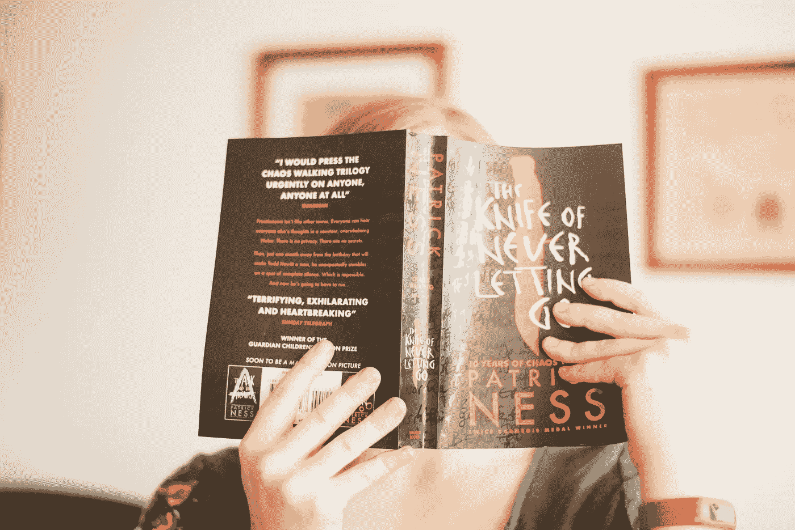

# 从去年尝试阅读 100 本书中学到的宝贵经验

> 原文：<https://medium.com/swlh/invaluable-lessons-learned-from-trying-to-read-100-books-last-year-b07443b803e3>

[Sophie Elvis](https://unsplash.com/@thetechnomaid) [@thetechnomaid](https://unsplash.com/@thetechnomaid) via Unsplash

## 页面中没有找到真正的值

2017 年 11 月下旬，我最大的孩子被分配给八年级英语课朗读哈柏·李的《杀死一只知更鸟》。我以前从来没有花时间去读这本经典的书，但我一直想读。