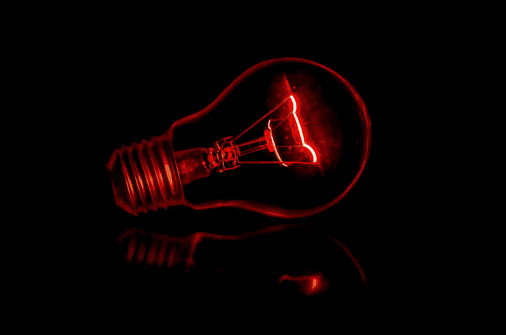

# 红外线桑拿和 5G:比较电磁辐射

> 原文：<https://medium.com/swlh/ir-saunas-and-5g-comparing-emf-exposure-2451166bf6d8>

## 两者都是辐射形式，因此都是 EMF 暴露源。这种比较的结果是违反直觉的，也是耐人寻味的。

Photo by Terry Vlisidis on Unsplash

由于声称的治疗益处，通过红外(IR)桑拿的治疗正在增加。因此，有越来越多的出版物和文章(如[这](https://draxe.com/infrared-sauna/)……