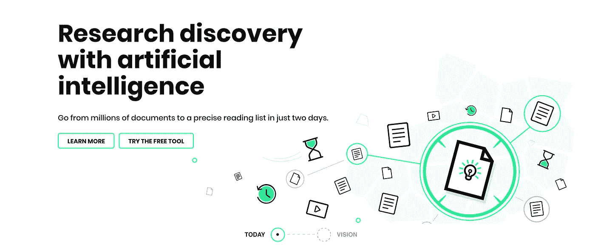

# 艾瑞斯。AI 你的科学助手

> 原文：<https://medium.com/swlh/iris-ai-your-science-assistant-60eefd3628ab>

Picture is a screenshot from [Iris website](https://iris.ai) 18th of June 2019

## 用人工智能研究发现和开放科学

如果科学研究可以越来越好呢？当然更好是很难定义的。或许更准确的说法是不同，因为科学研究在某种程度上已经被封闭在付费墙后面，只对那些有能力进入的人开放(富裕的大学和 R&D)。的…