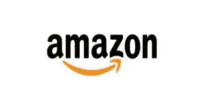

# 亚马逊是不是像 1985 年左右的伯克希尔哈撒韦？—价值股票指南

> 原文：<https://medium.com/swlh/is-amazon-like-berkshire-hathaway-circa-1985-value-stock-guide-7d021b673141>

我在 Quora 上回答过这个问题，[这里](https://www.quora.com/Is-Amazon-like-Berskshire-Hathaway-circa-1985-Already-having-grown-incredibly-and-likely-to-continue-to-grow-dramatically-From-my-perspective-it-appears-unstoppable-am-I-wrong-or-right/answer/Shailesh-Kumar-152)。

# 这个问题

> *亚马逊是不是像 1985 年左右的 Berskshire Hathaway？已经有了令人难以置信的增长，并可能继续大幅增长？从我的角度来看，这似乎是不可阻挡的…我错了还是对了？*

# 我的回应

我认为你的问题可以归结为

亚马逊能变成像伯克希尔·哈撒韦一样管理良好的企业集团[吗？](https://valuestockguide.com/all/6-public-companies-similar-to-warren-buffetts-berkshire-hathaway/)

这个问题我直接不知道答案。这需要一个水晶球。我能做的是提供一些观点，从他们的观点我们可以做出有根据的猜测。

# 联合大企业很难维持

曾经有一段时间，企业集团很受欢迎。想想通用电气、泰科等公司。经营一家企业集团的诀窍是找到一种创造额外价值的方式，而不仅仅是各部分的总和。1+1 确实需要大于 2，否则集团结构与独立公司相比没有优势。一般来说，在企业集团破坏价值的地方，现在有资金充足的激进投资者推动公司分裂成几个组成部分，从而释放价值。

通用电气在杰克韦尔奇时代因其卓越的管理创造了额外的价值。泰科经营良好，尽管表面上看，它的很多价值创造都是基于它的税务注册地。

伯克希尔·哈撒韦是一个特例，因为它是作为一个业务组合来运营的，高层管理者是优秀的资本配置者。他们有优秀的企业，但这不是优势所在。这些业务本身也会很出色(在伯克希尔·哈撒韦收购它们之前也很出色)。巴菲特和芒格明智地认识到他们的优势所在，他们不再插手这些业务。

# 亚马逊进行收购，但主要还是零售业务

如果你看看亚马逊网站的页脚，他们列出了这些年来他们收购的所有不同的公司。其中包括各种不同的业务，如 http://zappos.com、http://diapers.com、T2 和 Goodreads。虽然所有这些企业都有不同的产品或服务，但你会注意到它们都非常专注于零售。

是的，我知道云及其他与技术相关的产品/服务。他们可能也会向其他人提供物流和配送服务(例如 Prime Air)，但他们已经建立或正在开发的几乎所有东西都会继续推进他们的单一目标，即成为世界上最大的购物目的地。

他们找到了自己的重点，并坚持了多年。

华盛顿邮报不是亚马逊的一部分。蓝色起源不属于亚马逊。他们未来能整合进亚马逊吗？也许是，但最有可能不是。似乎没有任何有用的理由这样做。

因此，我不认为亚马逊会成长为伯克希尔·哈撒韦那样的企业集团。所以你的问题的答案是否定的。

*但是等等！还有更多……*

# 亚马逊和伯克希尔·哈撒韦有一点是相同的。

两家公司都极大地优化了自己的核心优势。

伯克希尔·哈撒韦公司在

1.  发现具有深度竞争优势的大企业，并收购它们
2.  [在投资组合公司之间智能地分配资本](https://valuestockguide.com/valueinvesting/james-holzhauer-jeopardy-optimal-capital-allocation/)，并且，
3.  让经理们做他们最擅长的事情——经营他们的业务，以实现长期价值最大化(不仅仅是下一个季度)。今天的大多数企业，如果是上市公司，都是以短期季度为周期运营的。他们必须向华尔街报告。伯克希尔·哈撒韦公司消除了这种压力，允许其公司从事长期战略增长

亚马逊做了一项了不起的工作

1.  发现很好的免费收购，并将其整合到零售渠道中
2.  坚持不懈地测试和优化购买周期的每个部分，
3.  众所周知，他们可以容忍多年亏损，因为他们在十年或更长时间内执行他们的长期战略

# 结论:亚马逊和伯克希尔·哈撒韦是两家非常不同的公司，在某些方面非常相似

那么，亚马逊会成长为下一个伯克希尔·哈撒韦吗？

我不这么认为。

但它或许能够为股东创造远超伯克希尔·哈撒韦的财富，原因有几个

1.  伯克希尔·哈撒韦公司的核心优势在于两个人——巴菲特和芒格。在他们之后，很难看到优势继续存在。这两个投资门生做得很好，但可以说没有表现出巴菲特和芒格一样的气质和技巧。在接下来的 20 年里，我完全预计伯克希尔·哈撒韦将被拆分成许多不同的公司
2.  另一方面，亚马逊已经建立了系统、流程和优化文化，可以在贝佐斯结束工作后持续很长时间。增长是有限度的，反垄断问题会比伯克希尔更困扰亚马逊。但我认为它可以在这些水域航行。

希望这有助于增加一些观点，并在几个不同的层面上回答这个问题。

有问题想问我吗？[在 Quora 上关注我，问我任何与投资相关的问题](https://www.quora.com/profile/Shailesh-Kumar-152)

*原载于 2019 年 5 月 23 日*[*【https://valuestockguide.com*](https://valuestockguide.com/questions/amazon-berkshire-hathaway/)*。*