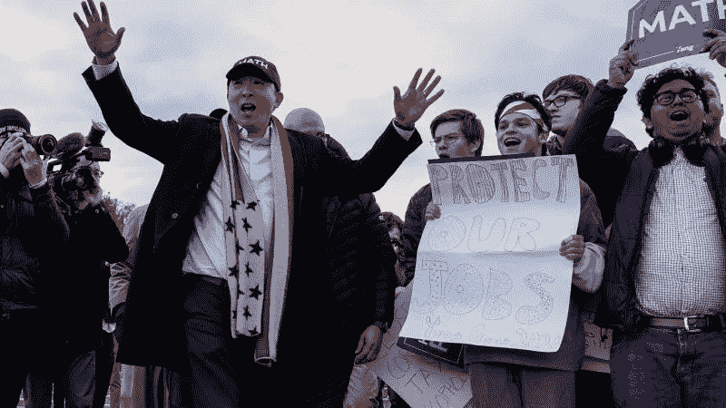

# 杨安泽的全民基本收入提案是个好主意吗？

> 原文：<https://medium.com/swlh/is-andrew-yangs-universal-basic-income-proposal-a-good-idea-2d0104ff9ea7>

Photo credit: Reason.com

**杨安泽&自由红利**

随着我们越来越接近 2020 年 11 月，即将到来的总统选举将成为传统和社交媒体以及全国各地饮水机旁的中心舞台。大部分的闲聊将会是谣言、指责的杂音，偶尔还会有严肃的政策辩论。