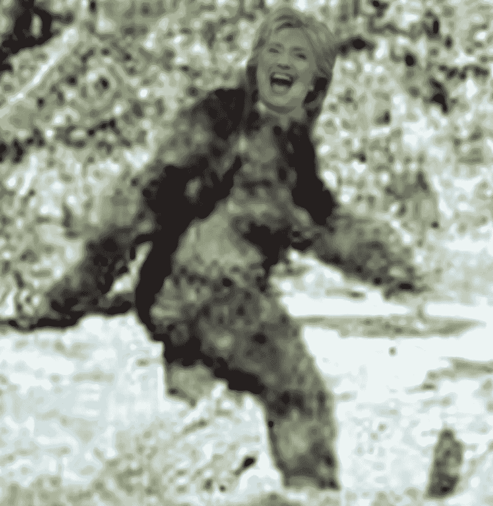
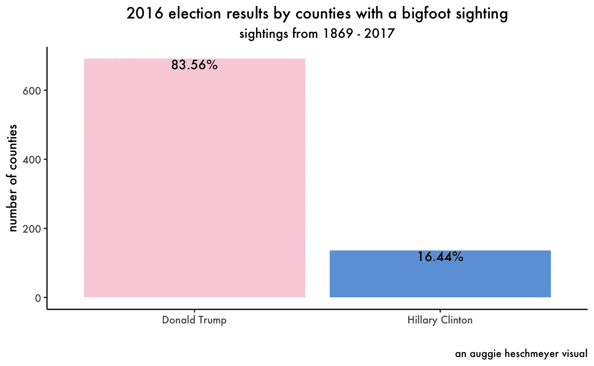
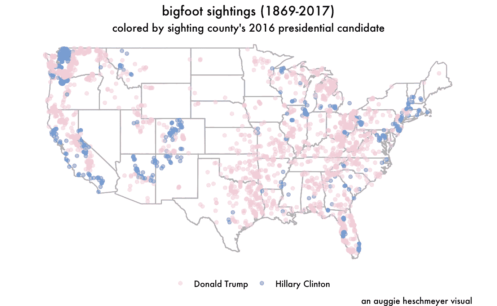

# 大脚是共和党人吗？

> 原文：<https://medium.com/swlh/is-bigfoot-a-republican-812020ad8677>



Haters gonna say it’s Photoshop.

我最近偶然发现了一个数据集，其中包含了从 1867 年到 2017 年的所有大脚怪目击事件。很自然地，我开始思考这些数据所包含的政治含义。毕竟，联邦调查局刚刚透露，他们自 20 世纪 70 年代以来一直在调查大脚怪。所以如果政府感兴趣，肯定有政治原因。比如大脚怪是共和党的暗金捐赠者！

好吧，玩笑和阴谋论放在一边，我确实认为看到大脚是否与上次总统选举的结果一致会很有趣。这让我想到了这篇文章标题中半开玩笑的问题。请允许我带你简单对比一下 2016 年总统大选的结果和历史上的大脚怪目击事件，看看我们是否无法回答我们一直偷偷摸摸的问题:*大脚怪是共和党人吗？*

我们开始吧！

# 1.0 导入数据

```
# Loading in our packages
 lapply(c(“tidyverse”, “openintro”, “usmap”),
 library,
 character.only = TRUE)

# Loading in our datasets
 elec_results <- read_csv(“/Users/auggieheschmeyer/Documents/Miscellaneous/R Practice/Bigfoot:Election Results/pres16results.csv”)
 bigfoot <- read_csv(“/Users/auggieheschmeyer/Documents/Miscellaneous/R Practice/Bigfoot:Election Results/bfro_reports_geocoded.csv”)

# Setting up some extra elements
 auggie_pink <- ‘#ffd1dc’
 auggie_blue <- ‘#5fa1e1’
 usa <- map_data(“usa”)
 states = map_data(‘state’)
```

为了总结上面的代码，我加载了一些最终将有助于在地图上绘制大脚怪的包，前面提到的数据集和一些将有助于将事情联系在一起的额外元素。

# 2.0 探索数据

```
glimpse(elec_results)## Observations: 18,475
 ## Variables: 9
 ## $ county <chr> NA, NA, NA, NA, NA, NA, NA, NA, NA, NA, NA, NA, NA, …
 ## $ fips <chr> “US”, “US”, “US”, “US”, “US”, “US”, “US”, “US”, “US”…
 ## $ cand <chr> “Donald Trump”, “Hillary Clinton”, “Gary Johnson”, “…
 ## $ st <chr> “US”, “US”, “US”, “US”, “US”, “US”, “US”, “US”, “US”…
 ## $ pct_report <dbl> 0.9951, 0.9951, 0.9951, 0.9951, 0.9951, 0.9951, 0.99…
 ## $ votes <dbl> 60350241, 60981118, 4164589, 1255968, 451636, 180877…
 ## $ total_votes <dbl> 127592176, 127592176, 127592176, 127592176, 12759217…
 ## $ pct <dbl> 4.729933e-01, 4.779378e-01, 3.263985e-02, 9.843613e-…
 ## $ lead <chr> “Donald Trump”, “Donald Trump”, “Donald Trump”, “Don…unique(elec_results$cand)## [1] “Donald Trump” “Hillary Clinton” 
 ## [3] “Gary Johnson” “Jill Stein” 
 ## [5] “Evan McMullin” “Darrell Castle” 
 ## [7] “Gloria La Riva” “Rocky De La Fuente” 
 ## [9] “None of these candidates” “Richard Duncan” 
 ## [11] “Dan Vacek” “Alyson Kennedy” 
 ## [13] “Mike Smith” “Chris Keniston” 
 ## [15] “Lynn Kahn” “Jim Hedges” 
 ## [17] “Monica Moorehead” “Peter Skewes” 
 ## [19] “Emidio Soltysik” “Scott Copeland” 
 ## [21] “Tom Hoefling” “Rocky Giordani” 
 ## [23] “Laurence Kotlikoff” “Kyle Kopitke” 
 ## [25] “Joseph Maldonado” “Michael Maturen” 
 ## [27] “Princess Jacob” “Ryan Scott” 
 ## [29] “Rod Silva” “Jerry White” 
 ## [31] “Bradford Lyttle” “Frank Atwood” 
 ## [33] NAglimpse(bigfoot)## Observations: 4,586
 ## Variables: 27
 ## $ observed <chr> “Ed L. was salmon fishing with a companion in…
 ## $ location_details <chr> “East side of Prince William Sound”, “I would…
 ## $ county <chr> “Valdez-Chitina-Whittier County”, “York Count…
 ## $ state <chr> “Alaska”, “Pennsylvania”, “Oregon”, “Oklahoma…
 ## $ title <chr> NA, NA, NA, “Report 9765: Motorist and childr…
 ## $ latitude <dbl> NA, NA, NA, 35.30110, 39.38745, 43.27314, 39.…
 ## $ longitude <dbl> NA, NA, NA, -99.17020, -81.67339, -76.89331, …
 ## $ date <date> NA, NA, NA, 1973–09–28, 1971–08–01, 2003–09-…
 ## $ number <dbl> 1261, 8000, 703, 9765, 4983, 26566, 5692, 438…
 ## $ classification <chr> “Class A”, “Class B”, “Class B”, “Class A”, “…
 ## $ geohash <chr> NA, NA, NA, “9y32z667yc”, “dpjbj6r280”, “dr9q…
 ## $ temperature_high <dbl> NA, NA, NA, 72.55, 76.32, 67.62, 88.56, NA, 7…
 ## $ temperature_mid <dbl> NA, NA, NA, 63.225, 70.440, 58.160, 70.220, N…
 ## $ temperature_low <dbl> NA, NA, NA, 53.90, 64.56, 48.70, 51.88, NA, 5…
 ## $ dew_point <dbl> NA, NA, NA, 50.86, 62.45, 54.06, 43.89, NA, 5…
 ## $ humidity <dbl> NA, NA, NA, 0.73, 0.82, 0.75, 0.42, NA, 0.73,…
 ## $ cloud_cover <dbl> NA, NA, NA, 0.16, 0.86, 0.48, 0.00, NA, 0.22,…
 ## $ moon_phase <dbl> NA, NA, NA, 0.07, 0.32, 0.81, 0.02, NA, 0.10,…
 ## $ precip_intensity <dbl> NA, NA, NA, 0.0000, 0.0006, 0.0006, 0.0000, N…
 ## $ precip_probability <dbl> NA, NA, NA, 0.00, 0.21, 0.21, 0.00, NA, 0.30,…
 ## $ precip_type <chr> NA, NA, NA, NA, “rain”, “rain”, NA, NA, “rain…
 ## $ pressure <dbl> NA, NA, NA, 1017.29, 1022.74, 1020.75, 1011.9…
 ## $ summary <chr> NA, NA, NA, “Partly cloudy starting in the af…
 ## $ uv_index <dbl> NA, NA, NA, 6, 6, 4, 9, NA, 8, 6, 5, 6, 1, 2,…
 ## $ visibility <dbl> NA, NA, NA, 10.00, 4.97, 9.53, 9.76, NA, 9.47…
 ## $ wind_bearing <dbl> NA, NA, NA, 263, 156, 253, 197, NA, 234, 63, …
 ## $ wind_speed <dbl> NA, NA, NA, 8.15, 3.02, 8.73, 1.96, NA, 2.47,…
```

看一看数据的形状总是一个好主意，这样您就可以了解它看起来像什么，以及您可以用它来做什么。上图中，我们可以看到选举结果按县和州进行了细分，显示了每个主要和次要候选人的获胜百分比，以及该县的最终获胜者。名单上有不少候选人，但我们可以有把握地说，我们只关注特朗普和克林顿。抱歉，加里·\_(ツ)_/

至于大脚怪的数据，上帝保佑管理这个数据集的人。虽然选举结果只有 9 个变量，但这个大脚怪数据给了我们 27 个关于每一个大脚怪目击事件的信息。他们甚至包括了月相！他们不需要为这个数据集这么努力，但是他们做到了。他们这样做是为了我们。遗憾的是，这次我将只使用位置数据。也许有一天我会重新访问这个数据集，并用它来计划我自己的大脚怪目击事件。

# 3.0 准备数据

```
# Preparing the data to be merged
 elec_results <- elec_results %>% filter(cand == “Donald Trump” | cand == “Hillary Clinton”, 
 !is.na(county)) %>% group_by(county) %>% arrange(county, desc(pct)) %>% 
 filter(pct == max(pct)) %>% mutate(state = abbr2state(st)) %>% select(county, 
 state, lead, pct)

 bigfoot <- bigfoot %>% select(date, county, state, latitude, longitude)
```

现在到了比较的部分，我准备好数据来回答我们想要回答的问题。为了让事情变得更简单，在上面，我已经将选举数据过滤为特朗普和克林顿，并选择了显示谁赢了以及赢了多少百分比的变量。

下面，我按照县和州将两个数据集连接在一起。看一看最终产品。

```
# Merging the two datasets
 combined <- bigfoot %>% inner_join(elec_results, by = c(“county”, “state”))

 head(combined, 10)## # A tibble: 10 x 7
 ## date county state latitude longitude lead pct
 ## <date> <chr> <chr> <dbl> <dbl> <chr> <dbl>
 ## 1 NA Yamhill Coun… Oregon NA NA Donald Tru… 0.501
 ## 2 1973–09–28 Washita Coun… Oklahoma 35.3 -99.2 Donald Tru… 0.832
 ## 3 1970–09–01 Washoe County Nevada 39.6 -120\. Hillary Cl… 0.464
 ## 4 1979–07–04 Saunders Cou… Nebraska 41.2 -96.4 Donald Tru… 0.706
 ## 5 1988–03–15 Yancey County North Car… 35.7 -82.3 Donald Tru… 0.649
 ## 6 1988–12–15 Silver Bow C… Montana 46.1 -113\. Hillary Cl… 0.527
 ## 7 2006–01–05 Tishomingo C… Mississip… 34.6 -88.2 Donald Tru… 0.856
 ## 8 2013–02–16 Tishomingo C… Mississip… 34.7 -88.3 Donald Tru… 0.856
 ## 9 2007–08–15 Silver Bow C… Montana 46.0 -112\. Hillary Cl… 0.527
 ## 10 2011–08–21 Yancey County North Car… 35.8 -82.2 Donald Tru… 0.649
```

最后，我正在整理另一个数据集，我将很快用它来绘制所有这些目击事件的地图。

```
# Prepping one more dataset that we’ll need for our map
 states <- states %>% mutate(state = paste(toupper(substring(region, 1, 1)), 
 substring(region, 2), sep = “”)) %>% left_join(elec_results, by = c(“state”)) %>% 
 select(long, lat, group, order, state, lead)

 head(states)## long lat group order state lead
 ## 1 -87.46201 30.38968 1 1 Alabama Donald Trump
 ## 2 -87.46201 30.38968 1 1 Alabama Donald Trump
 ## 3 -87.46201 30.38968 1 1 Alabama Donald Trump
 ## 4 -87.46201 30.38968 1 1 Alabama Donald Trump
 ## 5 -87.46201 30.38968 1 1 Alabama Hillary Clinton
 ## 6 -87.46201 30.38968 1 1 Alabama Donald Trump
```

# 4.0 回答大问题

现在数据已经按照我的喜好设置好了，我终于可以开始用它来得到一些答案了。我要问的第一个问题是，特朗普县和克林顿县的目击数量是否存在差异。为此，我将使用双边 t 检验。这种 t 检验所做的是确定特朗普县和克林顿县之间的目击数量差异是否是偶然发生的。它提出了“结果之间没有差异”的假设，然后测试是否可以合理地说这是真的。在统计界，如果观察到的结果(或更极端的结果)只有 5%或更少的时间被观察到，那么我们拒绝这个假设，并说存在“显著的”差异。

让我们看看测试结果。

```
t_test <- combined %>% group_by(county, lead) %>% summarize(sightings = n())

 t.test(sightings ~ lead, data = t_test) ## 
 ## Welch Two Sample t-test
 ## 
 ## data: sightings by lead
 ## t = -2.3485, df = 158.23, p-value = 0.02008
 ## alternative hypothesis: true difference in means not equal to 0
 ## 95 percent confidence interval:
 ## -2.4356485 -0.2103888
 ## sample estimates:
 ## mean in group Donald Trump    mean in group Hillary Clinton 
 ## 3.059334                      4.382353
```

代码所做的是统计每个县的访问量，然后计算每个县投票给特朗普和克林顿的人的平均访问量。这些平均值可以在输出的“样本估计”部分看到。克林顿的意思是更大，但再次，这可能是由于机会。如果我们看一下 p 值，我们会看到 0.02。这个数字是对我们看到这种极端结果的可能性的估计。由于 2%小于我们之前看到的 5%阈值，我们可以拒绝特朗普县和克林顿县的目击数量没有差异的假设。

这意味着投票给唐纳德·特朗普的县比投票给克林顿的县平均少 1.2 次大脚怪目击事件。所以大脚怪在民主党的郡里更常见，是吗？看来我对共和党大脚野人的看法可能是错的…

# 5.0 视觉表现

好吧，所以克林顿县可能有更高的平均目击数量，但这可能是因为她有大量目击的少数县。也许特朗普县的平均水平更低，因为它们的数量更多。让我们制作一个图表来比较两组县的大脚怪目击比例。

```
# Plotting the proportion of counties with Bigfoot sigtings (1869–2017)
 combined %>% distinct(county, .keep_all = TRUE) %>% select(lead) %>% group_by(lead) %>% 
 summarize(n = n()) %>% mutate(prop = paste(round(n/sum(n), 4) * 100, “%”, 
 sep = “”)) %>% ggplot(aes(x = lead, y = n, fill = lead, label = prop)) + 
 geom_col() + geom_text(aes(family = “Futura Medium”), vjust = -0.25) + scale_fill_manual(breaks = c(“Donald Trump”, 
 “Hillary Clinton”), values = c(auggie_pink, auggie_blue)) + labs(title = “2016 election results by counties with a bigfoot sighting”, 
 subtitle = “sightings from 1869–2017”, x = “”, y = “number of counties”, 
 caption = “an auggie heschmeyer visual”) + theme_classic() + theme(text = element_text(family = “Futura Medium”), 
 legend.position = “none”, plot.title = element_text(hjust = 0.5), plot.subtitle = element_text(hjust = 0.5))
```



哇哦。看来我的怀疑是对的。有更多的川普县发现了大脚怪。这张图表告诉我的是大脚(Bigfoots？)居住在上次选举中投票支持共和党的县。但我如何用 t 检验的结果来纠正这一点呢？t 检验显示克林顿县的平均目击率更高。大脚怪是否去过同一个民主县度假，并在那里一次又一次地被发现？也许一张标明目击事件的地图能帮我理清头绪。

```
# Plotting all Bigfoot sightings on a map
 combined %>% filter(longitude > -135) %>% ggplot(aes(x = longitude, y = latitude, 
 color = lead)) + geom_polygon(data = states, aes(x = long, y = lat, group = group), 
 fill = NA, color = “grey”, show.legend = FALSE) + geom_point(alpha = 0.5) + 
 scale_color_manual(breaks = c(“Donald Trump”, “Hillary Clinton”), values = c(auggie_pink, 
 auggie_blue)) + coord_quickmap() + labs(title = “bigfoot sightings (1869–2017)”, 
 subtitle = “colored by sighting county’s 2016 presidential candidate”, color = “”, 
 caption = “an auggie heschmeyer visual”) + theme_void() + theme(text = element_text(family = “Futura Medium”), 
 legend.position = “bottom”, plot.title = element_text(hjust = 0.5), plot.subtitle = element_text(hjust = 0.5))
```



这无疑澄清了事情。特朗普赢得了美国许多人口稀少的农村县。“人烟稀少的乡村”听起来很像大脚怪想要居住的地方。所有这些粉红色的点代表在特朗普县看到的大脚怪，其中大多数都不在任何大都市附近。然而，蓝点似乎确实集中在这些大都市周围。这支持了我的理论，也许像我们其他人一样，大脚怪喜欢参观这个城市，考虑到这个城市有多少人，他/她被更多人发现的机会就大大增加了。

# 6.0 总结

那么，大脚怪是共和党人吗？虽然我可能对摆弄这些数据很感兴趣，但我不认为我能明确地做出那个决定。鉴于他/她生活在支持特朗普的农村地区，这似乎是一个安全的假设。又或者大脚怪是民主党人，只是在城里付不起房租。也许我们会看到美国的大脚联合起来，在 2020 年投票给伊丽莎白·沃伦，因为我们只能假设她的财富再分配计划包括多毛、直立行走的类人猿生物。

感谢您的阅读。我希望在下一个案例研究中见到您。