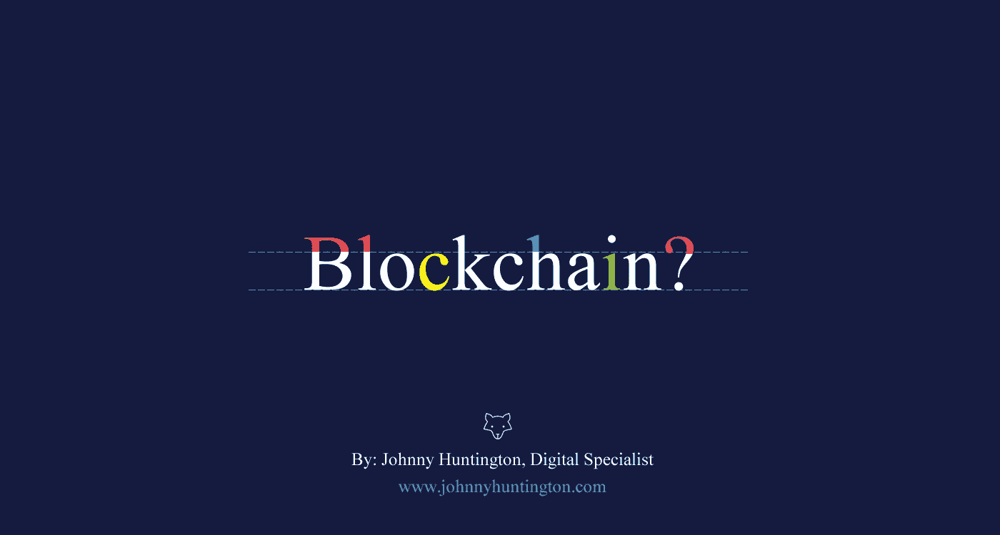

# 区块链还有意义吗？亨廷顿

> 原文：<https://medium.com/swlh/is-blockchain-still-relevant-62ff3f127f4f>

If you like this visit [www.johnnyhuntington.com](http://www.johnnyhuntington.com/) for further digital industry insights.

近几年来，这一直是科技界的热门话题。每一个*“今年要注意的十大技术”都有它的上榜。但是区块链真的如其所宣传的那样吗？*

***它的实际好处是什么？谁在使用它？这些都是需要进一步调查的有效问题。现在让我们看看区块链的优势、使用案例和挑战，因为炒作已经** …*