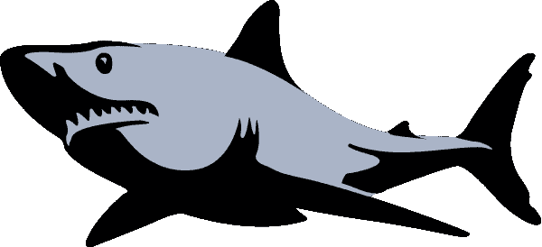

# 商业是鲨鱼池还是海洋礁石？

> 原文：<https://medium.com/swlh/is-business-a-shark-tank-or-an-ocean-reef-fe2188f21a0e>

*学习如何像大池塘里的大鱼一样漂浮，(同时也学习一些关于鲨鱼的惊人事实)*

有许多关于商业世界的比喻，把它想象成一个鲨鱼吃鲨鱼的杀戮地带。它被想象成一个残酷的，常常是无情的竞争的地方。但是，还有另一种商业网络的观点值得考虑:商业世界是一片海洋…