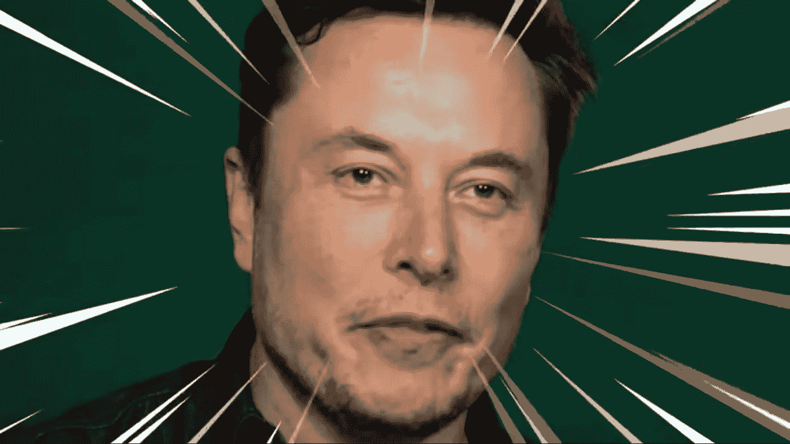
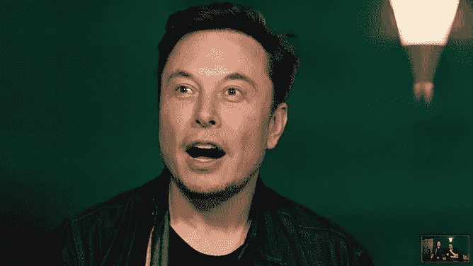
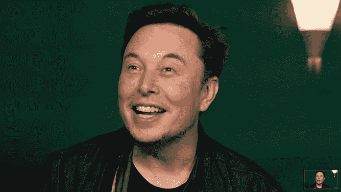
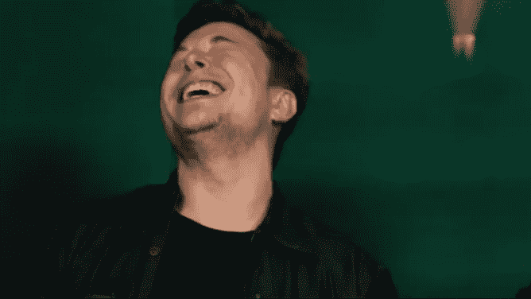

# 埃隆·马斯克很怪异吗？

> 原文：<https://medium.com/swlh/is-elon-weird-a25192c4c456>

[S](https://www.youtube.com/watch?v=zpWYQ1YtgnI)ource

它发生了。

埃隆马斯克主持迷因评论。如果你曾经想过看到埃隆·马斯克在泳池里谈论一只死鹿会是什么感觉，我会帮你省去这个麻烦。很奇怪，也很满足。

我也笑了。

就像乔·罗根和埃隆的播客一样，这是埃隆公关绝技的下一个层次。当然，他从不回避精彩的特技表演。我说的永远，就是永远。

他的 Twitter 似乎没有公关，但他比以往任何时候都更受欢迎。他会毫不犹豫地在数百万人面前试播合法消耗品。他将接受 YouTuber 的一次深思熟虑的采访。根据大众的要求，他不会拒绝和佩迪皮一起拍视频。

如果你在寻找引发愤怒的原因，你并不孤单。如果没有，继续读下去。也许有道理。

我多次观看了乔·罗根的采访。这是三个小时的深入交谈，涉及许多不寻常的话题。事实上，我认为这是最近娱乐制作中最好的作品之一。

传记作者阿什莉·万斯试图用她的书写一本客观的传记。在我看来，他对这位有争议的亿万富翁的描述有失偏颇。他就是这么做的。这本书是关于一个古怪的，像外星人一样不可预测的人，他冒了极大的风险，挑战了所有的可能性。他信奉物理高于一切，经常对人无礼。

> 埃隆很奇怪吗？

在我读完这本书后，我觉得我对这个人了解得不多。

当我听、看、再看乔·罗根的播客时，它开始连贯起来。所有的推文，特技，采访，争议，迷因。父亲，移居加拿大，移居美国，贝宝时代，麦克拉伦 F1，内华达州，愿上帝让他的灵魂安息，离婚，妲露拉·莱莉，SolarCity，SpaceX，特斯拉，SEC，加倍下注特斯拉…

> 一个有缺陷、感情、欲望和恐惧的人。

一个有缺陷、问题和坚韧不拔的人，不可动摇的原则毫无理由地被打破。一个有欲望、恐惧和感情的人。一个面临巨大挑战却没有被击垮的人。

但是让他明白自己在宇宙中的位置。埃隆只是一个普通人。

只是一个嘲笑迷因玩火的家伙。

This is Elon’s [not a flamethrower.](https://www.boringcompany.com/not-a-flamethrower)

链接:

[Meme 点评](https://www.youtube.com/watch?v=zpWYQ1YtgnI)
[Joe Rogan](https://www.youtube.com/watch?v=ycPr5-27vSI)
[本书](https://www.goodreads.com/book/show/25541028-elon-musk)

这篇文章发表在我在 martinuhnak.com 的博客上。感谢阅读。

如果你喜欢这篇文章，请点击下面的链接，加入我的圈子。我喜欢听取别人的意见，我会回复所有人。

[**报名信→**](https://mailchi.mp/a7d6819a370d/signupforletters)

## 这篇文章发表在[《创业](https://medium.com/swlh)》上，这是 Medium 最大的创业刊物，有+430，678 人关注。

## 在这里订阅接收[我们的头条新闻](https://growthsupply.com/the-startup-newsletter/)。

