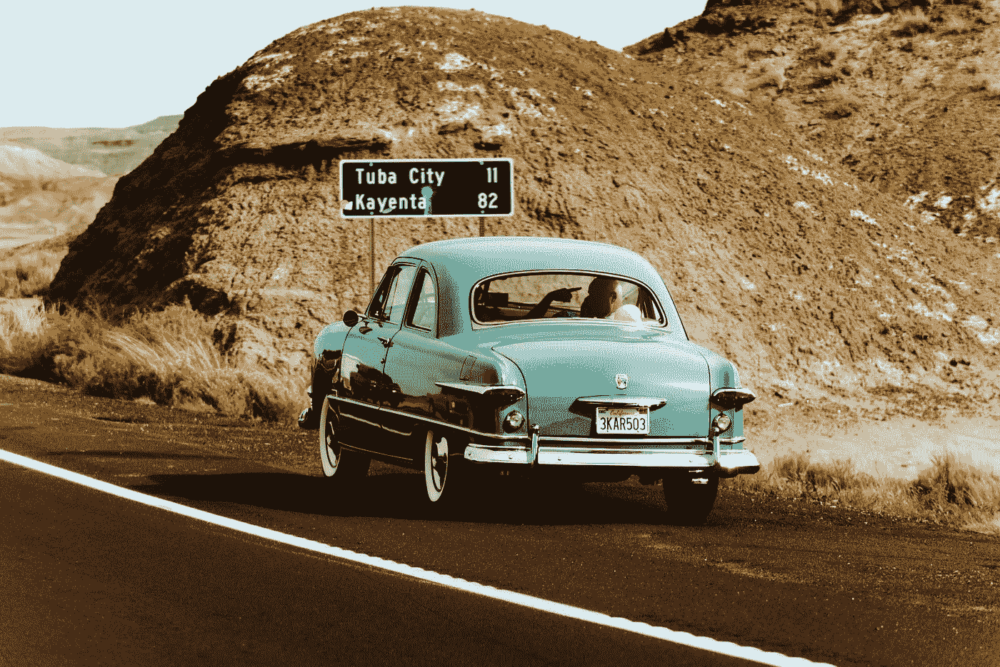

# 未来的移动性是新的白色飞行吗？

> 原文：<https://medium.com/swlh/is-future-mobility-the-new-white-flight-96a73cd3be2c>

Photo by [Quintin Gellar](https://www.pexels.com/@quintingellar?utm_content=attributionCopyText&utm_medium=referral&utm_source=pexels) from [Pexels](https://www.pexels.com/photo/arizona-asphalt-automobile-automotive-631522/?utm_content=attributionCopyText&utm_medium=referral&utm_source=pexels)

想象一下，走出你的前门，遇到一辆你招呼的自动驾驶汽车[带你去杂货店](https://blog.walmart.com/innovation/20180725/meet-waymo-your-new-self-driving-grocery-chauffeur)。

想象一下，当你从一个地方到另一个地方在地下高速行驶时，绕过几十个街区的高速公路和地面街道。

想象一下，坐直升机去 JFK 国际机场，不用看着别人的眼睛——只需[225 美元](https://www.nytimes.com/2019/06/05/travel/uber-helicopter-nyc-jfk.html)(含…