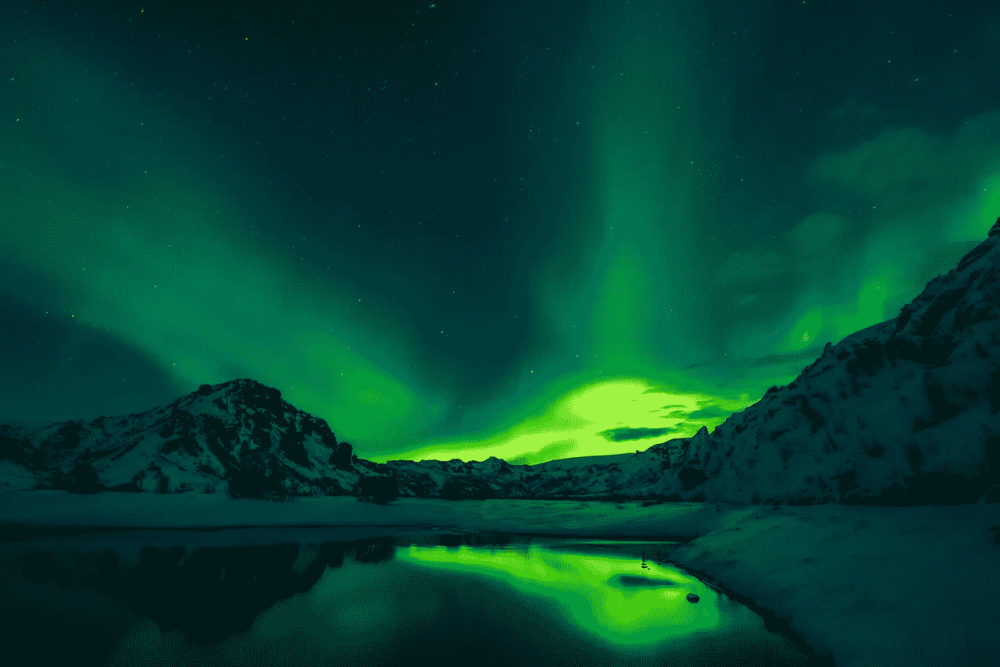
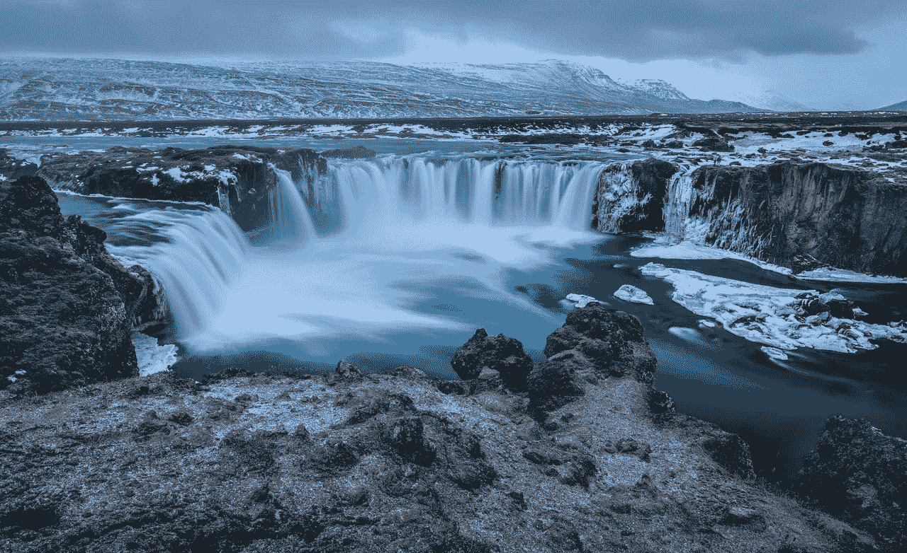
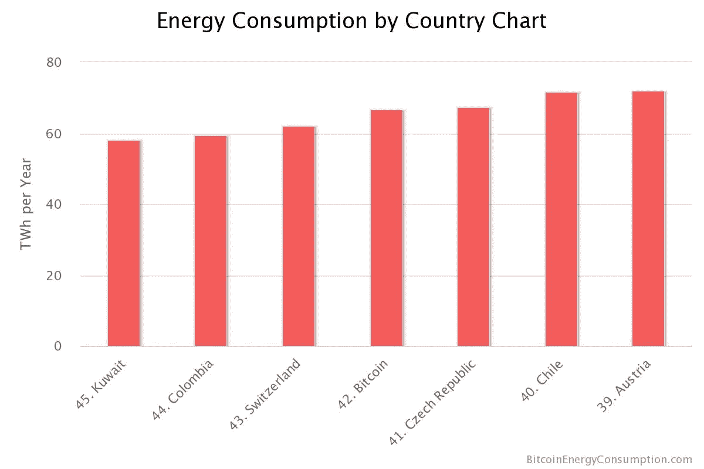

# 冰岛是绿色环保的比特币挖矿“独角兽”吗？

> 原文：<https://medium.com/swlh/is-iceland-the-unicorn-of-green-friendly-bitcoin-mining-maybe-not-for-much-longer-5aaec7fb0a18>

## 也许不会太久了…

Image by [David Mark](https://pixabay.com/users/12019-12019/?utm_source=link-attribution&utm_medium=referral&utm_campaign=image&utm_content=2111811) from [Pixabay](https://pixabay.com/?utm_source=link-attribution&utm_medium=referral&utm_campaign=image&utm_content=2111811)

在探索了斯卡夫塔费尔冰洞之后，格林达维克的地热温泉是一个很好的放松方式，但是除了冰岛的许多旅游景点之外，还有另一个原因让人们涌向这个“火与冰之地”:**比特币采矿**。

事实上，对于从冰岛寒冷的气温和持续供应的廉价可再生能源中获利的比特币采矿公司来说，冰岛是绿色环保加密采矿的“独角兽”。

但是完美的开采条件会永远持续下去吗？随着政治家和冰岛居民开始质疑加密采矿是否对他们的国家有益，我们可以看到比特币矿工未来的日子会越来越难过。

## 为什么冰岛非常适合比特币挖矿？

冰岛以严寒著称，但它同样因火山爆发和令人惊叹的瀑布而臭名昭著。这些自然发生的现象使得冰岛人几乎可以从水力发电和地热能源中获取所有的供暖和电力。这使得冰岛的电力既“绿色”又便宜。

通过将负担得起的绿色能源与自然寒冷的温度(防止计算机过热)结合起来，很容易看出冰岛如何为比特币采矿风暴提供了完美的条件。

Image by [nathan618](https://pixabay.com/users/nathan618-2626656/?utm_source=link-attribution&utm_medium=referral&utm_campaign=image&utm_content=2064170) from [Pixabay](https://pixabay.com/?utm_source=link-attribution&utm_medium=referral&utm_campaign=image&utm_content=2064170)

然而，秘密采矿天堂可能会有麻烦。冰岛的政府领导人正看着他们的能源计量表触及红色区域，他们开始谈论新的法规，这可能会给比特币派对浇上一盆冷水。

## 冰岛正在努力应对比特币的能源需求

事实上，最近冰岛比特币挖矿的爆炸式增长导致了能源使用量的惊人增长。[据冰岛能源公司 Hitaveita Sudurnesja 的 Johann Snorrie Sigurbergsson](https://www.apnews.com/a6cd50b37105447991be9a9ce76c2421) 称，2018 年，冰岛用于加密开采的能源消耗将从 50 兆瓦翻一番，达到 100 兆瓦。这意味着地下采矿将很快比冰岛所有的家庭消耗更多的能源。这是第一次在一个国家进行的加密开采有超过其他能源使用的趋势。

至于冰岛，在 2018 年初，Sigurbergsson 告诉美联社，“我无法预测这一趋势-但后来比特币暴涨，我们收到了更多的电子邮件……就在今天，我参加了一个寻求购买 18 兆瓦的矿业公司的会议。”

在撰写本文时，全球范围内，比特币开采使用了全球能源资源的 30%。一些人推测，在未来几年，管理全球比特币网络将消耗比美国更多的能源。正如数字经济学家的这张[图表所示，比特币的全球能源消耗已经超过了各个国家的消耗:](https://digiconomist.net/bitcoin-energy-consumption)

Screenshot 6–17–2019 from [https://digiconomist.net/bitcoin-energy-consumption](https://digiconomist.net/bitcoin-energy-consumption)

冰岛这样的政府会采取行动阻止需要大量能源的加密货币开采活动吗？或者，他们会看到加密货币带来的好处使能源支出物有所值(即，它们是利润丰厚的税收来源)。

## 冰岛可能对加密货币开采征税

冰岛国会议员(也是海盗党的领袖)斯玛丽·麦卡锡在接受美联社采访时对能源使用的急剧增加表示担忧。他担忧的声明反映了一种日益增长的情绪，即冰岛在加密开采方面给出的比得到的多。麦卡锡说:

> “我们正在花费数十或数百兆瓦生产一些没有实际存在、在金融投机领域之外对人类没有真正用途的东西……这可不好。”

Modified from images by [OpenClipart-Vectors](https://pixabay.com/users/OpenClipart-Vectors-30363/?utm_source=link-attribution&utm_medium=referral&utm_campaign=image&utm_content=1296177) and [WikimediaImages](https://pixabay.com/users/WikimediaImages-1185597/?utm_source=link-attribution&utm_medium=referral&utm_campaign=image&utm_content=910307) from [Pixabay](https://pixabay.com/?utm_source=link-attribution&utm_medium=referral&utm_campaign=image&utm_content=910307)

麦卡锡的海盗党在 2008 年冰岛灾难性的银行业崩溃后声名鹊起。它目前在议会中拥有 10%的席位，它已经将海盗的目光投向了比特币，以及冰岛可以通过对加密货币采矿业务征税而获得的利润。

麦卡锡并不赞同加密货币的“投机”方面。他认为应该征税:

> “在正常情况下，在冰岛创造价值的公司会向政府缴纳一定数量的税款……这些公司没有这样做，我们可能会问自己是否应该这样做。”

考虑到冰岛的许多加密采矿业务都是外国人所有的——他们进入冰岛是为了从冰岛丰富的自然资源中获利，而没有让当地居民受益——大多数人都会承认，这种情况对这个国家来说似乎不太公平。因此，也许国家对这个新的有利可图的家庭手工业征税才是正确的。

海盗党控制了冰岛议会的 10 %,所以也许其领导人的声音是未来的准确反映。

麦卡锡在 2018 年发的这条[推文](https://twitter.com/smarimc/status/962991922242564096)非常清楚地说明了税收问题:

> “加密货币开采几乎不需要员工，只需要很少的资本投资，而且基本上不产生任何税收。对冰岛的价值……几乎为零。”

## 让我们对比特币采矿国家的独角兽保持希望

随着“火与冰之地”在未来的几个月和几年里继续与能源消耗、税收和加密开采等问题作斗争，只有时间才能证明冰岛的比特币开采实验能否成功。

Image by [Jacqueline Macou](https://pixabay.com/users/jackmac34-483877/?utm_source=link-attribution&utm_medium=referral&utm_campaign=image&utm_content=725904) from [Pixabay](https://pixabay.com/?utm_source=link-attribution&utm_medium=referral&utm_campaign=image&utm_content=725904)

通过让我们知道依靠位置来盈利开采加密货币的危险，冰岛会成为比特币矿场中的“金丝雀”吗？或者，冰岛会成为国家政府和加密矿工之间互惠互利的边缘政策的一个例子吗？

希望最后一个选择被证明是正确的，密码矿工可以在冰岛找到一种保持绿色的方法。与此同时，也许一些勇敢的企业家和密码开采梦想家会发现开采比特币的新的革命性方法——不依赖于“位置、位置、位置”。