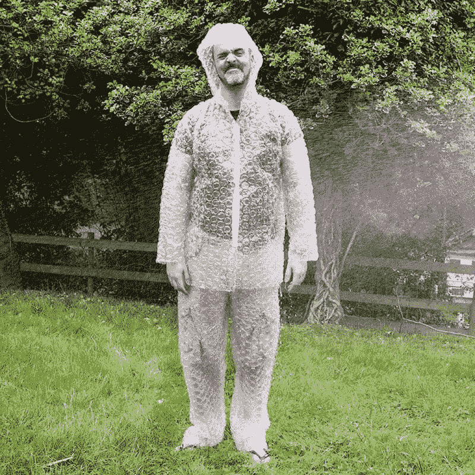

# 我们对安全的渴望会给我们带来伤害吗？

> 原文：<https://medium.com/swlh/is-our-desire-for-safety-causing-us-harm-5537e2db3400>

## 泡沫包装世界可能弊大于利。

Bubble Wrap Costume — [Prezzybox.com](https://www.prezzybox.com/bubble-wrap-costume.aspx)

这个世界比过去更加安全和美好，这是件好事。人们活得更长了。据斯坦福大学生物学家 Shripad Tuljapurkar 称，发达国家 65 岁以上的人会比他们的父母长寿。每一代人到了这个年龄…