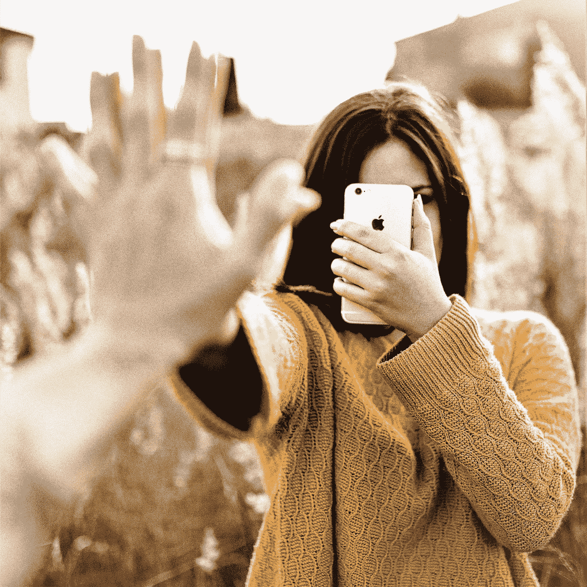

# “人格色情”正在取代真实的关系吗？

> 原文：<https://medium.com/swlh/is-personality-porn-replacing-real-relationships-540d00f62ebd>

Adrian Sava, StockSnap IO, Creative Commons CC0

## simtimacy——相比真人，沉迷于 YouTube 的人格魅力是可以理解的

> 看着我的眼睛，你看到了什么？
> 个人崇拜
> 我知道你的愤怒，我知道你的梦想
> 我已经成为你想成为的一切
> 我是个人崇拜
> 像墨索里尼和甘乃迪
> 我是个人崇拜 …