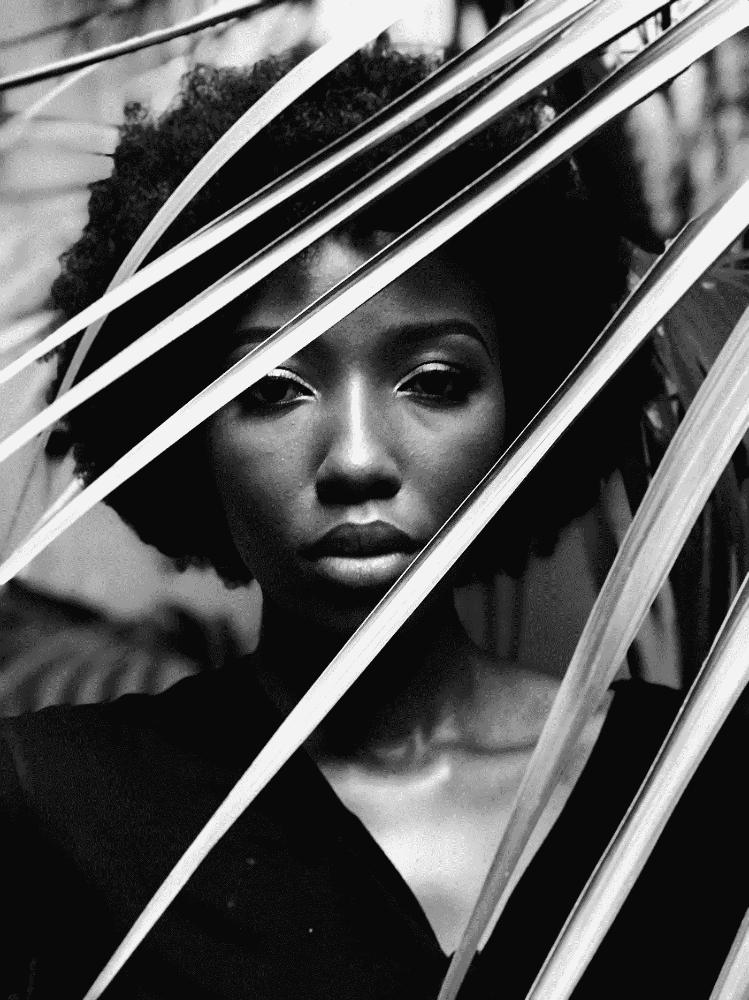

# 自我怀疑是一件坏事吗？

> 原文：<https://medium.com/swlh/is-self-doubt-such-a-bad-thing-38f1ce66cbce>

Photo by [Samantha Qeja](https://unsplash.com/@sammilk?utm_source=unsplash&utm_medium=referral&utm_content=creditCopyText) on [Unsplash](https://unsplash.com/search/photos/black-woman?utm_source=unsplash&utm_medium=referral&utm_content=creditCopyText)

你从来没有做对过任何事。这些话几乎每天都从我嘴里溜出。我从来不知道我什么时候说的。它们来自于我潜意识中对完美的渴望和对我无力尝试的评判。

至少可以说，这是令人震惊的。没有人应该听到这些话。至少当你亲口说出来的时候。但是自我怀疑是真实的。它在我们一些人身上比……