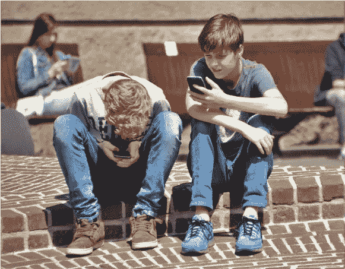

# 社交媒体是新的吸烟方式吗？

> 原文：<https://medium.com/swlh/is-social-media-the-new-smoking-we-should-ask-the-kids-65a34278a058>

## 也许我们应该问问我们的孩子。

These kids may know something the grownups around them don’t. Source: [natureaddict](https://pixabay.com/photos/pokemon-pokemon-go-phone-game-1553995/) via [Pixabay](https://pixabay.com/) (CCo)

到我可以走进酒吧合法点一杯酒的时候，我还可以点燃一支烟来配酒的时间只剩下不到六个月了。剥夺这种自由的立法被戏称为自由呼吸法案，至少在明尼苏达州是这样。它在其他州有其他的名字，现在大多数美国人都不能点烟了…