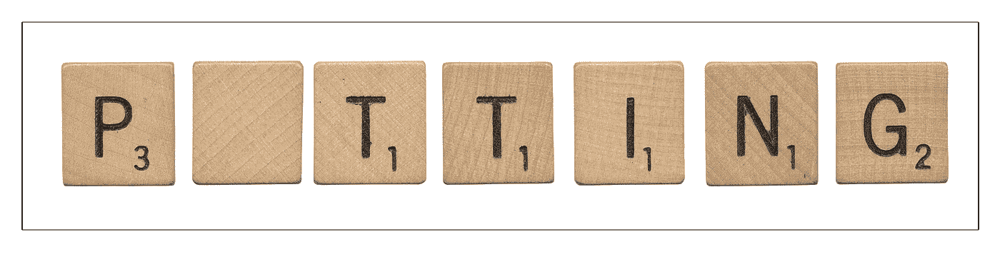

# 战略死了吗？

> 原文：<https://medium.com/swlh/is-strategy-dead-fa00d844eccb>

一家拥有 500 名员工的公司的首席执行官最近对我说，“在这里，战略甚至不是一份全职工作”。

他在一家经营良好的公司工作。他为什么需要策略？

对于创业公司来说，最近最低可行产品/精益创业方法的兴起不是扼杀了对战略的需求吗？难道我们不能根据快速的用户反馈循环，一路找出我们需要知道的一切吗？

如今，当考虑战略时，如果你不困惑，你可能至少会有点沮丧。

近年来，我自己也对战略进行了很多思考，首先是作为麦肯锡的顾问，然后，最近，我在几家科技初创公司和成长期公司担任创始人、战略负责人和董事会董事。我想分享一些我一路走来对战略的见解，以及为什么它在今天仍然如此重要。

# **我对战略有一些见解:**

## 策略没有死。事实上，这在今天和以往一样重要

*   我们周围的世界正在发生变化，这意味着企业不能再依赖年度战略计划来提供有意义的指导。但这也意味着，如果没有简单地阐明我们为谁服务，以及我们为什么要为这些客户创造独特的价值，公司可能会迷失在我们周围狂热而混乱的环境中。
*   不幸的是，近年来我们集体忽视了战略。这可能是因为我们高估了重复过去增长的能力，或者是因为我们把战略看得比实际情况可怕得多。这里有一种方法可以检验后一种理论:看看你能多快地让任何职业经理人感到恐惧，只要你走到他们面前，问他们:“你的策略是什么？”

## “竞争优势”的概念并没有消亡

*   这本书名为《竞争优势的终结》的畅销书提出了许多重要观点，但我不同意它的中心论点。我相信连作者都不同意。例如，在她对 Milliken 的案例研究中，她强调了他们在特种材料生产、企业文化和员工参与度等领域的一贯独特性——所有这些在我看来都是竞争优势的绝佳范例！
*   每个人都同意当今世界的发展速度比以往任何时候都快。在 20 世纪 70 年代，30 年的优势可能已经司空见惯，而在今天，5 到 10 年可能更是如此。此外，竞争优势的来源已经从有形资产(如矿山和工厂)转移到技术和文化/基于技能的资产。但这并不意味着这些概念是不相关的。今天的创新是这样一个过程:把你作为一个组织做得很好的一系列事情，注入到新产品和更好的方法中，为你的客户服务。
*   找到你所拥有的独特技术、技能或资源，让你能够帮助你的客户以 2 倍、3 倍、5 倍或 10 倍的速度、更低的成本或更好的效果完成事情:这就是他们向你购买的原因，也是你的优势所在。如果你没有竞争优势，为什么还有人买你的产品？

## 精益创业方式并没有让战略变得无关紧要。事实上，缺一不可是很危险的，而这两者结合起来是异常强大的

*   精益启动方法是一套工具和概念，用于创建迭代产品开发周期的高度可移动的团队。但是太多的创业公司正在使用快速迭代和最小可行产品作为逃避前期战略思考的借口。
*   如果你在没有战略指导的情况下纯粹迭代 MPV，谁知道你最终是否会解决一个对买家来说有意义的大需求？

## 谷歌的成功并没有证明战略无关紧要

*   谷歌在雇佣有创造力、聪明的工程师、在长期产品上投入大量资金，以及在易于使用的产品上创造技术性的、基于网络的解决方案方面与众不同。做这些事情的能力是他们竞争优势的很大一部分。
*   谷歌的两个最公开的失败，Wave(一个实时电子邮件和信息平台)和 Glass(可穿戴眼镜)都植根于这些竞争优势领域。
*   它们都建立在技术洞察力的基础上，但没有解决明确的业务需求。他们可能用精益启动方法迭代产品开发，并获得了很好的用户反馈。但是他们解决了什么问题呢？为了谁？为什么有人会为它们付费(或接受广告)？战略迫使这些问题成为焦点。

## 分析是当今最有效策略的基础

*   几年前，战略主要基于框架(如五种力量)和执行肌肉记忆。那些日子已经过去了。当今的战略需要以数据为基础。数据是我们进行战略决策和投资的最佳指南，尤其是我们能够唯一看到的数据。
*   此外，在您的产品中构建一个分析飞轮，随着时间的推移为新的创新浪潮和客户价值提供信息，这是一个战略的强大组成部分。

## 建立企业的三个主要因素是战略+分析+灵活性

*   战略是你为谁服务的清晰愿景，你为他们解决的问题，对他们为什么需要你帮助解决的理解，以及你将如何解决的概述。
*   分析(或类似的技术洞察力)是你能够用来解决问题的唯一工具，而其他人要么没有机会，要么没有考虑应用于这个问题。
*   敏捷性是您快速部署技术为客户解决问题、获得反馈并持续改进的独特能力。

## 雇佣和投资“战略干细胞”是公司变得更具流动性、更快创新并能够根据需要重新分配资源的主要方式

*   如今，初创公司和成功的公司在招聘时，他们寻找的是那些能够适应模糊性、能够学习新技能、对在公司担任多个角色的前景感到兴奋的人。他们希望对核心资产进行深度投资，这些核心资产可以随着不确定的未来发展成不同的产品(例如灵活的工厂)。他们加倍努力构建基础能力，如客户服务、设计独特的用户体验和培训员工。
*   这些都是我称之为“战略干细胞”的例子:在快速发展的环境中，随着企业优先事项的转变，技能/资产/能力的灵活集合可以转移到不同的产品中。
*   就像拼字游戏中的空白瓷砖一样，战略性干细胞可以扮演任何元音的角色。我们需要什么词？拍拍？放？盆栽？我们未来的选择是开放的。

## 公司需要去中心化和敏捷来创新……而一个强大、简单的战略会让你做到这一点

*   我个人比较喜欢这种创业模式，在这种模式下，所有的事情都是集中和分散的:公司足够小，所以每个人都可以很快地看到和参与大多数事情，而任何员工通常都可以自由地提出和实施重大变革。但即使在初创公司，我也看到了钟摆的摆动，这是应该的。有一个开放创新的时期，解决方案被拼凑在一起(以分散的方式)，然后，一旦证据点被建立，就有一个有目的的重建时期来处理规模、保持一致性和提高响应能力(作为集中构建的一部分)。
*   当我有机会成为大公司的一员时，我看到了让任何过程以分散的方式运行是多么困难。任何希望更具创新性的公司都必须减少控制的集中化。做这件事有许多方法。最重要的标准是他们有一个强大而简单的战略。然后，分散的、敏捷的团队可以在一致的公司方向的约束下自由地运作。

## “黑天鹅”的存在强调了对简短、简单和深思熟虑的策略的需求

*   纳西姆·尼古拉斯·塔勒布关于“黑天鹅”的流行书籍，这些罕见和极端的事件发生的几率是不可知的，并没有为避免制定策略提供理由。事实上，在这种情况下，策略是最有价值的。一项战略应该在你的市场受到冲击的混乱时期提供足够的清晰度，同时还应该足够开放，允许所有员工根据实际情况和机会的变化，根据需要调整自己的决定和行动。

也发表在[strategic . blog](http://strategist.blog)上，在那里我分享了关于构建基于分析的产品和业务的想法(例如“产品策略”)。本文中提及或参考的任何书籍或其他资源都列在[这里](https://strategist.blog/further-resources-and-acknowledgements/#7)。

## 这篇文章发表在[《创业](https://medium.com/swlh)》上，这是 Medium 最大的创业刊物，有+427，678 人关注。

## 在这里订阅接收[我们的头条新闻](https://growthsupply.com/the-startup-newsletter/)。

