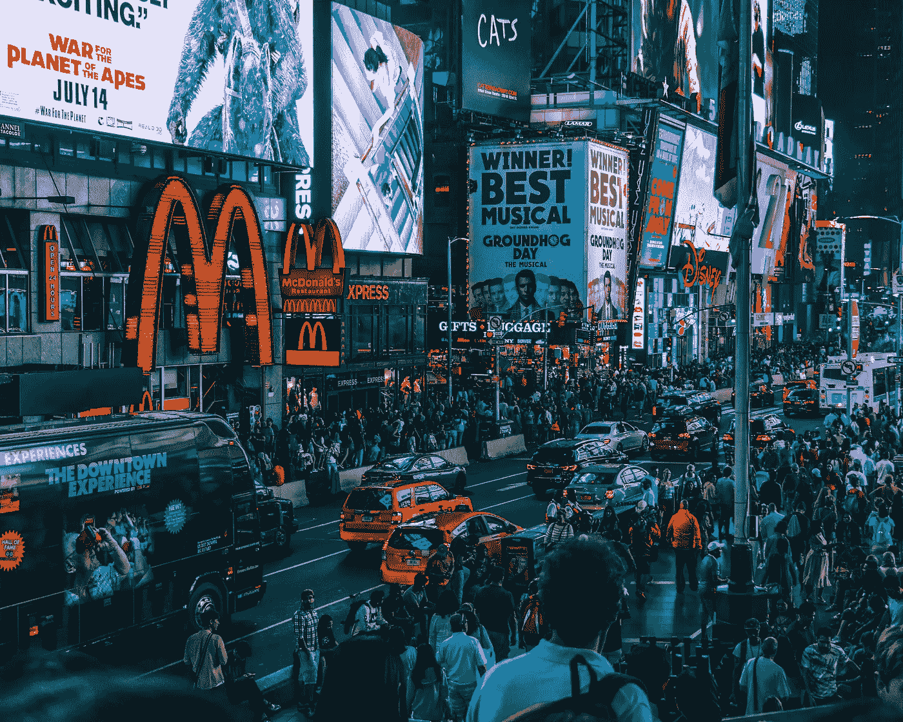

# 麦当劳还有未来吗？

> 原文：<https://medium.com/swlh/is-there-a-future-for-mcdonalds-5346b40b75c1>

## *为什么我们不必害怕“工作的未来”*

Photo by [Tom Ritson](https://unsplash.com/photos/14-jJXWXUys?utm_source=unsplash&utm_medium=referral&utm_content=creditCopyText) on [Unsplash](https://unsplash.com/search/photos/mcdonalds?utm_source=unsplash&utm_medium=referral&utm_content=creditCopyText)

> 我爱麦当劳！

没有人理解我为什么离开空军，并决定在 20 世纪 90 年代初开始在麦当劳工作。但是，当时，我觉得一切都很清楚。

雷·克洛克的人生故事鼓舞人心(如果你还没看过，请观看创始人的