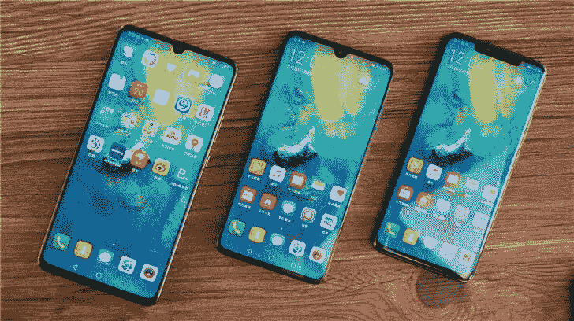

# 谷歌封杀后华为还有命吗？

> 原文：<https://medium.com/swlh/is-there-life-for-huawei-after-google-ban-7c2d7b740370>

谷歌周一宣布，将不再为华为技术公司(Huawei Technologies)即将推出的智能手机提供支持，这与美国政府将这家中国电信设备巨头列入贸易黑名单的命令相符。

此举被视为对华为的一大打击，华为目前是全球第二大智能手机品牌。