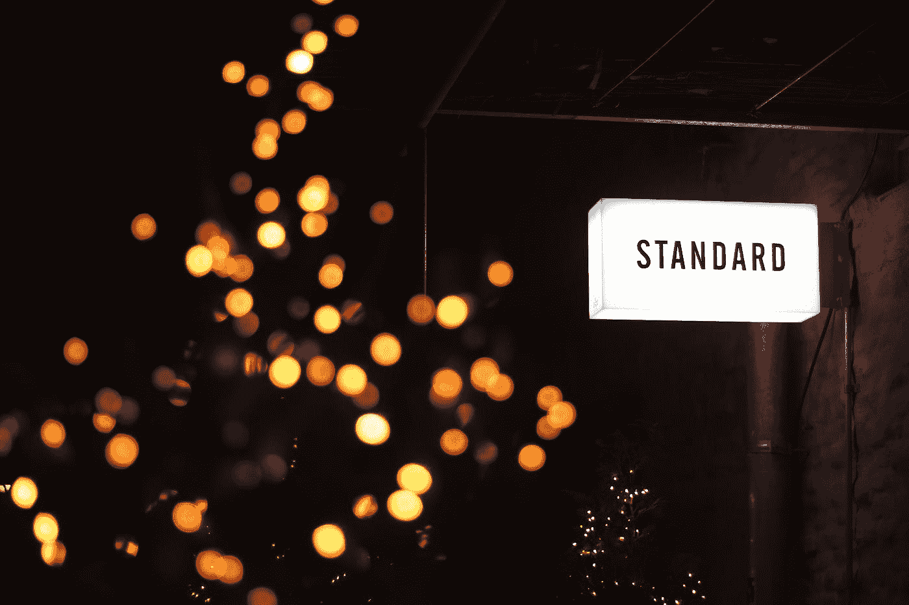

# 多少变化才算太多变化？

> 原文：<https://medium.com/swlh/is-there-such-thing-as-changing-too-much-2ed7b22ca965>

虽然大多数人似乎避免改变，但我很想知道是否有改变太多的事情。

Photo by [Frederick Tubiermont](https://unsplash.com/@callmefred?utm_source=medium&utm_medium=referral) on [Unsplash](https://unsplash.com?utm_source=medium&utm_medium=referral)

*“我将用一声叹息来讲述这件事*

*某个年代久远的地方:*

*一片树林里分出两条路，而我——*

*我选择了人迹较少的一条，*