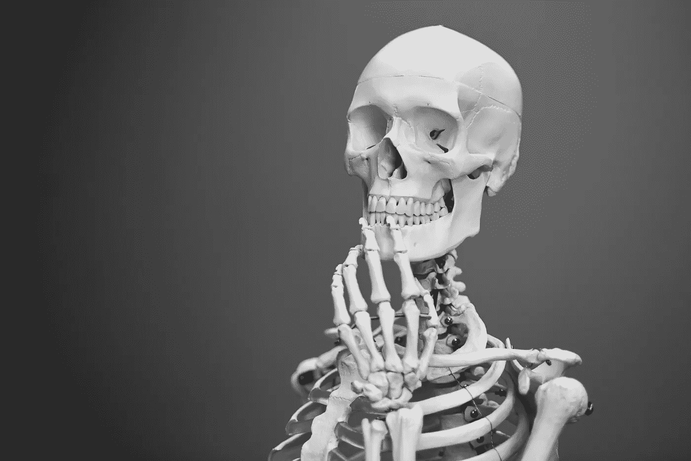

# 思考是进化错误吗？

> 原文：<https://medium.com/swlh/is-thinking-an-evolutionary-mistake-8ceb2cd693c5>

Photo by [Mathew Schwartz](https://unsplash.com/photos/8rj4sz9YLCI?utm_source=unsplash&utm_medium=referral&utm_content=creditCopyText) on [Unsplash](https://unsplash.com/search/photos/thinking?utm_source=unsplash&utm_medium=referral&utm_content=creditCopyText)

## “…如果是，我们如何解决它。”

安东尼·德梅洛是耶稣会牧师、心理治疗师、畅销书作家和精神导师。他的早期生活被僵化的基督教信仰所主导，但随着时间的推移，他开始探索东方传统，以及这些传统与他早期观点的关系。这种探索性的观点最终导致了一种非传统的方法，根据…