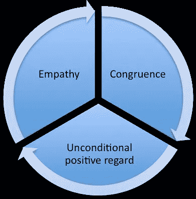
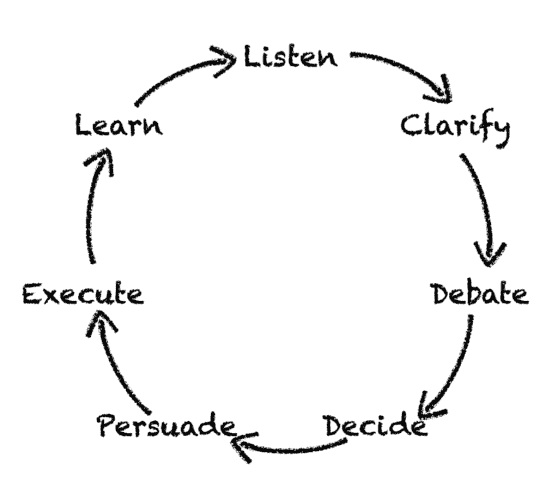
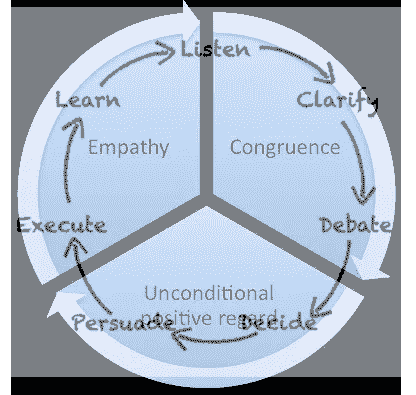

# 这是激进坦白的秘史吗？

> 原文：<https://medium.com/swlh/is-this-radical-candors-secret-history-1767a4fd563c>

## 和大约 10 秒钟的相互理解

在*彻底坦白*的第三章中隐藏着一个双关语(重点是我的):

> 我在俄国管理的**钻石切割师**团队——我在第一章中提到过的教我“个人护理”的那些人——是工匠大师，和世界上任何人一样技艺高超。他们是**摇滚明星**；他们对我老板的工作没有兴趣。

钻石切割机。摇滚明星。我会很感激一个眨眼或者其他什么让我知道不仅仅是我。

但是我也发现了隐藏在金·斯科特极具影响力的作品的字里行间的更大的东西，它与斯科特思想的基础有关。

大多数交流都没有结果。如果你在日常生活中没有看到这种情况发生(幸运的你)，有整个“社交网络”致力于证明这是真的。不幸的是，对于职业世界来说，办公室很少能例外。

金·斯科特在她的书中着手解决这个问题和其他问题。

这也是我选择 YouTube 评论]这种仍在流传的 T10 激进坦率 T11 的原因之一。我对沟通很感兴趣，尤其是当它涉及到建立一种有凝聚力的团队文化时。

《彻底的坦白》是一部不可思议的作品。斯科特以小说家的散文形式提供了一个有力而又深思熟虑的经理建议。令人欣慰的是，在新的权力中心(谷歌、苹果、推特等)如此根深蒂固的人在谈到人性时是如此尽责。

但是当这本书进入我的大脑时，它开始让我想起另一件给我留下深刻印象的事情。

# 以人为中心的日常站立

> “在我职业生涯的早期，我一直在问这样一个问题:我该如何治疗、治愈或改变这个人？现在我会这样表述这个问题:我怎样才能提供一种关系，让这个人可以利用这种关系来促进自己的个人成长？”—卡尔·罗杰斯

我忘了我第一次听说卡尔·罗杰斯的作品是在哪里，但那是在人际关系的背景下。具体来说，推荐一种“罗杰式”的谈话方法:**在所有发言者对最后一位发言者刚刚说的内容的总结达成一致之前，不要说任何新的内容**。

这给了我一个难以置信的解决方案，解决了普遍的，更不用说阴险的，沟通不畅的问题。所以我开始在日常对话中使用它。我今天仍然经常使用它。特别是当我和我的对话者进入新的领域，我们的谈话变得越来越长，我们的想法变得越来越模糊时，我现在想知道如果不这样做我是如何度过的。

实际上我知道怎么做:我只是没听清楚。:(

通常只需要几秒钟来思考我所听到的，然后与我正在交谈的朋友或同事核对我的理解，但是如果花一个小时，这是值得的。我宁愿离开一个有一条清晰信息的谈话，而不是几十条模糊的信息。

这在工作中尤其真实、必要和有效。我们都知道，让自己听起来聪明的一个方法就是重复别人说过的话。这就像那样，加上检查你是否正确的个性化，然后添加你自己的观点(我确信这本身就是聪明的)。

# 新旧规则

那么罗杰斯和斯科特是什么关系呢？

罗杰斯和斯科特都信任人。他们认为你(治疗师或老板)并不*比你的同事(客户或团队成员)更了解你。*

为了从和你一起工作的人那里得到最好的结果，罗杰斯和斯科特都说你需要

(A)了解和你一起工作的人*和*
(B)和他们达成共识。

胡言乱语被他们俩扔出窗外。无论是弗洛伊德式的本我痴迷还是伪装成“野心”的痴迷，罗杰斯和斯科特令人信服地指出，人*总是知道得更多——无论是关于什么导致了他们的精神痛苦，还是他们在职业生涯中寻找什么。*

*治疗师或老板的角色从向导转变为合作伙伴。他们的角色是进行诚实、坦率的对话(不需要很长时间！)帮助每个人做到最好。它们以惊人的相似方式到达那里。*

## *相同的周期，不同的名字*

******

*A representation of Rogerian therapy and Scott’s getting stuff done cycle. And then together.*

*两者最大的区别在于，激进的坦诚外化到了一群人身上。但是罗杰斯和斯科特都倾向于自我实现。而且他们意识到起点往往远非如此。*

*这解释了为什么两者都从*理解*客户/团队的心理开始，然后在支持的环境中慢慢*努力达成相互理解*，并以确保所有人之间的*积极关系*结束。*

*关于如何做到这一点，斯科特写了半本书，我敢肯定罗杰斯和他的学生写了更多。*

# *结论*

*斯科特给了领导者很好的工具和使用它们的很好的理由。看到人类第一的想法如此好地应用于工作场所，这非常酷。*

*我认为*这是对罗杰斯和斯科特之间关系的总结。两人都在人员密集的领域投入了时间，都发现了实践与现实脱节的地方。**

*在我看来，斯科特发现自己的工作和罗杰斯的工作有重叠，这是对她的巨大认可。随着越来越多的公司认识到员工体验的重要性，他们会谨慎地看看罗杰斯和斯科特，以更好地了解他们如何改善他们的工作场所。*

*因为只有那些认识到*人*为他们工作的组织——以及由此带来的所有(不一定是)混乱——才能留住顶尖人才，并在长期内做到最好。*

*无论如何，在我的个人生活中，我很感激找到了他们两个。*

*谢谢你喜欢这个！*

*我目前正在为 Sprynkl 策划一份关于这类事情的时事通讯(团队文化+心理学黑客&c)。[你可以在这里报名](http://bit.ly/sprynklnewssub)。:)*

*请推荐更多像斯科特的书。我**渴望**阅读它们，并乐于发布摘要。*

**

## *这篇文章发表在 [The Startup](https://medium.com/swlh) 上，这是 Medium 最大的创业刊物，拥有+431，678 名读者。*

## *订阅接收[我们的头条新闻](https://growthsupply.com/the-startup-newsletter/)。*

**