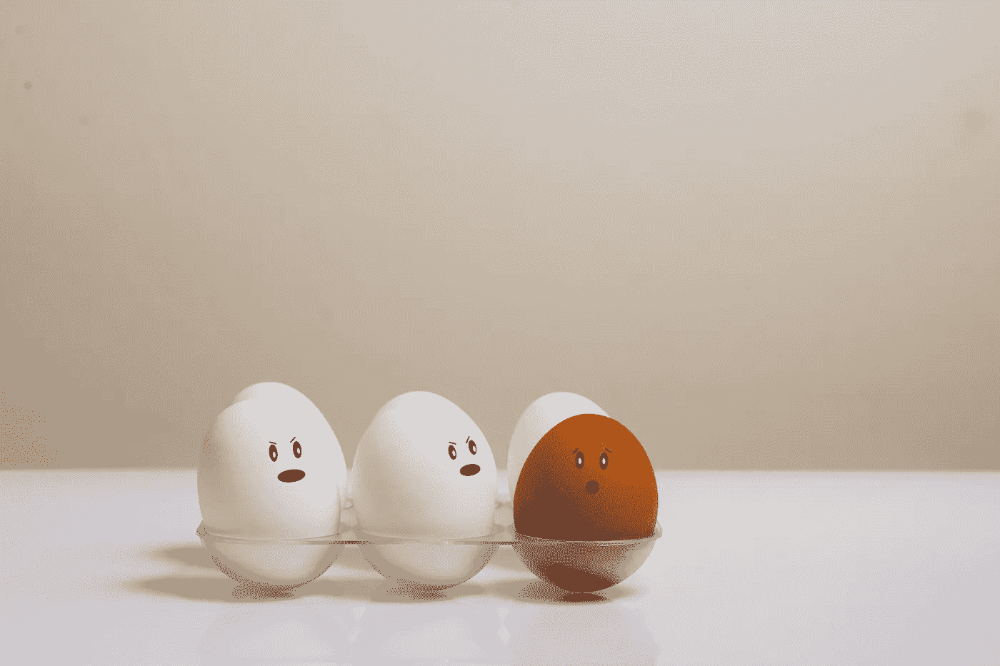

# 这是你今天在 Medium 上读过的最差的文章吗？

> 原文：<https://medium.com/swlh/is-this-the-worst-article-youve-read-on-medium-today-a55dd1c63f4a>

大多数问题的答案教给我们的东西很少。

让我用一个我发现的问题来说明，这个问题旨在帮助害羞的人更有效地与他们的同龄人交往——大概是在一些内向者地狱的版本中，又名“混合器”

“你最近看过什么很棒的电影？”