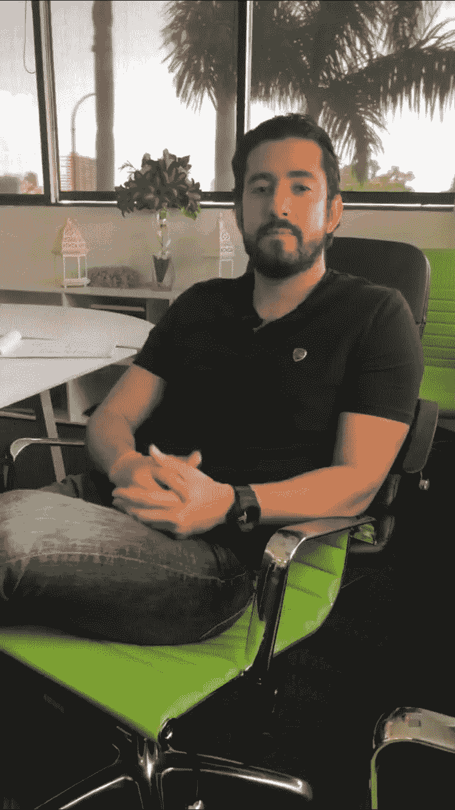

# 你的企业濒临倒闭吗？

> 原文：<https://medium.com/swlh/is-your-business-on-the-verge-of-collapse-c1b3b9cfe1d1>

## 给企业带来微弱优势的惊人公式

Photo by [Jake Ingle](https://unsplash.com/photos/s-t1oJXKYI4?utm_source=unsplash&utm_medium=referral&utm_content=creditCopyText) on [Unsplash](https://unsplash.com/?utm_source=unsplash&utm_medium=referral&utm_content=creditCopyText)

一年前，我给[写了一篇文章](https://www.practicepanther.com/3-300-revenue-year-learn-can-grow-law-firm-attorney/)，讲述了我如何在一个名为[律师事务所 500](https://lawfirm500.com/) 的节目中认识了一位成功的律师，她的年增长率从 3%上升到 300%。与这位律师交谈的最大收获是，她对待自己的律师事务所就像一家碰巧从事法律业务的企业。

参加完大会后，我意识到这位成功的律师给我的建议不仅仅是针对律师事务所，而是针对所有的企业和企业家。

当她放下麦克风说“我从 3%增长到 300%”时，我没有只是点头示意，而是问她任何想要进步的人都应该问的问题:

> “你为什么这么做，你是怎么做到的？”

不要被这么明显的问题所迷惑。

你用最明显的答案解决了多少次复杂的问题？

“为什么”这个问题的答案揭示了一些我从未在企业中寻找的东西。有两个有趣的解释:

1.  如果发生了一些事情，使我无法对业务投入 100%的精力，那么业务本身会发生什么？
2.  为什么我每年不能创造更多的收入？什么阻止了我？

这两个问题看起来太明显了。

*但是，有多少次，企业只是做接下来的事情，就能轻松过关？*

既然我理解了目标背后的原因，我需要理解“如何”。

看到一个完全不同的行业的收入增长实际上可以成为完全不同行业的企业成功的共同标准，这让我非常着迷。

你不会相信“如何”是什么。不，不是增加营销预算、裁员或在社交媒体上花更多钱。

让这位律师的收入从每年 3%增长到 300%的是建立政策和程序。

> “我们制定并实施政策和程序”

听到这里，我的第一(思想)反应是，“无聊。这可不酷。”

*运营缺失的业务是什么样子的？*

如果决策几乎从未做出，或者做出了决策，但未能正确执行，那么很可能是你公司的程序存在漏洞。

在*Traction:Get a Grip on Your Business*,[Gino wick man](https://www.eosworldwide.com/traction)中说“大多数企业家不明白过程可以有多强大，但是当你正确应用它时，它就像魔法一样工作，带来简单性、可伸缩性、效率和盈利性。”

这意味着当情况发生时不要即兴发挥。我们都因为没有记录我们希望我们的组织如何运行而感到内疚，因为无论什么借口，很多时候，懒惰和未能专注于长期结果。

# **如何开始扩展你的业务:**

## **记录突出业务支柱的当前流程**。

如果你正在建立你的销售部门，那么最好的方法就是把这些场景储存起来。例如，在进行销售拜访时，反对/反驳销售脚本是一个很好的记录操作的例子。

如果你管理客户维系部门，那么有一个类似“当客户想取消他们的服务时会发生什么？”会被记录下来(和答案一起)。

## **实施和测量过程**。

*您如何知道您现有的流程是否值得保留？*

如果你制定了一个损害收入、士气和增长的程序，你可能会对你的企业造成更大的伤害。

你应该如何衡量它？

*   与你部门的每一位经理安排一次周会，以获取进度报告。
*   让部门经理每周与员工会面，听取他们的反馈。

任何部门都不应缺少政策和程序指南。

如果你现在正在读这篇文章，那么请指出你所在的部门，即市场部。销售、客户支持，并在本周与经理会面，以记录业务中持续发生的核心活动。

> *无论你有多少核心流程，你都需要确定那些处理业务中正在进行的每项活动的流程……确保你的领导团队 100%在同一页上……*
> 
> *——吉诺·威克曼*

如果你看过这个节目，你会知道主持人马库斯·莱莫尼斯的核心原则是:*人、过程和产品。*

The Profit: Marcus Lemonis

做生意的流程部分允许一家公司“系统化”和组织事情如何运行，即使你不在场。

你现在有了衡量成功的标准，而不是凭直觉做出决定。

自那次会议以来，我花了数百个小时为我管理的所有部门创建、更新和实施我们公司的政策和程序。

> *在您的业务流程中创建“如果 _____ 则 _ _ _ _ _”等式时，扩展变得更加简单。*

律师提到的最重要的一点是:

如果你在经营一家企业，如果你的公司运营“有弹性”，那就是“生死攸关”

被限制在一个无法解释的程序中只会阻碍它的发展。

在 [**Linkedin**](http://www.linkedin.com/in/morassouline) 上与我联系

Mor Assouline 是 PracticePanther 的销售副总裁，practice panther 是世界上发展最快的法律案件管理软件。作为该公司的第二名员工，Mor 将他的热情和 10 多年的销售和客户服务经验注入了市场上排名第一的法律案件管理平台。Mor 将他对构建精简、直观的业务流程的热爱与他在成功实施这些流程方面的丰富经验相结合，引领了大部分实践伙伴的创收，并取得了巨大的成果。Mor 很高兴能继续带领 PracticePanther 的客户走向一个光明繁荣的未来。

## 这篇文章发表在 [The Startup](https://medium.com/swlh) 上，这是 Medium 最大的创业刊物，拥有+408，714 名读者。

## 订阅接收[我们的头条](http://growthsupply.com/the-startup-newsletter/)。

