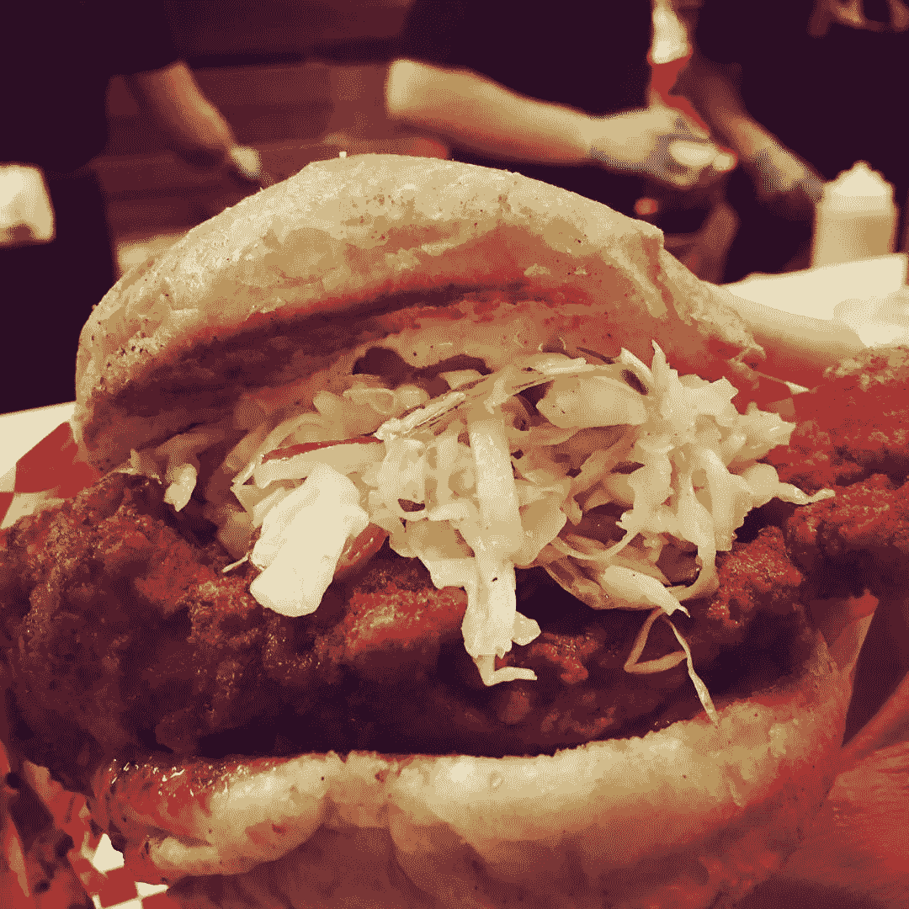
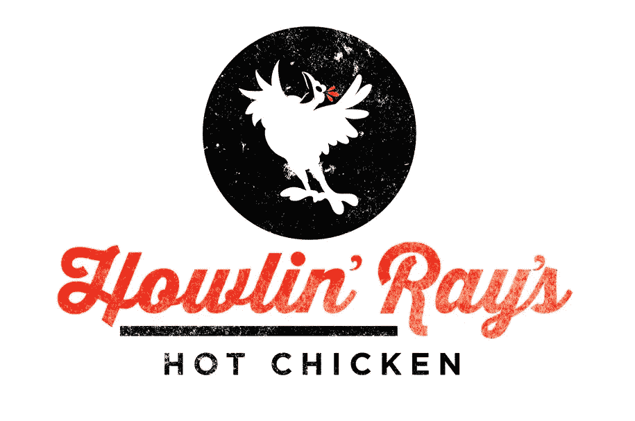

# 贵公司的目标是世界一流吗？

> 原文：<https://medium.com/swlh/is-your-companys-purpose-to-be-world-class-30f71bce2ede>

What can a hot chicken sandwich teach us about being world-class?

在某方面成为世界第一的想法引发了一系列复杂的感觉。渴望一个疯狂的高水平的潜力是令人兴奋和激励的。与此同时，这是一个如此高的目标，以至于考虑它几乎会感到自大甚至愚蠢。

但是，当你从正确的角度看待“世界级”的概念时，它不仅开始感觉可以实现，而且可以成为你业务的强大指南。

**拥抱世界级的概念做两件事:**

1.  它迫使你发现使你的企业具有独特价值的优势组合。
2.  当你开始评估机会是否符合这些优势时，它为你的业务提供了焦点。

**这是一个强有力的组合。**

当涉及到公司的方向和决策时，理解你的价值并保持专注会对你的成功产生巨大的影响。

这是《从优秀到卓越的 T4》一书中的关键概念之一。

作者吉姆·科林斯在书中比较和对比了一些历史上伟大的公司，以了解它们与众不同的地方。理解“你能成为世界上最好的人”是所有伟大公司的一个共同点。

你可以在他的网站上阅读柯林斯和他的团队[开发的其他模式来识别伟大的公司。](https://www.jimcollins.com/concepts.html)

但是在这篇文章中，我只想把重点放在成为世界级的想法上。

# 世界级不一定意味着大

世界级的概念之所以让人感觉如此之大，原因之一是它让人想起大公司。

仅仅因为苹果、亚马逊和谷歌是世界级的*和*大规模，并不意味着大规模是成为世界级的必要条件。

确定你在哪里可以成为世界级的一部分就是要具体。

正如柯林斯在最近与蒂姆·费里斯的采访中所说，小企业可以“……在特定社区的特定事情上做得最好……”，因此，“……没有大公司能在这方面做得比他们更好。”

一个很好的例子是位于洛杉矶的餐馆，Howlin' Rays。他们做纳什维尔风味的辣鸡。这真是太棒了。

[Sooooooo good](http://www.howlinrays.com/)

我知道这很神奇的部分原因是因为人们会排队等上 2-3 个小时。)去那里吃饭。我自己已经做过多次了，我还会再做一次。食物是那么好。

我不知道 Howlin' Rays 配方的秘密，但我知道是什么让它们成为世界级的。他们做的热狗是洛杉矶最好的。

Yelp 评论不言自明:

[Read the reviews](https://www.yelp.com/biz/howlin-rays-los-angeles-3)

无论用什么标准来衡量，它们都不算大。现在他们在一个不起眼的购物中心有一个小小的位置。但他们完全专注于比其他人更好地交付一件东西。

再说一次，他们并不想成为“最好的烤鸡店”。他们是“洛杉矶最好的炸鸡店”

这种特殊性是他们业务成功的核心。它表明了对他们的产品、服务和位置如何促成世界级组合的理解。

这是每家企业都能体现的世界级水平。找到你的企业最适合在高层次上实现的特定元素组合，并加倍努力。

# 这需要时间来提炼

不是每家公司一开始就一清二楚。更有可能的是，你需要一些时间来磨练如何成为世界级的。

有些发现是自省的。你需要了解自己和团队的优势和劣势，以及如何利用这些优势。

这个发现的另一面是你的客户。为什么客户会付钱给你而不是其他人？你需要深思熟虑地揭露这些信息。如果你不与你的客户沟通，很容易误解他们为什么喜欢你。

对于我的咨询公司， [Map & Fire](https://mapandfire.com/?utm_source=blog&utm_medium=article&utm_campaign=world-class) ，我们的核心目的一直围绕着提供企业家和商业领袖成功所需的工具和资源。

但我认为我们可以成为世界级的地方是两件事的结合:

1.  **简化想法:**我们想方设法将复杂的品牌、营销和战略概念简化，以便人们更容易使用。
2.  [**了解客户**](https://mapandfire.com/field-guide/customers/?utm_source=blog&utm_medium=article&utm_campaign=world-class) **:** 我们的工作围绕着从根本上了解客户行为。这指导着我们的战略工作以及我们如何与客户建立紧密的联系。

在《地图与火》出现之前，这些主题就已经是我职业生涯中的一条主线了。但是在过去的几年里，越来越清楚如何将它们作为业务的支柱。

尽管在我的职业生涯中，我已经感受到了这些主题的重要性，但要将它们作为一个独特的组合来识别，仍然需要付出特别的努力。

# 找到你自己的世界级特质

当你思考你自己的世界级特质时，这里有一些简单的问题可以帮助你发现你的特殊组合:

*   **你认为**贵公司最大的优势*和*是什么？
*   **你的*客户*认为**什么是你公司最大的优势和劣势？
*   **什么活动**让你和你的团队表现出高水平？
*   正如柯林斯在个人层面上谈论世界级特质时所说的:你个人相信什么是你生来就注定要做大事的？

再说一遍，这可能不是一个单一的项目，而是一个元素的组合，共同为您的企业创造一个独特的位置。

这需要一些努力来弄清楚，但你得到的清晰结果可能会推动你的业务更上一层楼。

# 为您的搜索提供一些帮助

如果您需要帮助来明确您的目标和如何成为世界级的，请在下面注册以获得 7 个工作表，带您了解品牌和营销概念，如您的核心目标、客户动机、品牌原型、语气等等！

Get the worksheets: [mapandfire.com](https://mapandfire.com/?utm_source=blog&utm_medium=article&utm_campaign=world-class)

# 如果你读到这里，请在下面给这个故事一些掌声:)

*原载于 2019 年 2 月 28 日*[*mapandfire.com*](https://mapandfire.com/blog/is-your-companys-purpose-to-be-world-class/)*。*

## 这篇文章发表在 [The Startup](https://medium.com/swlh) 上，这是 Medium 最大的创业刊物，拥有+429，678 读者。

## 在这里订阅接收[我们的头条新闻](https://growthsupply.com/the-startup-newsletter/)。

