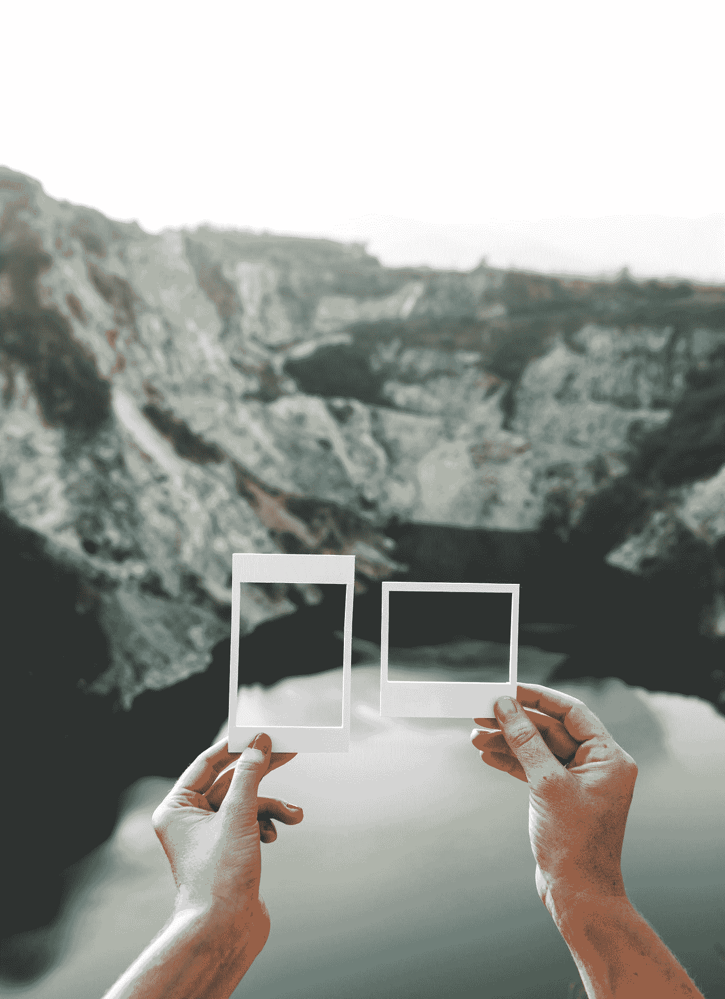
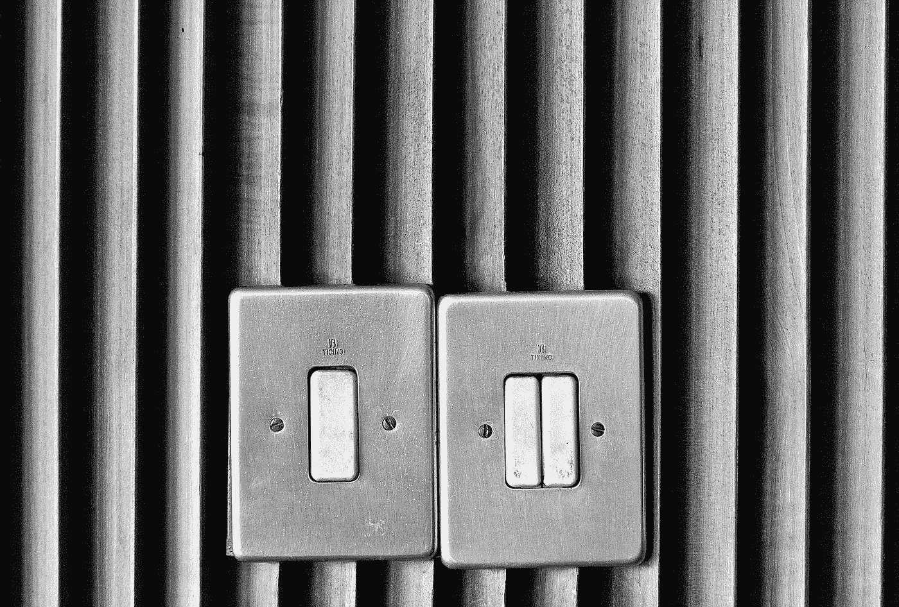
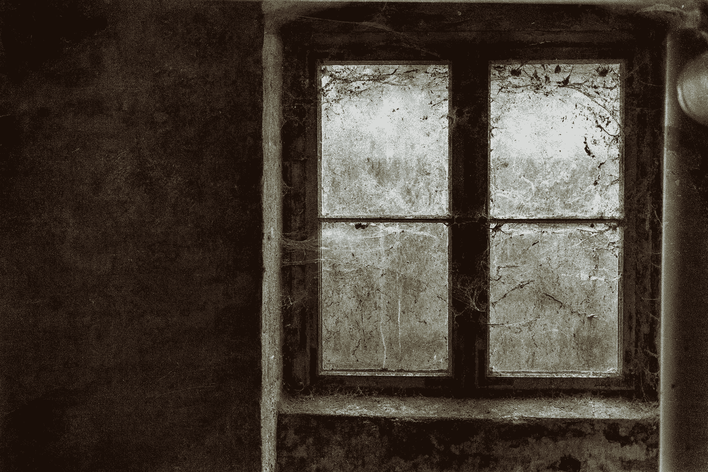

# 你的快乐是建立在比较的基础上吗？

> 原文：<https://medium.com/swlh/is-your-happiness-based-on-comparison-50cda8b271e4>

Photo by [rawpixel](https://unsplash.com/@rawpixel?utm_source=medium&utm_medium=referral) on [Unsplash](https://unsplash.com?utm_source=medium&utm_medium=referral)

“比较”地过日子，我好内疚。

当有人问我是否快乐时，我会想起我没有这么快乐或满足的时候，我的回答是勉强的，“是的，与我过去的感觉相比”。

但是，这意味着我快乐吗？这是否意味着我很满足？

我的生活一直被别人认为是“美好的”。我和我的搭档戴夫住在一个简朴的新家里。我们都有体面的工作，我们旅行，我们有新的交通工具，从物质上来说，我拥有的东西比我想要或需要的都多。

我在一个甚至没有牙膏或肥皂的家庭中长大。那不是“家庭酒吧”。我所有的衣服都是我姐姐传下来的，或者说是可怜的邻居女士，她把她女儿丢弃的裤子和上衣给了我。我们小时候什么都没有，那是一种尴尬的生活。

然而现在，我觉得我囤积了这些东西。我想买衣服就买，我有一堆几乎可耻的浴室用品，我们的橱柜和冰箱里堆满了食物。

和我的童年相比，是的，我对生活很满意。我满足于我不需要任何我自己不能得到的东西。我并不富裕，甚至也谈不上经济自由，但我拥有过去所缺乏的一切。

Photo by [Neal Kharawala](https://unsplash.com/@nealk?utm_source=medium&utm_medium=referral) on [Unsplash](https://unsplash.com?utm_source=medium&utm_medium=referral)

# 快乐

你怎么知道什么时候你是真正“快乐的”这个词是什么意思？

对我来说，它是当你早上醒来，感到安全、温暖和被爱的时候。这是当你带着希望和梦想展望未来，并能预见实现它们的方向。

幸福就是你能活在自己的皮囊里，感受到周围人的爱，知道自己的生活是美好的。你可以微笑，不知道为什么。你可以在任何事情上找到乐观，你感觉被接受了。

相对而言，是的，我很快乐。我无法想象过去的我是谁，在我过去的生活中挣扎的时候。如果她不得不回到我曾经的生活方式，这个“新的我”绝对会失去她的屎。

我很高兴自己能走到这一步，有一份好工作，有自己的家庭。

然而，我充满了不满。

Photo by [Hailey Reed](https://unsplash.com/@haileysreed?utm_source=medium&utm_medium=referral) on [Unsplash](https://unsplash.com?utm_source=medium&utm_medium=referral)

# 不满和焦虑

满足是每个人努力的目标。

对你是谁、你如何生活以及你所取得的成就感到满足和满意，这就是梦想。这是我们所有人为了感受成功和快乐所追求的。这是我们渴望的感觉，就在我们咽下最后一口气之前。

知足可能因人而异，因镜头而异。

也许你对你的家、你的生活方式、你的工作、你的家庭或者你生活中的其他幸福感到满意。

对我来说，焦虑使我无法满足。我想对我的生活感到满足和满意，然而我脑中的这个声音总是告诉我我做不到。“你不可能对自己满意。你今天不能去上班。外面有人。就待在家里，不理这个世界。”

它扼杀了我自我满足的机会，所以我与之斗争。我强迫自己站起来，走出门去。我吃医生给我的药丸，以“帮助”我的功能。我的功能，好吧，和任何机器人一样。

我的情绪变得迟钝，我的恐惧和压力被堵住，窒息，我的不满足慢慢消失。我做我的工作，我吃饭，我和我的伴侣在一起，我睡觉。我写作。

然而，与我过去的地方相比，我现在满足多了。

Photo by [Karim MANJRA](https://unsplash.com/@karim_manjra?utm_source=medium&utm_medium=referral) on [Unsplash](https://unsplash.com?utm_source=medium&utm_medium=referral)

# 关闭比较

我常常想，如果我能去看催眠师，完全抹去我的记忆，我会有什么感觉。

如果我们有能力重新启动我们的大脑，就像我们清除电脑记忆一样。你会开心满足吗？你会看看你现在所处的位置，并对你所看到的感到满意和快乐吗？如果不与你的过去进行比较，它看起来还会一样吗？

我们如何才能停止与过去的比较，看到我们的成功？知道有多少人会审视自己的现状并感到满足是很有趣的。

如果你想到一个孩子，他是来自一个饱受战争蹂躏的国家的难民。这个孩子被一艘危险的船带到一个新的国家，并被安置在一个昏暗的旅馆房间里，等待他的新生活开始。然后他被带到托儿所，那里没有其他孩子说他的语言，他吃的食物也不是他熟悉的。他整天都在哭，日托老师也不知道为什么。

**他们看到了什么:**

“他为什么这么不开心？他应该很高兴在这里，和我们在一起，面前有食物”。

“我不明白他为什么哭。他应该对自己的新世界感到满足。难道他不知道自己有多幸运吗？”

相比较而言，他应该是幸福的，是的。他应该感觉更好，更幸福，更安全，更温暖，更可爱。然而他不是。

这就像是在对比地狱和炼狱。

脱离地狱是美好的，但你被困住了。你渴望天堂。你渴望天堂。

Photo by [贝莉儿 NG](https://unsplash.com/@danist07?utm_source=medium&utm_medium=referral) on [Unsplash](https://unsplash.com?utm_source=medium&utm_medium=referral)

# 如何找到你的天堂

这是个大问题，不是吗？怎样才能让你感到满足和快乐？这是可以获得的吗？还是你一直在用快速自我实现的创可贴填充你的生活，希望感觉你已经“足够”了。或者更好的是，你想要“绰绰有余”。你想要天堂。

当你把天堂比作地狱时，有可能找到你的天堂吗？

也许你以前从未真正下过战壕。也许你的生活很轻松，没有精神健康的困扰，没有经济问题，也没有人际关系的挑战。如果是这样的话，我非常为你高兴。

但是你快乐吗？你找到你的天堂了吗？

当我想到比较幸福的时候，我经常会想到名人。

作为“正常人”，许多名人拥有我们可能想要的任何东西。他们有大房子、豪车、夜生活和著名的朋友。他们可以买任何他们想买的东西，去任何他们想去的地方。他们拥有我们普通人渴望的自由。

然而，我们总是在新闻和杂志封面上看到他们的不快！乱七八糟的离婚、吸毒成瘾、酗酒和自杀似乎在这些因成名而赚了数百万美元的人身上泛滥成灾。

为什么他们还没有找到自己的*幸福的*？他们对找到天堂的喜悦的庆祝在哪里？

罗宾·威廉姆斯就是一个很好的例子。他很风趣、善良，是世界上最著名的人之一。然而，这种黑暗、悲伤的抑郁在他内心燃烧了多年。他可能是他那个时代收入最高的名人之一，但他一生都在努力寻找自我。

是因为他在过自己的生活，不断地将自己与他人或自己的过去进行比较吗？他是否活着，寻找天堂，却找不到？还是他充满了自我厌恶的声音告诉他*“你永远不会满足。就结束这一切吧。”*我知道他也患有路易体病，但这让我怀疑是不是他的不满足让他最终放弃了。如果他找到了幸福，克服了抑郁，也许他会在家庭的爱中找到快乐。也许他会看到他的生活给了他什么，并感到满足。

有那么多其他名人结束了他们的生命，这确实让我深思，他们是因为他们疯狂的财富和混乱的生活方式而放弃，还是因为他们从来没有比较过他们“从哪里来”以继续他们的生活。

就我个人而言，我过去的黑暗帮助我看到了前方的光明，以及我今天的处境。然而，有一个持续的，唠叨的，对自我幸福和完全满足的渴望。也许我有，只是看不透自己的心理健康。

Photo by [Denny Müller](https://unsplash.com/@redaquamedia?utm_source=medium&utm_medium=referral) on [Unsplash](https://unsplash.com?utm_source=medium&utm_medium=referral)

# 街区的克里斯蒂娜

我来自“错误的一边”。我从小一无所有。

我应该对我是谁和我在生活中取得的成就感到完全快乐和满足，因为我熬过了耻辱和悲伤的生活。

我也一直在财务、离婚和一些心痛中挣扎。除了我自己的财务挑战，这些都已经过去了。

总的来说，我应该把我的生活视为天堂。我应该感到兴奋和满足，在一个爱我的人的家里醒来，去做我擅长的工作，坐在所有我小时候或年轻时从未有过的“东西”中间。

我也是。我很满足。我很开心。和我以前的样子相比。

但是，这就够了吗？

这里还有一个你可能会喜欢的故事:

 [## 你的“够了”是什么？

### 在我们的语言中,“够了”这个词本身就很有力量。

medium.com](/publishous/what-is-your-enough-5c9517c184ed) 

## 这篇文章发表在[《创业](https://medium.com/swlh)》上，这是 Medium 最大的创业刊物，有+427，678 人关注。

## 在这里订阅接收[我们的头条新闻](https://growthsupply.com/the-startup-newsletter/)。

