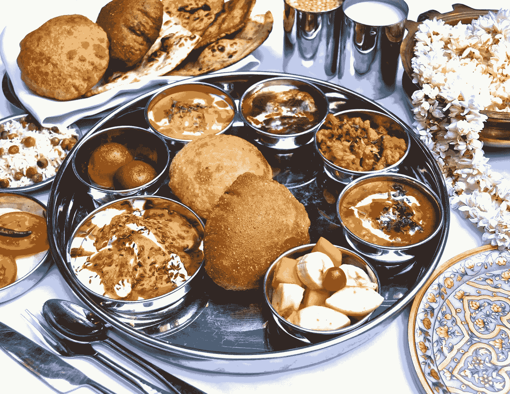

# 你的创业公司是在做一条烤鱼，还是做一份 40 道菜的预算餐？

> 原文：<https://medium.com/swlh/is-your-startup-making-one-grilled-fish-or-a-40-item-budget-thali-337960a52978>

A magnificent Thali. Photo credit: [http://www.allwhatshewants.com/2013/01/indian-thali-all-time-classic.html](http://www.allwhatshewants.com/2013/01/indian-thali-all-time-classic.html)

如果你去过美国的西餐厅，你会看到有人点烤鱼。这只是一条鱼，比四分之一盘子略大，可能还刷了一点橄榄油。美食家可能会加入盐和胡椒——这就是正餐。这是一条烤鱼，但可能是那个人吃过的最好的鱼！

在印度，你可能会去一家经济型餐馆，那里有 40 道菜，他们为这种菜肴感到自豪。这 40 条中可能有一条是好的，大多数是一般的，有几条很烂。下周你可能会去另一个地方。

# 为什么重要？

有大量的印度创业公司生产一种塔里产品，而不是一种只有一道菜的产品。为什么重要？

这是我从第一次创业中学到的一课。这是一个非常昂贵的教训；我花了将近一百万美元，花了我五年多的时间，在旅途中洒下了一群才华横溢的创始人的血、汗和泪。

作为一名开发人员，我发现构建大多数东西都很容易。弄清楚要造什么真的真的很难。当你在创业初期为不同的用户角色构建多个相邻的功能时，你最终会欺骗自己有一个市场，而实际上你有多个小市场。

> 如果你创建了一个 thali-startup，你最终会创建一个没有人真正喜欢的产品。

一家初创公司根本没有资源来打造一款世界级的 thali 产品——根据定义，一家初创公司的资源非常有限，与打造一款世界级的菜肴相比，你需要更多的资源来将 thali 上的 40 个项目打造到世界级的水平。

如果你建立一个 thali-startup，你最终会建立一个没有人真正喜欢的产品。每个人都声称喜欢你做的菜，但是没有人喜欢某一道菜。他们中的一些人喜欢他们使用的产品的一部分，但是他们对你构建的其他部分真的漠不关心。

印度买家过去喜欢 thali-startups。很多。在一个低信任度的环境中，与一个能为你提供一切的供应商合作要比与多个供应商合作要好，即使你不能在任何事情上获得世界级的质量。这就是为什么“没有人因为购买 IBM 的产品而被解雇”在企业世界中是有意义的——你相信 IBM 能够很好地满足你的需求。

如今，随着结构化 API 导致集成成本下降，用户对用户体验的要求越来越高，管理层要求快速采用，这种情况在美国发生了巨大的变化，而在印度发生的速度要慢一些。客户需要的是能够与他们已经拥有的多样化产品生态系统很好地集成和发挥作用的同类最佳点解决方案，而不是不具备任何世界级功能的宽泛解决方案。

# 我的世界上最好的喀拉拉邦

另一方面，一家只有一道菜的初创公司别无选择，只能用自己打造的东西成为世界一流。他们别无选择，只能与制造世界级产品的其他公司建立合作伙伴关系。别无选择，只能选择经济高效、销售周期短的 GTM(快速回答是或否)。自然地，买家最终会从一系列做好一件事的初创公司中获得更高的质量，而不是从一家提供预算的初创公司中获得。

例如，看看 Stripe 与 Shopify 建立合作关系，优步使用 Paytm 钱包，或者在更早的一代，史蒂夫乔布斯与 Adobe/Photoshop 建立合作关系，或者 Sun/Java 与 Netscape 建立合作关系。这些合作伙伴关系为他们的客户带来了巨大的价值，因为他们是世界上最优秀的合作伙伴，这种合作关系给双方都带来了巨大的利益。

# 我的 gulab-jamoon 打败了你的 falooda

现在考虑一下一家 thali-startup 的竞争含义。因为你什么都做，你就自然而然地和市场上的每个人竞争。市场上没有人是潜在的合作伙伴。事实上，在企业环境中，你甚至有系统集成商，他们通常是潜在的渠道合作伙伴，作为竞争对手。

一家只有一道菜的初创公司对收购者也更有吸引力，因为与一家广度很大、深度很小的初创公司相比，它的产品更有深度。

看看思科，在思科的核心网络市场中，他们贪婪地收购拥有客户认可的产品的网络初创公司。思科收购任何一家正在打造世界一流产品的初创公司，因为它完全知道，思科的销售人员大军将会成功地向它出售他们广泛的现有客户名单，获得比初创公司高得多的利润。

# 除了我的安得拉芒果泡菜，我现在还做芒果泡菜

有些人马上问我什么时候可以构建多个产品。答案很简单——为 10 个人做多菜系自助餐毫无意义。但是当你达到 10，000 时，多种美食的自助餐会让很多人更开心。因此，如果你的收入少于 100 万美元，就专注于打造一款优秀的产品。如果不起作用，转向不同的产品。一旦你的收入达到 7 位数，就开始考虑你的第二个产品。即使这样，这种产品也应该是一种产品线的延伸，很容易在你现有的市场上销售；利用你已经建立的信誉和关系将使追加销售变得更加容易。

> 关注从你的工作中获取最大价值的客户群。

那么，你正在建立一个 thali-startup 的道路上吗？停止和终止。相反，你应该专注于从你的工作中获得最大价值的客户群，让他们全身心地投入到构建你的产品愿景中，为他们服务，并找到拥有互补产品的合作伙伴一起进入市场。这是一条通往真正世界级产品创业的道路。

现在是时候让印度企业家从廉价的 thali 产品转向单一但世界级的烤鱼产品了！

在 [Upekkha](http://upekkha.io) ，我们帮助创始人找到合适的 SaaSy 餐来服务他们的顾客:)

## 这篇文章发表在[《创业](https://medium.com/swlh)》上，这是 Medium 最大的创业刊物，有+437，678 人关注。

## 订阅接收[我们的头条新闻](https://growthsupply.com/the-startup-newsletter/)。

