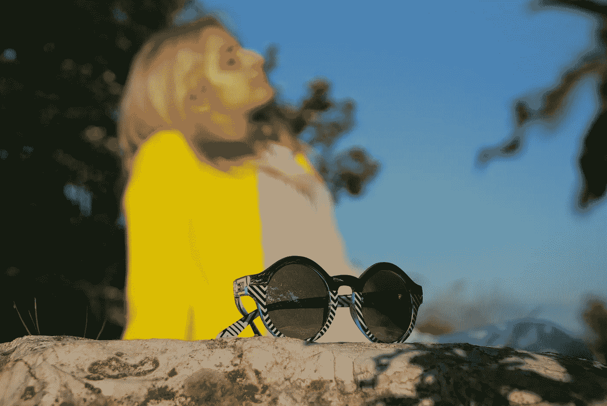

# 你的防晒霜对你真的安全吗？

> 原文：<https://medium.com/swlh/is-your-sunscreen-really-protecting-you-753c3521ec19>

## 是促癌而不是防癌吗？

Image by [Bob Dmyt](https://pixabay.com/users/Bob_Dmyt-8820017/?utm_source=link-attribution&utm_medium=referral&utm_campaign=image&utm_content=3431203) from [Pixabay](https://pixabay.com/?utm_source=link-attribution&utm_medium=referral&utm_campaign=image&utm_content=3431203)

随着地球的臭氧层在世界许多地方几乎完全耗尽，防晒霜已经成为保护自己免受当今遇到的各种形式的皮肤癌的必需品。

防晒的重要性如今已是众所周知，因为成千上万的公司开始…