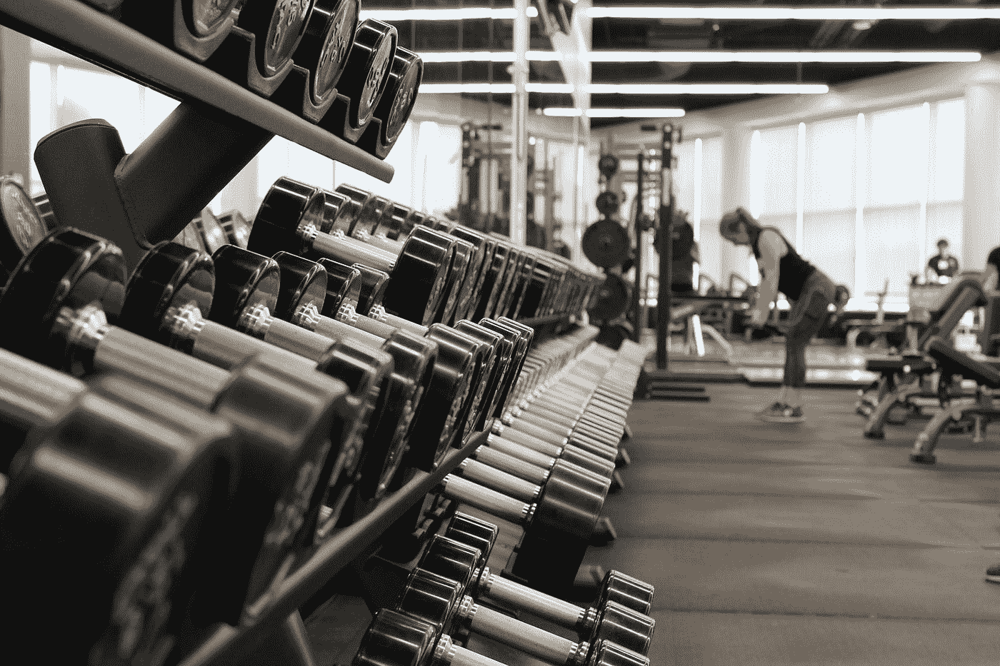

# 它不会变得更容易；挑战越来越大

> 原文：<https://medium.com/swlh/it-doesnt-get-easier-the-challenges-just-get-bigger-2d6132a9a433>

Photo by [Danielle Cerullo](https://unsplash.com/@dncerullo?utm_source=medium&utm_medium=referral) on [Unsplash](https://unsplash.com?utm_source=medium&utm_medium=referral)

我想起了大约一年前的一次谈话。我当时在健身房，正在努力形成一个全年去健身房的习惯，但最终失败了。我和一个已经坚持了 18 个月的人聊了聊。我想我是在寻求某种安慰或保证，从我开始时就一直困扰着我的疼痛只是暂时的。我渴望在…听到这句话