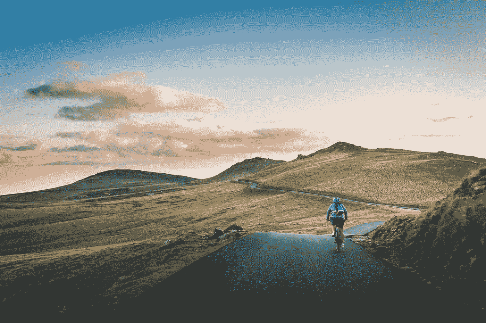

# 它从来没有变得更容易，你只是走得更快

> 原文：<https://medium.com/swlh/it-never-gets-easier-you-just-go-faster-626bafa113e>

Photo by [David Marcu](https://unsplash.com/photos/VfUN94cUy4o?utm_source=unsplash&utm_medium=referral&utm_content=creditCopyText) on [Unsplash](https://unsplash.com/search/photos/cycling?utm_source=unsplash&utm_medium=referral&utm_content=creditCopyText)

## 创业是一项耐力运动，也是一次艰难的攀登

格雷格·乐蒙德被认为是有史以来最伟大的美国自行车运动员。他的一生被记录在 [*东山再起*](https://www.amazon.com/Comeback-LeMond-American-Cycling-Legendary/dp/0802127940) 中，详细记录了一次胜利之旅——从优雅中灾难性地跌落，又英勇地爬回巅峰。这本书是丹尼尔·德·维塞写的，让我们一瞥运动员的…