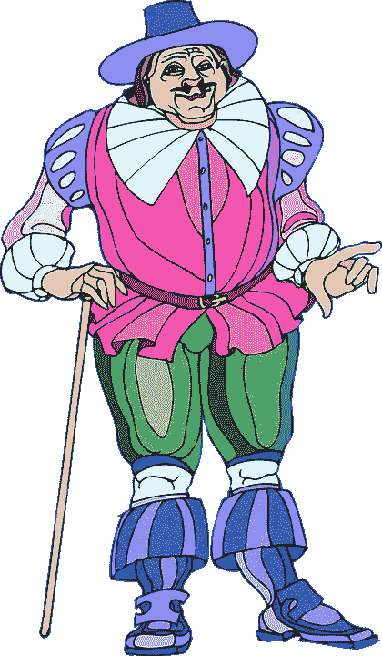

# 以前都做过了...那又怎样？

> 原文：<https://medium.com/swlh/its-all-been-done-before-so-e8794461ebc1>

你仍然可以把你的帽子扔进创意圈。

deviantart.com

> “我不在乎以前是否做过一万次。如果你需要做，就去做！”—伊丽莎白·吉尔伯特

当你有一个想法——任何想法——有人可能会说，

> 哦，我以前见过。