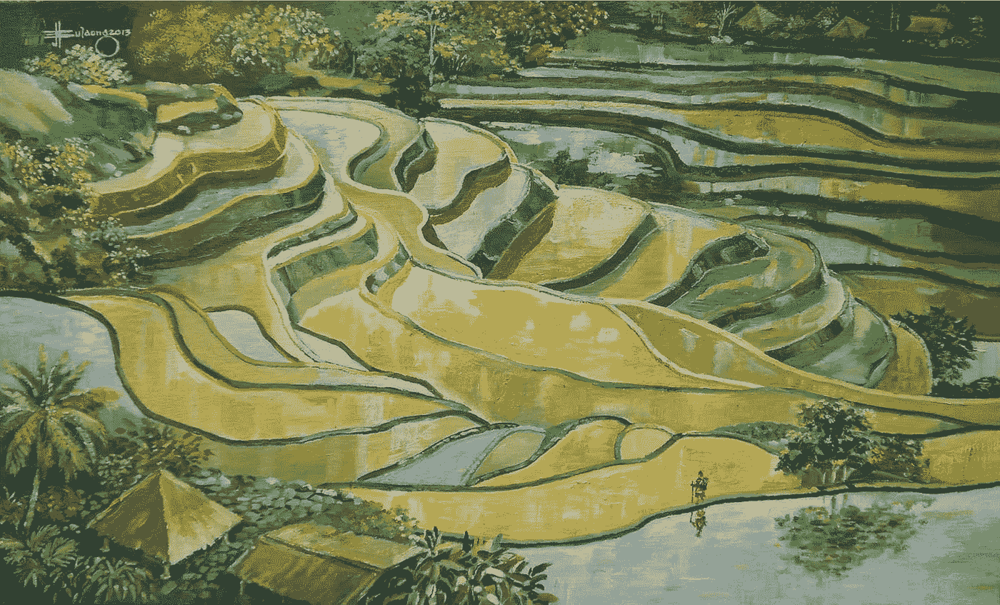

# 这不全是关于出口

> 原文：<https://medium.com/swlh/its-not-all-about-the-exit-6e23b59b8d52>

## 关注人如何能带来最大的回报

Banaue Rice Terraces by [Mariliza Reyes-Bulaong](https://www.pinterest.com/mlizgnoarey/)— oil on canvas (2013)

在我职业生涯的转折点，当我试图弄清楚下一步该何去何从时，我问了自己以下问题:

> 哪种组织结构对相关人员的补偿最少？

以下是我对这个问题的回答，我希望除了我自己之外，对其他人也有用，无论他们处于职业生涯的哪个阶段，而且，更广泛地说，作为一个基于市场的社会中负责任的行为者，我们应该努力成为一个榜样。

## 事实证明，答案是没有简单的答案。

在几个不同的组织结构中工作过之后，并且阅读了其他的，我已经确定每一个都或多或少是公平的，但是默认情况下，没有一个是公平的。无论是初创企业、中小企业、财富 500 强企业，甚至是非营利组织，如果以某种方式进行，它们都可能具有剥削性。

归根结底，这是我们经济体系中一个根深蒂固的问题。人们选择做他们所做的事情来挣钱，而不是提供真正的价值。结果是一个剥削的系统循环→通过想出与创造的价值不成比例的方法来努力获得*竞争优势。*

## **但是什么才是真正的价值(以及对谁来说)？**

价值通常被认为是效用的一部分。投资一家初创公司是基于它加快流程(B2B)或让生活更轻松(B2C)的能力。但是也应该考虑不同形式的价值——教育和幸福，这两者，如果由一个公司提供给它的顾客，都会带来满足感。

当我们购买一本书时，我们是在为获取知识付费。它并不总是直接适用于我们的日常生活；因此，它不同于效用。当我们购买一个创造性的作品，比如一张音乐专辑或一个手机游戏时，我们是在为它给我们带来的快乐付费。除了纯粹的“效用”之外，其他形式的价值创造也是一种确保公司的产出明显符合客户利益的方式。哪里有顾客满意，哪里就有快乐的员工。快乐的员工工作更出色，提供更好的服务→公司兴旺发达。

## 越大并不总是越好

随着公司变得越来越大，层级越来越多，为了吸引投资者，给人一种更“专业”的感觉，一些花哨的头衔应运而生，而员工获得的关注和收入却越来越少。个人的努力变得与他们得到的报酬不相称(一个通宵工作来修复一个 bug 的程序员比下午 6 点离开办公室的“公司主管”工作得更努力)。

组织越小，就越容易确保每个人都得到公平的补偿——因为对决策者来说，考虑时间和努力更容易，而对员工来说，让别人听到自己的声音更容易。

理想地说，剥削最少的系统应该是这样一个系统，其中有一个单独的成员或一个平等分享利润的合作团体。在现实世界中，这可能是一个作家、艺术家、音乐家——有人可以仅仅依靠欣赏他们作品的人来维持生计。虽然像 [Patreon](https://www.patreon.com/) 这样的平台为许多人，尤其是作家和艺术家，提供了这种真实的可能性，但一人公司通常很难实现——所以我们应该致力于*保持小规模*。

## 一切都从“为什么”开始

如果退出(即金钱收益)是目标，员工将永远排在利润之后。公司如何避免这种情况？考虑这样一个案例，一个创始人对一个领域充满热情，觉得他们真的可以贡献一些新的东西，可以在行业/客户的生活中产生积极的影响。这位创始人(即组织领导者)完全有理由投资于员工的福祉。这个创始人会基于热情而不是威权来领导(照我说的做，因为我是老板，但不要质疑我一开始为什么有资格当老板)。

## 向可持续经营而不是退出的转变是向更公平的公司结构的转变

在他们的业务得到验证(无论是消费者还是投资者)之前，创始人应该对他们工作的领域有所了解；这证明他们工作不仅仅是为了盈利，还因为他们觉得他们的专业知识可以让他们提供一种新的/改进的价值形式。

以一个约会应用为例:这是一个明显的场景，其中利润的动机对消费者来说是一个直接的劣势，因为更高的用户保留率的结果与其用户的关系失败(即不满)直接相关。如果约会应用的目标是让客户满意，那么它的创始人应该在心理学和/或行为理论方面有一定程度的专业知识，以便为用户创造最有益的体验，而不是创造出保留率最高的应用。

一个对他们/他们的团队给世界带来的贡献充满热情的创始人更感兴趣的是让他的公司可持续发展，这样他们就可以继续以最好的方式为人们服务，并不断改进他们的产品，以确保满足他们的客户。这一标准不仅使一家公司本质上是道德的和无欺诈的——客户服务将是运营的核心——它还完美地解决了如何确保员工不吃亏的问题。

股东在这一切中扮演什么角色？

接受外部投资应该永远是最后的手段。追求缓慢、持续的增长比让投资者一直支持你更好，投资者鼓励你做出对他们有利的决定，而不是对你的公司有利的决定。更进一步地说，由于没有外部股东，也没有“退出”的压力，人们没有理由不投资于他们的员工，他们是组织的生命线，而不是在你“做大”的那一天可以扔掉的可消耗的劳动力。

> 当参与者只想尽快套现时，长期可持续性就被抛到了九霄云外。——杰森·弗里德，[大本营](https://techcrunch.com/2019/03/27/for-basecamp-brand-identity-and-product-development-are-all-about-the-customer/)

***社会需要开始重新思考商业。商业是欺骗人们为自己获取最大利益的艺术。商业是人，商业是信任，商业是公平和公正(是的，也是公正)。***

我们需要专注于让*更小的、可持续的*组织由充满激情的人(而不是“老板”)运营，他们关心的是利用自己的独特潜力为消费者创造积极的东西，而不是纯粹的*市值*。

当人们把自由市场理解为“不惜一切代价为自己谋利”，而不是“利用这种自由来利用对你和你周围的人都有利的东西”时，我们的经济结构(理解为资本主义)的问题就出现了。

创业公司创始人不应该在想:“我能在三年内建立一个十亿美元的公司并卖给亚马逊什么样的想法”；而是:“我能比其他任何人都更好地带来什么样的独特价值，以及我如何从中创造一个可持续发展的组织？”。这样，大家都赢了。

我把我所有的写作放在没有付费墙的地方，因为分享我的经历并激励其他人也这样做对我来说更有意义。如果你愿意支持我的任务，请考虑 [*请我喝咖啡*](https://www.buymeacoffee.com/nicksnomadlife) *。*