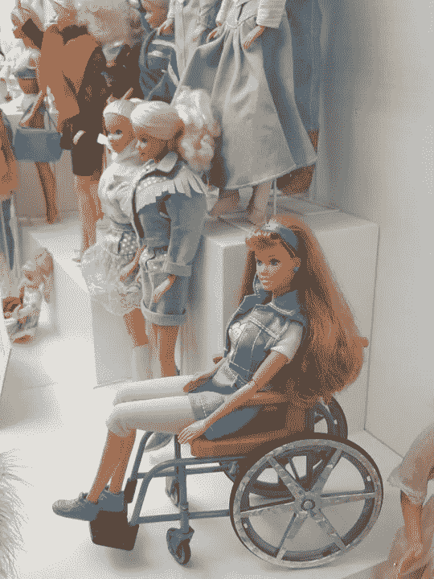

# 这个女人的创业公司以她丈夫和他的朋友的名字命名，这很可耻

> 原文：<https://medium.com/swlh/its-shameful-that-this-woman-s-startup-was-named-after-her-husband-his-friend-61c3c3d6fe0a>

这篇文章的一个版本曾出现在《福布斯》杂志上。

1936 年，露丝·汉德勒和她的丈夫艾略特负债 200 美元，无力支付房租。埃利奥特是一个害羞的木匠，而露丝的朋友形容她是“迷人和坚定的。”

Tomasz_Mikolajczyk via Pixabay

在她 20 岁的午休时间，露丝带着她丈夫的椅子样品走进了当地的一家家具店。起初遭到拒绝，她拒绝离开，直到她能与商店的经理交谈。她拿着一张 500 美元的订单走出商店。四年后，她通过全国零售商售出了价值 200 万美元的埃利奥特玩具屋家具。

尽管她是公司事实上的销售负责人，但上个世纪的美国还没有准备好承认女性高管。因此，露丝的创业公司以她的丈夫(埃利奥特)和他的朋友哈罗德“马特”马特森的名字命名，从而产生了“美泰”这个名字。

由于健康问题，马特森在公司成立不到两年后辞职，并将其股份出售给露丝和埃利奥特。Matson 离职后，Ruth 被正式提升为首席执行官。

**露丝的大创新**

在 Ruth 的指导下，Mattel 在 20 世纪 40 年代稳步发展。1944 年，在一次贸易展上，Ruth 售出了 10 万美元的公司玩偶家具，相当于 2018 年的 140 万美元。

1952 年，银行拒绝贷款给露丝投资一架发条八音盒钢琴，她确信这将是一个巨大的成功。她没有退缩，而是向朋友和家人借钱，最终卖出了 2000 万架钢琴。考虑到当时美国的总人口是 1.57 亿，也就是说每 1.7 个美国人中就有一个是卖家，这是一个非凡的成就。

1955 年，该公司的净收入为 50 万美元(经通货膨胀调整后为 460 万美元)。露丝决定将公司押在一个新的电视媒体提供的未经证实的节目上:迪斯尼的米老鼠俱乐部。当时，玩具是向成年人做广告的，前提是成年人是决策者。

然而，露丝持相反的观点。她以 50 万美元的价格购买了第一季每集 15 分钟的商业时间。第二次世界大战后，露丝感受到了一种更包容、更温和的育儿方式，于是直接向儿童推销美泰的革命性广告。

露丝在迪斯尼秀上宣传的第一个玩具汤米打嗝枪之前已经推出，但销售一直不景气。今天的枪支暴力敏感性几乎不存在。第二次世界大战结束后不到十年，玩具武器是一个受欢迎的产品部分。

这种冲锋枪的主要卖点是开火时发出的砰砰声。电视媒体强调了这种枪的声音质量，销量一夜之间翻了三番。尽管 Ruth 直接向儿童营销的创新并非没有批评，但它继续推动每年数十亿美元的消费者购买。

**洋娃娃和剃刀片**

1957 年，当露丝和女儿芭芭拉在欧洲旅行时，她想给女儿几天前买的莉莉艾洋娃娃买些衣服。店员告诉露丝，如果她想要更多的衣服，她必须购买额外的娃娃，因为衣服不单独出售。

看到了一个机会，露丝设计并销售了一个类似的娃娃，她通过创造一个巨大的服装和配件衣柜来区分它。

在很短的时间内，Mattel 售出了 300 万个芭比娃娃，每一个芭比娃娃都通过出售售后服装和服饰获得了额外的收入。这种“剃刀和剃刀刀片”的商业模式使得美泰公司能够以相对低廉的价格出售娃娃，这反过来又刺激了额外的销售。几十年来，价格适中的芭比成为 5 岁至 12 岁女孩的理想生日礼物，确保每一代新的儿童都会要求芭比的房子、汽车、衣服以及芭比的朋友。

露丝的另一项创新是改变娃娃世界传统的儿童/婴儿动态。在芭比问世之前，儿童玩偶通常是解剖学上正确的婴儿，这迎合了年轻女孩的母性本能。露丝推出的成熟、性感的洋娃娃颠覆了这一传统。年轻女孩们不是培育她们的娃娃，而是创造充满活力的以工作为导向的幻想，其中包括许多职业生涯，包括医生芭比、古生物学家芭比、宇航员芭比和总统芭比。

虽然儿童从养育婴儿到作为自主独立的成年人进行角色扮演的演变在很大程度上是积极的，但批评家们正确地指出，芭比不切实际的解剖设计也对年轻女性的身体形象问题产生了负面影响。

**露丝的第二幕**

美泰于 1960 年上市，并持续增长，直到 20 世纪 70 年代初，文化变化开始影响芭比的销售。1970 年，露丝被迫退出运营岗位，并于 1975 年离开了公司董事会。然而，她的创业生涯并没有结束。

1971 年从乳腺癌中幸存下来后，露丝创建了一家名为“近我”的假肢公司。20 年后，她将公司卖给了 Spenco Medical。截至 2018 年，NearlyMe 继续为女性提供术后假肢。

露丝于 2002 年去世，但她创建的帝国永存。美泰 2017 年的销售额为 16 亿美元，其中大部分是由露丝的两大创新推动的，直接面向儿童的营销和成人玩偶芭比特许经营。

*在这里关注约翰面向初创企业的 Twitter feed:*[*@ John great house*](https://twitter.com/#!/johngreathouse)*。*

## 这篇文章发表在 [The Startup](https://medium.com/swlh) 上，这是 Medium 最大的创业刊物，拥有+431，678 名读者。

## 在这里订阅接收[我们的头条新闻](https://growthsupply.com/the-startup-newsletter/)。

