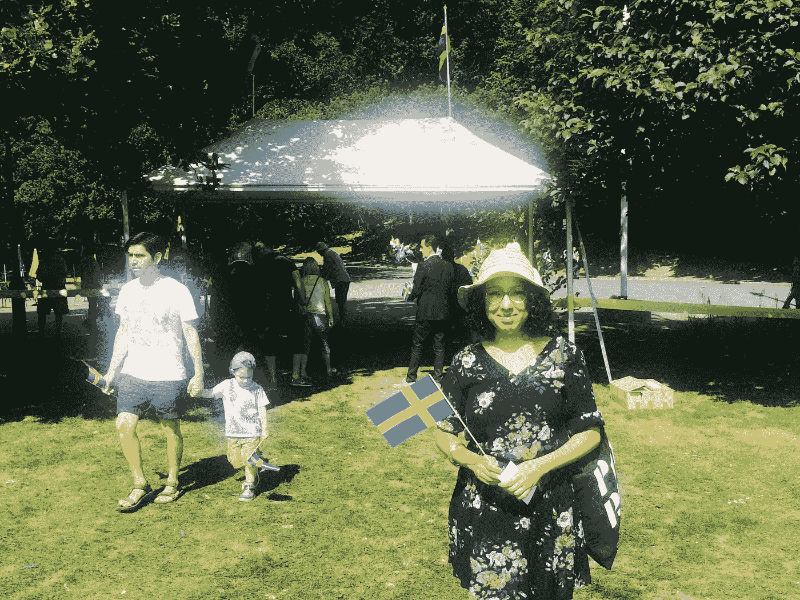
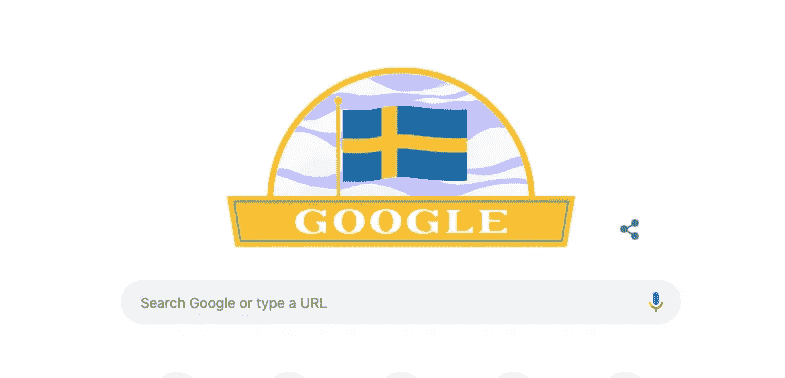

# 今天是瑞典的国庆节。这就是瑞典让我不像瑞典人的原因。

> 原文：<https://medium.com/swlh/its-sweden-s-national-day-and-this-is-how-sweden-keeps-me-un-swedish-9be8bad157cd>

这是我第四次以瑞典公民的身份庆祝瑞典国庆日，我仍在努力融入和感受瑞典，最重要的是，被视为一个完整的瑞典公民。

On this day, in 2016, I was given a certificate during a big celebration, affirming my “becoming” a Swede. It was a nice gesture but for me, it was like a starting point of me joining the struggle of “svartskalle” (discriminatory term in Sweden to describe people with dark-haired heads, meaning black skull) in this country.

在你继续阅读之前，请理解我的目的不是抨击或赞美瑞典。我只是分享我自 2011 年年中以来在瑞典生活的经历。作为一名来自也门的记者，我看到了让世界相信也门除了坏的一面还有好的一面是多么的困难；当我试图让世界相信瑞典好的一面之外还有坏的一面时，我发现了同样的问题。所以，请暂时抛开所有的成见。

瑞典是一个伟大的国家，和其他地方一样，它有好有坏。它从来都不是完美的，就像没有其他地方是完美的一样。有许多关于瑞典的问题是如此真实，但我们从来没有谈论过，特别是在国际媒体上；比如种族主义、歧视、贫困、瑞典的军火工业等。我试着用英语和阿拉伯语写了几次关于瑞典的文章。我被瑞典极右翼在网上收到的仇恨和威胁程度震惊了。

“回你在也门的家去吧”，“你小时候就应该在也门，嫁出去”，“回你的基地组织国家去吧，你这个恐怖分子”，这是我过去“敢”谈论瑞典时收到的一些评论或信息。

所以，我保持沉默，尽管我知道我的沉默不会保护我，就像奥德·洛德曾经说过的那样。

当一群瑞典作家和记者发起网上运动谴责他们在网上收到的仇恨和死亡威胁时，我深受鼓舞。我认识到这个问题很严重。

在瑞典做了大约四年的政治难民后，到 2015 年 7 月，我成为了瑞典公民。与此同时，战争在我的祖国也门爆发了。我有一种喜忧参半的感觉。我渴望那一刻的到来——拥有瑞典护照，这样我就可以飞往也门看望我的家人，但由于战争和对该国的封锁，我不能这样做。我不得不无限期推迟我的计划。同时，我很高兴我是瑞典公民，终于可以投票了。2016 年的这一天，我在一次大型庆祝活动中获得了一份证书，肯定了我“成为”一名瑞典人。这是一个很好的姿态，但对我来说，这就像是我加入这个国家“svartskalle”(在瑞典，这是一个歧视性的术语，用来描述深色头发的人，意思是黑色的头骨)斗争的起点。

Google celebrating the National Day of Sweden, today.

极右的反移民政党瑞典民主党这些年来越来越受欢迎。我刚到瑞典的时候，他们曾经是一个小团体。今天，他们是瑞典议会的第三大党。我过去常常低估瑞典日益高涨的种族主义气氛，直到我看到我自己的一位来自也门的密友——他来瑞典寻求庇护——加入了白人至上主义的瑞典民主党。他一直在宣传他们所有的法西斯宣传，却没有考虑到他自己是该组织不想在瑞典看到的一切。

白人至上主义、极右、民粹主义和法西斯主义的崛起是全球性的。

瑞典是地球的一部分。

我很感激我在瑞典与瑞典人、埃塞俄比亚人、叙利亚人、库尔德人、伊拉克人、土耳其人、索马里人、法国人、塞尔维亚人、德国人、伊朗人、罗马人、厄立特里亚人、萨尔瓦多人、西班牙人、葡萄牙人、阿富汗人、埃及人、巴勒斯坦人和许多其他国家的人建立的友谊。好像全世界都住在瑞典。据统计，在瑞典 1000 万人口中，约有 25%的人与除瑞典之外的另一个国家有全部或部分的血缘关系，但我估计这几乎是这个国家的一半。

瑞典的文化如此多元，我喜欢它！

然后，还有融合与同化的问题。我尽量不去关心这些——我所关心的是以我想要的方式生活在瑞典，拥有自由和尊严。我对此很有经验，因为我在也门长大时就有埃塞俄比亚的根。

自然，无论你住在哪里，你都需要说当地的语言。所以我报名参加了免费的瑞典语学习班，在瑞典我们称之为“SFI”。对于许多外籍人士、移民和其他人来说，SFI 课堂是一次有趣的经历。从第一天起，我就注意到班级的结构是多么的糟糕。从让有着不同学术背景的学生(比如拥有学士学位的人和不识字的人)到教师在与教授瑞典语无关的事情上浪费时间。在 SFI 学校的四年里，我只有一个优秀的老师，他专注于用瑞典语教学。其余的人不知何故痴迷于同化话题。例如，我们有一个老师一直问我们关于女权主义和阿拉伯和穆斯林世界的妇女问题。

她会在课堂上告诉我们:“在你们那个地区，你们确实会打女人，但在瑞典我们不会这么做。”。

嗯，我是一名女权主义者，但我不认为用一堂关于瑞典语的教学课来给我们讲女权主义有什么用。

最重要的是，老师的态度是如此的居高临下。

我从阅读托芙·扬松的儿童读物、在公共汽车站或电视和广播中与喝醉的老人交谈中学到的瑞典语比在 SFI 课堂上学到的还多。

信不信由你，和瑞典人说瑞典语很难。一旦他们注意到你说蹩脚的瑞典语，他们就会转向他们喜欢的英语，因为这可以让他们练习英语。他们认为英语很酷。他们英语说得很流利。然而，在工作面试时，瑞典人并不觉得英语很酷。

在瑞典找工作太难了——有基础甚至高级瑞典语，真的无所谓。重要的是你在瑞典有多少工作经验。但是，如果你们瑞典从一开始就不允许我有机会获得工作经验，那我怎么会有工作经验呢？

我提交了无数份工作申请，但几乎所有的时间里，我甚至没有收到他们的任何反馈——甚至是拒绝。我记得一位来自伊朗的女出租车司机，有一次她开车送我去参加一个电视采访，我是在瑞典电视大楼里做的。她告诉我她在伊朗获得了工程学位，但出租车司机是她在瑞典唯一能找到的工作。这让我从简历中删除了我因新闻工作获得的所有瑞典和国际奖项的详细信息。我甚至开始考虑做出租车司机或服务员。我非常尊重所有的出租车司机和女服务员——当然，这些工作没有什么可羞耻的。

我知道自己的潜力，我不断问自己，为什么在瑞典我会觉得自己没有价值？为什么我总是在经济上挣扎？为什么瑞典的体制不允许我发挥最大的潜力，找工作，安定下来？这个系统的某些东西让你成为局外人。在瑞典约会？我早就放弃了。

我最后一次试图让自己适应瑞典，我联系了瑞典公共服务部门 SVT，询问他们是否对我写的关于我使用瑞典语的经历的专栏感兴趣。他们礼貌地告诉我他们不感兴趣。

这是我第四次以瑞典公民的身份庆祝瑞典国庆日，我仍在努力融入和感受瑞典，最重要的是，被视为一个完整的瑞典公民。