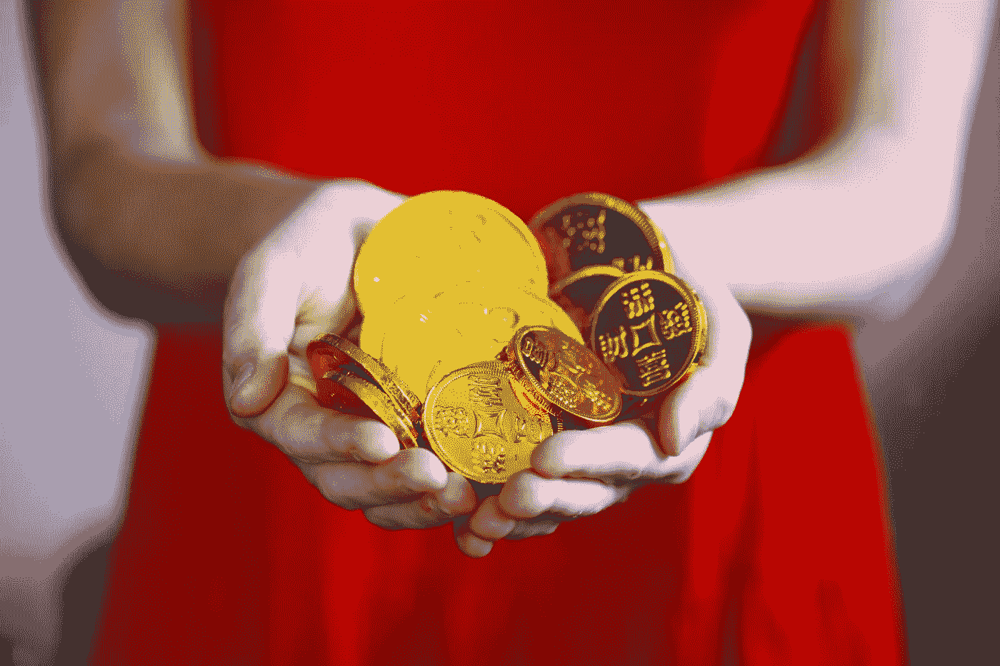

# 是时候改变你对致富真正含义的看法了

> 原文：<https://medium.com/swlh/its-time-to-change-your-perspective-on-what-getting-rich-really-means-15f2fff0fd13>

Photo by [Sharon McCutcheon](https://unsplash.com/@sharonmccutcheon?utm_source=unsplash&utm_medium=referral&utm_content=creditCopyText) on [Unsplash](https://unsplash.com/search/photos/wealth?utm_source=unsplash&utm_medium=referral&utm_content=creditCopyText)

网上最受欢迎的两样东西是什么？

减肥致富。

在这两个类别中，你所听到的大部分都是重复的废话。然而，人们会在有生之年花费数千美元来购买最新的课程或指南。