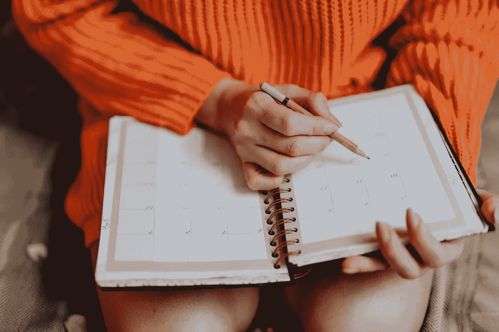

# 是时候重新思考工作与生活的平衡了

> 原文：<https://medium.com/swlh/its-time-to-rethink-work-life-balance-81005df7a37a>

## *过时的概念没有进化到数字时代*

Photo by rawpixel.com, courtesy of [pexels.com](https://www.pexels.com/photo/person-holding-pen-and-planner-1898291/)

工作与生活的平衡是一个神话。

千禧一代被出售的版本——我们的职业生活和个人生活之间神话般的 50/50 比例——被定位为某种北极星。但是像大多数北极星一样，它仍然遥不可及，不是因为它的难度很高，而是…