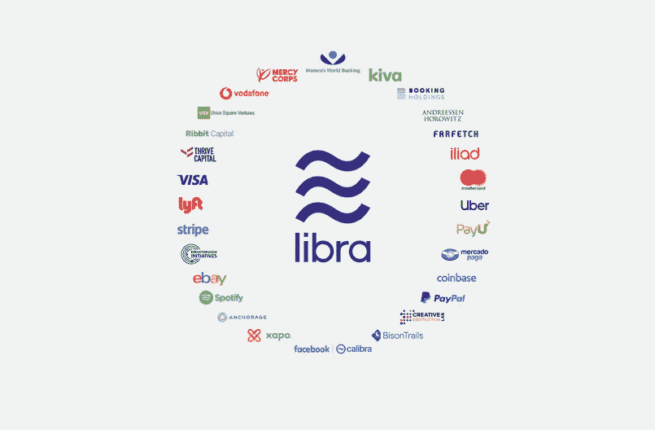

# 是时候认真对待区块链教育了。

> 原文：<https://medium.com/swlh/its-time-to-take-blockchain-education-seriously-6dae20a94699>

知识就是力量，但问题是:这是谁的力量？

Would you trust your money with governments … or for-profit corporations?

随着脸书今天推出他们的加密货币项目 Libra,“区块链”一词突然引起了公众的额外关注。

一些人认为这是朝着更广泛采用区块链迈出的一大步，然而与其他开放平台不同的是，Libra 是一种加密货币，由…