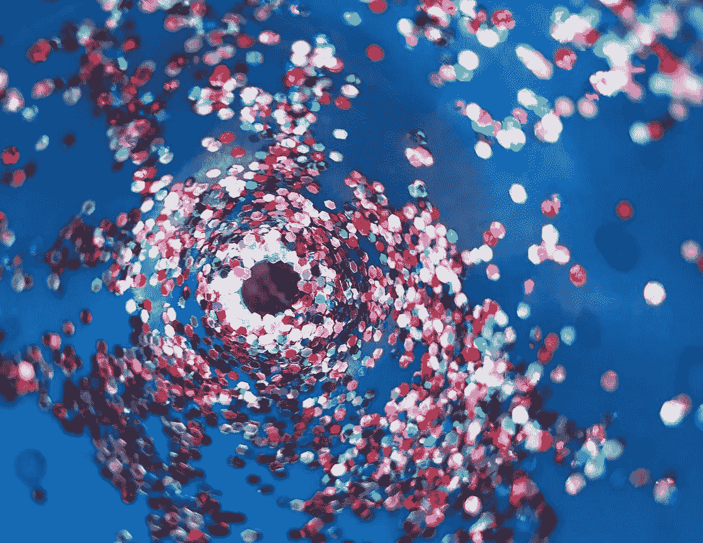

# 是时候收回品牌了

> 原文：<https://medium.com/swlh/its-time-to-take-branding-back-86893b9269f8>

我必须坦白。一段时间以来，我一直对品牌感到矛盾。如此矛盾，以至于我认真考虑过先进入任何不相关的职业领域。

因为事实是，在资本主义和主导文化的手中，品牌被用来操纵我们。

花 7 美元买一瓶自来水(这是我最近去拉斯维加斯的一个真实故事)。