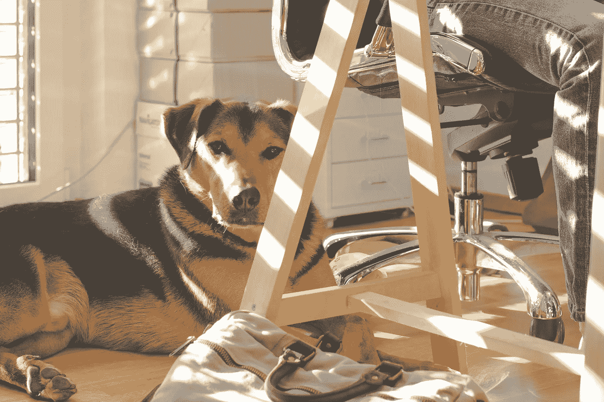
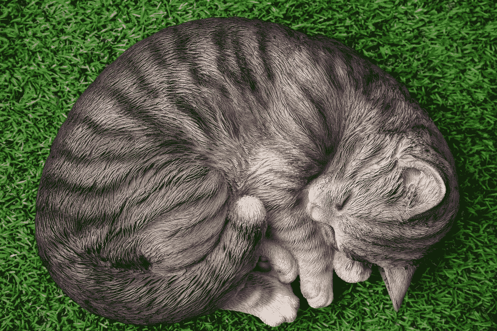

# 我在家工作了 7 年。这是我所知道的关于完成工作的一切。

> 原文：<https://medium.com/swlh/ive-worked-at-home-for-7-years-here-s-everything-i-know-about-getting-stuff-done-1c3e2698d3ac>

## 坏消息是:你可能不得不保持一个规律的时间表。

**Step 1: Get a dog, I guess.** ([Lum3n.com](https://www.pexels.com/@lum3n-com-44775)/Pexels)

七年多前，我成为了一名全职自由职业者。虽然我可以说很多关于如何做自由职业者的事情，但是今天我想和你谈谈当你在家工作的时候如何把事情做好。因为除了招揽新业务，让自己真正坐下来做事是自由职业者最难的部分。

此外，如今越来越多的全职员工在家工作。公司已经意识到远程办公是一个有吸引力的好处。如果其他条件相同——工资、福利、晋升机会——允许人们远程工作的组织可能会吸引候选人。

但是不管你的工作情况如何，如果你是全职或兼职远程办公，你需要知道如何在办公室之外高效工作。以下是如何做到这一点:

## 1.保持一个时间表。

You don’t actually have to get up with this guy … but it might help. ([Diana Parkhouse](https://unsplash.com/@ditakesphotos)/Unsplash)

即使你是一名自由职业者——或者为一家采用了[唯结果论工作环境的公司工作——你仍然需要每天准时出现。](https://www.gorowe.com/)

什么是“准时”？这取决于你，但它应该是一致的。如果你是一个早起的人，你可能会在早上 7 点到下午 3 点。如果你喜欢在中午休息，你可以计划在午饭前后休息几个小时。但一般来说，你希望在大多数正常工作时间都有空，这样客户和同事就知道如何与你联系。

## 2.设定一个停止点…然后把你的设备放好。

知道什么时候停止一天的工作和去上班一样重要。为什么？因为否则，你会忍不住继续前进…然后发现自己精疲力尽。

当你注销一天的时候，考虑把你的设备停在一个较远的地方，或者至少设置你的离开信息并关闭电子邮件提醒。当你应该在看《网飞》的时候，很容易因为整晚收到邮件而结束回复。

## 3.有专门的工作空间。

除非你一个人住，否则餐桌可能不会这样做。即便如此，出于税务考虑，最好有专用的办公空间。向你的会计师询问具体的建议，但大多数人会告诉你，你甚至不需要有一扇门。你只需要不要和三个家庭成员、一只狗和一盒圣诞树装饰品分享你的办公空间。

拥有一个工作空间对你的心态也很重要。当你每天走进办公室时，你会有物理距离提醒你你要去工作了。但是当你在家工作的时候，你必须自己做提醒。

## 4.让你的家人和朋友加入进来。

尽管越来越多的人在家工作，但这还不够普遍，还不足以让每个人都明白。你可能会发现*你的*手下对你的新工作安排感到困惑，他们不明白你真的在工作。

从事自由职业已经三年了，我仍然会收到朋友们的邀请，在某个随机的周三招待他们的外地家人，或者带他们的猫去看兽医。不管你把自己的处境说得多好，它都会发生。但首先要给人们一个支持的机会。当人们要求你在工作日做非工作的事情时，直截了当地告诉他们你不能，因为你在工作。你甚至可以说，你发现规律的工作时间对你的工作效率至关重要，等等。，使用上面的点。

只是要准备好一些古怪的表情和挠头，不要屈服。你在工作。你很忙。你没时间帮忙。

## 5.每天至少出去一次。

**Actual nature walk optional.** ([Lacey Raper](https://unsplash.com/@laceyraper)/Unsplash)

当你在家工作时，很容易一连几天呆在室内，特别是如果你没有需要离开房子的小孩或宠物。但是对你的心理健康不好。我曾经连续三天呆在室内。第三天结束的时候，我看起来就像是阴谋惊悚片里的英雄。我不再梳头，就差这么一点点就能把一个巨大的板子拼起来，上面全是用纱线和大头针连接起来的照片和地图。

最后老公告诉我裂缝露出来了，坚持让我到外面去。然后当我马上感觉好起来的时候，我觉得自己很傻。

所以:到外面去。每天都是。即使只是走到邮箱然后回来。

## 6.倾听你的身体在告诉你什么。

大多数职业专家会告诉你每天进行一些锻炼，尤其是如果你在家工作，并且没有通过其他方式进行锻炼的话。这是一个极好的建议，但我不会给你，因为我不想成为一个伪君子。我一直说我要每天早上做拜日式，然后去散步，然后我的宝宝有一个便便爆炸，当它被清理干净时，我决定这一天的运动已经足够了。

然而，我会说，你应该听从你的身体。如果你感到疼痛，无精打采，全身布满蜘蛛网，是时候行动了。少谈减肥甚至健身，多谈运动你的身体，这样你就能保持运动。我发现，锻炼时，低期望值是快乐的秘密。

## 7.知道有些日子是糟糕的工作日…早点结束。

有些日子，你会坐在办公桌前，什么也不会发生。你会写三段，但不知何故删除了四段。电话会在一个小时内响七次，即使你从 90 年代起就没有真正打过电话。你的消息来源在度假，你的客户很忙，你的编辑在开会。

如果可以，最好在那几天走开，等宇宙没那么破碎的时候再回来。也许这是一个信号，表明你需要出去散步或者吃点冰淇淋。

## 8.改变你的心态。

运动心理学家建议用一个简单的心态调整来提高工作效率:不要告诉你自己*有*去做某事，而是告诉你自己*有*去做。

这是一个很小的变化，却有很大的不同。你不必写那份报告，你可以把你的发现汇总起来。你不必清理那些文件——你会有一个更有条理的系统。等等。

## 9.不要一心多用。

即将开始在家工作的人经常谈论他们是多么高兴，因为他们终于有时间扔一些衣服进去，或者做这个或那个家庭装修项目。虽然利用休息时间让生活变得更轻松是完全可以的，但不要陷入过度安排工作时间的陷阱。

你不在家收拾。你回家工作了。不要用通勤来换取一份家务清单。你不会觉得更有效率，而且你会怨恨那些不必兼顾家务和工作的家庭成员。

## 10.休息一下。很多突破。比你想象的要多。

**Looks good, right?** ([Mike Bird](https://www.pexels.com/@mikebirdy)/Pexels)

众所周知，久坐不利于健康。但是即使你坚持站着办公的生活方式，你仍然需要休息。为什么？因为它们会提高你的工作效率和注意力——因为如果你不吃，你很可能会分心，浪费时间。

一项研究发现，理想的工作节奏是工作 52 分钟，然后休息 17 分钟。如果这对你来说听起来像很多休息时间，试着跟踪你的工作时间，看看你每天实际上花了多少时间在工作上。结果可能会让你大吃一惊。

有意识地休息，可以利用休息时间休息，为下一次工作冲刺恢复精力。