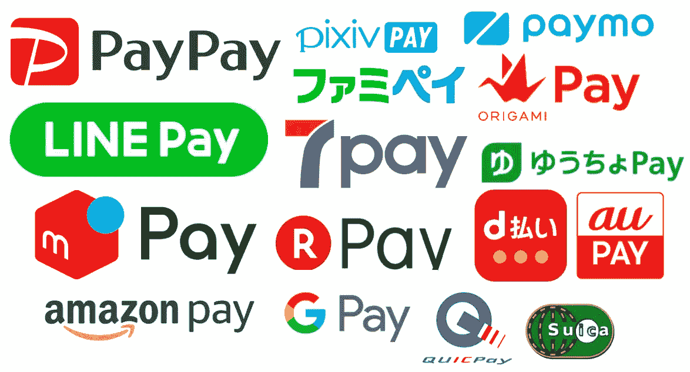

# 日本政府发起移动支付大战

> 原文：<https://medium.com/swlh/japans-mobile-payment-arms-race-575544d67522>

Take your pick

日本一直是一个以现金为基础的社会，小商店和餐馆只接受现金仍然很普遍。然而，在 2018 年底，政府宣布了一项计划，为那些使用无现金服务支付的人提供 2%至 5%的现金返还，以加速在 2020 年奥运会前引入无现金支付基础设施。