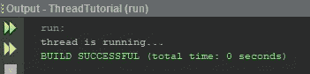
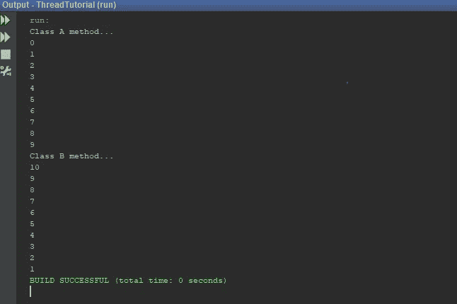
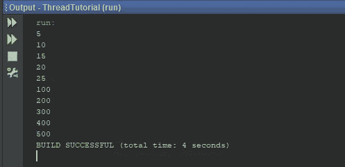

# Java 多线程

> 原文：<https://medium.com/swlh/java-multithreading-b8dd4771a902>


同时执行几个程序的能力叫做**多任务**。用系统的术语来说叫做多线程。这里，主程序被分成两个或多个子程序(进程),这些子程序可以同时并行执行。

**例子:**

*   多个客户访问服务器的铁路客票预订系统。
*   在 I/O 阻塞时执行一些执行。
*   游戏是线程化的很好的例子。你可以在游戏中使用多个物体，比如汽车、摩托车、动物、人等等。所有这些对象都只是运行游戏应用程序的线程。
*   多个帐户持有人在服务器上同时访问他们的帐户。当您插入 ATM 卡时，它会启动一个线程来执行您的操作。
*   一边听音乐一边输入 MS Word 文档。

# 什么是线程？

线程类似于只有一个控制流的程序。每个程序至少有一个线程，线程有开始、主体和结束。它按顺序执行命令。因此多线程意味着并行执行多个命令。特别的是 Java 支持多线程。

因此，Java 使我们能够在开发程序时使用多种控制流。每个控制流(线程)与其他控制流并行运行。包含多个控制流的程序称为**多线程程序**。

让我们假设程序有如下线程

```
Main Thread 
Thread A 
Thread B
Thread C 
```

现在首先启动**主线程**。然后**线程 A、B 和 C** 并发运行，共同共享资源。由于 Java 中的线程是主应用程序的子程序，并且共享相同的内存空间，所以它们被称为**轻量级线程。**

**重要提示:记住线程并行运行并不意味着它们同时运行。所有线程都运行在单个处理器上，并且在线程之间共享执行。Java 编译器处理线程之间的控制切换。**

## 线程的生命周期

在线程的生命周期中，它可以进入许多状态。

*   **新生状态** —当我们创建一个线程对象时，线程就诞生了，并处于新生状态。
*   **可运行状态** —线程准备执行，等待处理器的可用性。
*   **运行状态** —处理器已经给出了执行时间。
*   **阻塞状态** —线程被阻止进入可运行状态和运行状态。当线程被挂起、休眠或等待以满足某些要求时，就会发生这种情况。
*   **死状态** —正在运行的线程结束了自己的生命周期，完成了 run 方法的执行。

# 线程异常

Sleep()方法应该包含在 try 块中，后面跟一个 catch 块。这很重要，因为 sleep 方法抛出了一个应该被捕获的异常。如果我们没有捕捉到异常，程序将无法编译。

每当我们试图调用一个线程在给定状态下无法处理的方法时，Java 都会抛出一个名为[**IllegalThreadStateException**](https://stackoverflow.com/questions/7315941/java-lang-illegalthreadstateexception)的异常。

**例子:** Sleeping 方法无法处理 resume()方法，因为睡眠线程无法接收任何指令。

# **如何创建线程？**

创建线程有两种方法:

1.  通过扩展线程类
2.  通过实现 Runnable 接口。

可以根据我们创建的类的需求来使用这种方法。

## 1.通过扩展线程类

Thread 类提供了创建和执行线程操作的构造函数和方法。Thread 类扩展 Object 类，实现 Runnable 接口。

## 步骤:

*   将该类声明为扩展 Thread 类。
*   实现 run 方法。
*   创建线程对象并调用 Start 方法。

```
package threadtutorial;/**
 *
 * [@author](http://twitter.com/author) Kasun Dissanayake
 */class Multi extends Thread{
    [@Override](http://twitter.com/Override)
    public void run(){
//your code here
        System.out.println("thread is running...");
    }
}
public class ThreadTutorial {public static void main(String[] args) {
        Multi t1 = new Multi();  
        t1.start();}

}
```

这里***Multi t1 = new Multi()；*** 语句创建对象。将运行此对象的线程尚未运行。该线程处于新生状态。

现在***t1 . start()；*** 语句引导线程移动到可运行状态。然后 Java 解释器将通过调用这个 ***run()*** 方法 ***来调度线程运行。*** 现在线程处于**运行**状态。

运行这段代码，你会得到这样的结果。



# 如何停止一个线程？

每当我们想停止一个线程的运行状态，我们应该调用它的 stop()方法。它会将线程的**运行状态**移动到**死状态**。

当线程到达其方法的结尾时，它将自动进入 dead 状态。

**例如:**

一个包含显示数字 1 到 10 的线程的程序。如果数量达到 5，则停止线程。

```
package threadtutorial;/**
 *
 * [@author](http://twitter.com/author) Kasun Dissanayake
 */class Test extends Thread{
    public void run(){
        for (int i = 0; i < 10; i++) {
            if(i == 5){
                stop();
            }
            System.out.println(i);
        }
    }
}public class ThreadTutorial {public static void main(String[] args) {Test test = new Test();
        test.start();}    
}
```

# 如何阻塞一个线程？

线程可以被暂时挂起或阻止进入可运行和随后运行状态，

*   睡眠()；—线程在指定的时间间隔后启动，除非它被中断。
*   挂起()；—此方法将线程置于挂起状态，并且可以使用 resume()方法恢复。
*   wait()；—使当前线程等待，直到另一个线程调用 notify()。
*   notify()；—唤醒正在该对象的监视器上等待的单个线程。
*   resume()；—此方法恢复使用 suspend()方法挂起的线程。
*   stop()；—此方法完全停止线程。

## 等待()和睡眠()的区别

***【wait()】*是一个用于线程同步的实例方法。**它可以在任何对象上被调用，因为它是在 *java.lang. Object、*上定义的，但是**它只能从同步块**中被调用。它释放对象上的锁，以便另一个线程可以加入并获得锁。另一方面， *Thread.sleep()* 是一个静态方法，可以从任何上下文中调用。 ***Thread.sleep()* 暂停当前线程，不释放任何锁。**

当我们使用 *sleep()* 方法时，线程在指定的时间间隔后启动，除非它被中断。

对于 *wait()* ，唤醒过程稍微复杂一点。我们可以通过在被等待的监视器上调用 *notify()* 或 *notifyAll()* 方法来唤醒线程。

当您想要唤醒所有处于等待状态的线程时，请使用 *notifyAll()* 而不是 *notify()* 。类似于 *wait()* 方法本身， *notify()* 和 *notifyAll()* 必须从同步的上下文中调用。

**例如:**

用线程写一个程序来显示数字 1 到 10。如果该数字等于 5，则线程休眠 5000 毫秒。(在这里，Sleep()方法应该包含在 try 块中，后跟 catch 块。)

```
package threadtutorial;/**
 *
 * [@author](http://twitter.com/author) Kasun Dissanayake
 */class Test extends Thread{
    public void run(){
        for (int i = 0; i < 10; i++) {
            if(i == 5){
                try {
                    Thread.sleep(5000);
                } catch (InterruptedException e) {
                    e.printStackTrace();
                }
            }
            System.out.println(i);
        }
    }
}public class ThreadTutorial {public static void main(String[] args) {Test test = new Test();
        test.start();}    
}
```

# 线程优先级

在 Java 中，我们可以给一个线程分配一个优先级，这个优先级会影响线程在运行时间表中的顺序。具有相同优先级的线程具有相同的优先级(这由 Java 调度程序完成),它们以先到先服务的方式共享处理器。

我们可以使用 **setpriority()** 方法设置线程的优先级，如下所示。

```
Threadname.setpriority(int number);
```

该数字是一个整数值(1 -10 之间的值)，是线程的优先级。

线程类定义了几个优先级常量。

*   **最小优先级** = 1
*   **最大优先级** = 10

默认设置为**定额 _ 优先级**。这等于数值 **5** 。

## 练习:

一种包括 A 类和 B 类的程序。A 类用一个线程显示数字 1-10，B 类用一个线程显示数字 10 -1。优先级为**A 类线程—最大，B 类线程—最小**

```
package threadtutorial;/**
 *
 * [@author](http://twitter.com/author) Kasun Dissanayake
 */class A extends Thread{
    public void run(){
        System.out.println("Class A method...");
        for (int i = 0; i < 10; i++) {
            System.out.println(i);
        }
    }
}class B extends Thread{
    public void run(){
        System.out.println("Class B method...");
        for (int i = 10; i > 0; i--) {
            System.out.println(i);
        }
    }
}
public class ThreadTutorial {public static void main(String[] args) {
        A a = new A();
        B b = new B();

        a.setPriority(Thread.MAX_PRIORITY);
        b.setPriority(Thread.MIN_PRIORITY);

        a.start();
        b.start();}

}
```

执行代码。然后你会得到一个这样的结果。



# 同步

在运行中，方法线程试图使用一些位于运行方法内部和外部的资源。如果两个线程试图访问同一个资源，可能会出现问题。然后 Java 给了我们一种技术来克服这个问题，叫做**同步**。这里我们可以用一种同步的方法来实现**同步**机制**。**

同步主要用于

1.  以防止螺纹干涉。
2.  以防止一致性问题。

当我们将一个方法声明为 synchronized 时，Java 会创建一个监视器，并将它交给第一个被调用的线程。其他线程不能访问该同步代码段。

示例:

```
//example of java synchronized method  
class Table{  
 synchronized void printTable(int n){//synchronized method  
   for(int i=1;i<=5;i++){  
     System.out.println(n*i);  
     try{  
      Thread.sleep(400);  
     }catch(Exception e){System.out.println(e);}  
   }  

 }  
}  

class MyThread1 extends Thread{  
    Table t;  
    MyThread1(Table t){  
        this.t=t;  
    }  
    public void run(){  
        t.printTable(5);  
    }  

}class MyThread2 extends Thread{  
    Table t;  
    MyThread2(Table t){  
        this.t=t;  
    }  
    public void run(){  
        t.printTable(100);  
    }  
}  

public class Example6{  
    public static void main(String args[]){  
        Table obj = new Table();//only one object  
        MyThread1 t1=new MyThread1(obj);  
        MyThread2 t2=new MyThread2(obj);  
        t1.start();  
        t2.start();  
    }  
}
```

执行代码，你会得到这样一个结果。



这里，MyThread1 调用一个同步方法，它自动获取该对象的锁，并在线程完成任务时释放它。

然后调用并执行第二个线程 MyThread2。

## 2.通过实现可运行的接口

runnable 接口声明了在我们的程序中实现线程所需的 run()方法。

## 步骤:

*   将该类声明为实现 Runnable 接口。
*   实现 run 方法
*   通过定义从这个 runnable 类实例化的对象作为线程的目标来创建线程
*   调用线程的 start()方法来运行线程

```
package threadtutorial;/**
 *
 * [@author](http://twitter.com/author) Kasun Dissanayake
 */class Test implements Runnable{
    public void run(){
        for (int i = 0; i < 10; i++) {
            System.out.println(i);
        }
    }
}public class ThreadTutorial {public static void main(String[] args) {Test test = new Test();
        Thread thread = new Thread(test);
        thread.start();}    
}
```

和往常一样，你可以在 GitHub 上查看本文提供的例子。

谢谢大家！